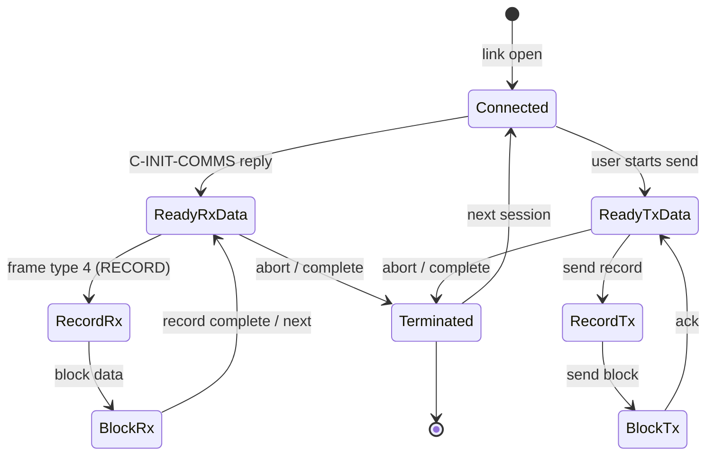
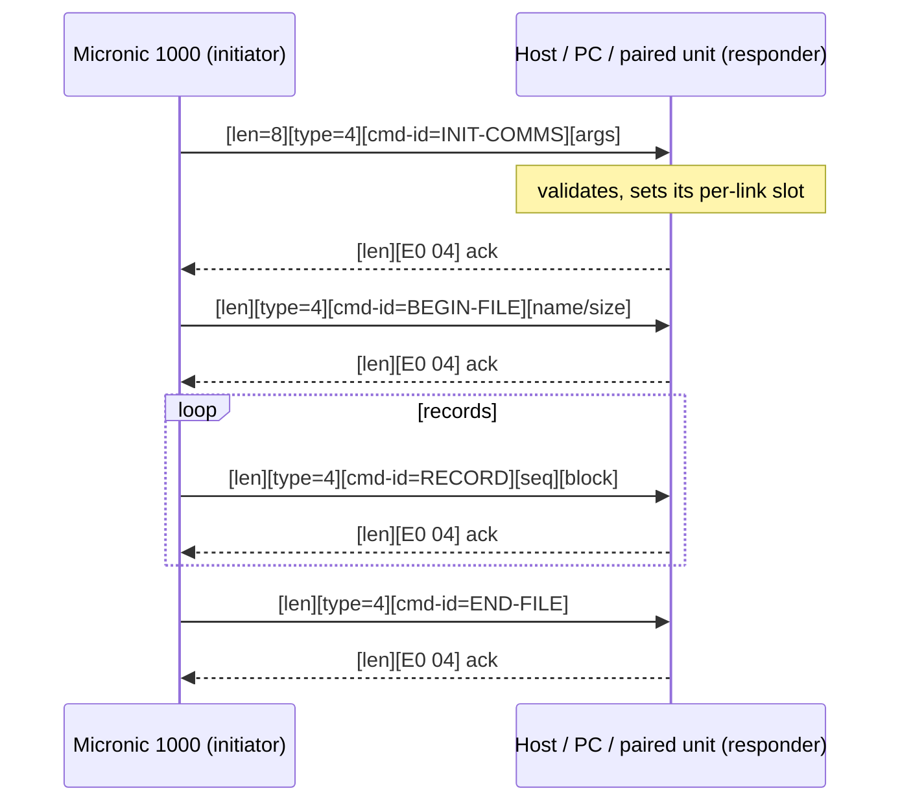

# Commstar transfer protocol

State: **under active reverse-engineering**. The hardware transport,
frame grammar, reply-prefix set, role model and session-state names
are established (below). The exact wire byte values of the C-* record
framing are partially open — see "Open items" at the bottom.

## Reference data locations

All in ROM00 (bank-0 firmware), in the `6800..6F00` range:

| Address | Content |
|---------|---------|
| 6A50 | `ptbl_session_state_names` — 13-word pointer table to state name strings |
| 6A61 / 6A7A | "NOT-STARTED" / "DISCONNECTED" static labels |
| 6A9A–6B58 | state names (see table below) |
| 6B88–6C80 | `C-*` command-name texts (INIT-COMMS, DIAL, ANSWER, MANUAL, DROP-LINE, COMMAND, TX-REPLY, SHUT-DOWN, BEGIN-FILE, END-FILE, END-TX, ABORT) |
| 6C8E–6E84 | transfer status messages (Sending/Receiving data|prog, transmitted/received, Line failure, Plinth not connected, Modem fault, Failed to connect, Session complete, Logging on/off, Invalid reply/command/data stream, Timeout) |
| 69C0–69F0 | 8× 14-byte character templates (0x8D block-graphics "dark dot" frames + text) used to render session phases |
| ~6A08 | ragged value tables near the templates |

### Session state name table (ROM00:6A50)

| Idx | State name | Str @ |
|-----|-----------|-------|
| 0 | CONNECTED | 6A9A |
| 1 | READY-RX-DATA | 6AAB |
| 2 | READY-RX-PROG | 6ABC |
| 3 | READY-TX-DATA | 6ACD |
| 4 | READY-TX-PROG | 6ADE |
| 5 | RECORD-RX | 6AED |
| 6 | BLOCK-RX | 6AFC |
| 7 | RECORD-TX | 6B0B |
| 8 | DATA-SET-TX | 6B1B |
| 9 | BLOCK-TX | 6B2A |
| 10 | TERMINATED | 6B3A |
| 11 | REPLY-START | 6B48 |
| 12 | REPLY-END | 6B58 |

NOT-STARTED (6A61) and DISCONNECTED (6A7A) precede the table as
static labels — the state column really starts at CONNECTED.

Note: the boot-loaded module delivers a *runtime-built* state-name
table at ram:D0CF (names like "SHUT-DOWN", "C-RX-REC" as parsed by
the text interpreter) — that D0CF table is distinct from the static
names here. Relationship unconfirmed.

## Transport mechanism

**The 08h/28h indexed pair is the HD146818 RTC.** The external link
(PLINTH/V24 IR, side port) uses the **4x parallel transport**:

* `LinkBlockTx` (ROM00:3277) — poll 4Bh bit7, `OUTI` byte -> 4Dh
* `LinkBlockRx` (ROM00:3378/33AC) — poll 4Bh bits 0/1/2, `INI` byte <- 4Eh
* 4Ah control latch (bit6/7 link online), 4Ch command/ACK (0x81),
  4Fh probe (0x1F), timeouts -> error codes (EE/EB/EC/ED)

**Interface shape:** byte-parallel latch set, not a Z80 SCC/ADLC —
distinct TX (4Dh) and RX (4Eh) latches, straight-line OUTI/INI byte
pumps, no register-select/command-vector programming. The synchronous
IR (clock+data pairs, 2 photo + 2 EMIT per port) is serialized
downstream of this byte interface. See io-map.md.

Higher-level link service: `LinkTransferService` (ROM00:2F86) and
`Link0`/`Link1` (2EF3/2F53) manage link state (fdd5/fdd6/fdd8) and
buffer at fdea, driven by Commstar's C-command state machine. This is
where Commstar transfer bytes flow.

## Send path (frame -> wire), all ROM00

```
Commstar session code
  -> LinkInit (2EF3/2F53): link state fdd5=1, fdd6=0x32, builds
     header buffers via 3106 (frame @ FE0E) and 3130 (frame @ FDEA)
  -> buffer @ FDEA: len at FDEA(=6), FDEB=0, payload FDE2+ (fdec)
  -> LinkTransferService (2F86): if fdd5 in {2,4} bail; check link
     ready (30FC); HL = FDEA; CALL LinkBlockTx (3277)
  -> LinkBlockTx: OUT(4A) strobes; poll 4Bh bit7 (RLCA->C); OUTI
     byte -> 4Dh; B=count; timeout 0x26C/0x6F9 -> error
```

## Receive path (frame <- hardware)

```
Unsolicited frame: LinkBlockRx (3378/33AC):
   clear 4Ah bit0, set bit5, IN(4Eh) data byte, set bit4, wait,
   release bit5; then poll 4Bh bits 0/1/2 (RRCA chain), INI bytes
   from 4Eh into buffer; LX=0 count.
-> RX dispatcher 2FBD: LinkBlockRx; validate via 30DC(link frame);
   if bad -> clear state; else branch on fdd5 (3=306C data, 2=3072
   cmd, else 3078)
```

So TX data -> 4Dh (OUTI), RX data <- 4Eh (INI), status 4Bh, control
4Ah. This fully defines the byte-level hardware transport for the
external link(s).

## Frame grammar (from frame builders 3106/3130 + validator 30DC)

Frames are **pointer-based descriptors**, not raw byte streams:

```
LinkBuildHeaderFrame (3106) @FE0E:
  +00 word 0x0006          data length
  +02 ptr  0xFDE4         -> TX payload buffer (data source)
  +.. zero-scanned pad, then type/link marker 0x03
  +ptr 0xFE38             secondary data pointer
LinkInitTxBuffer (3130) @FDEA: same layout for the main Tx buffer
LinkValidateFrameHeader (30DC): checks len >= 6, header fields,
  link-id byte at +5 must equal fdd4 (current link id)
```

So the wire record = **len (16-bit LE) + payload + type/link marker**.
The type marker (0x02/0x03/…) selects the frame class that the
session state machine (C-INIT-COMMS / C-DIAL / C-BEGIN-FILE …)
acts on. The _0x38_ byte is part of a data pointer, not a literal
in the wire stream.

## Session-open handshake (Commstat bootstrap, ROM00:0F40-10FB)

`CommstarOpen` (0F40/0F5D) + `CommstarSessionEntry` (10E0) bring a
link up and exchange the init frame:

```
10E0 entry: f978 = link-id; installs return vector (10F4/10FB)
0F5D:
  F990 = 0x45 (link id / type byte) ; F994=1 ; F995=0
  2EAB(link_id)          -> open link; state fdd5=4 until ready
  copy template RAM 0FAF (10 B) -> F978 node block
  copy template 0FB9 (6 B)
  2F1A(&0FA4)            -> install command-dispatch vector; then:
        if fdca bit6: build header frame + LinkTransferService (init
        handshake TX); fdd5=1, fdd6=0x32
  0FA4 = RX callback: LD (F97A),A (received byte -> f97a)
  0FA8 = RX echo -> tty_out (1BEB)
  loop via RST28 while !carry
```

The link API surface used by Commstar (all ROM0):
  `LinkTransferService` (2F86) - send a buffer (HL, count via fdd8)
  `LinkTransportCall`   (2F1A) - install dispatch vector + first TX
  `LinkTransferService` RX dispatcher (2FBD) - branch by fdd5
  `LinkValidateFrameHeader` (30DC) - header/len/link-id check
  `LinkBuildHeaderFrame` (3106) / `LinkInitTxBuffer` (3130)
  `LinkSetCommandHeader` (3078) - write 2-byte opcode to FE14 frame,
     set state 4, indirect via (*fdd2) to the command handler

This is the complete software surface under the C-command state
machine; hardware is fixed (4x ports). Frame contents for the
file-transfer records (RECORD-/BLOCK-TX) still need the session-code
analysis.

## Command / token IDs

Two distinct ID spaces exist in the firmware — do not confuse them:

1. **Link/session-type IDs** (table ROM00:31F2, matched by
   `LinkCommandLookup`/31C6 against a caller-supplied id masked 0x7F):
   `{0x2B, 0x2A, 0x23, 0x03}` with associated word-table at 31F5
   (`2B→0xFF03, 2A→0x1221, 23→0x1221, 03→0x1893`). These select the
   session/transport handler at link open (LinkTransportCall 2F1A);
   e.g. 0x1893 is the "return + RST28" kernel stub. This is the link
   *kind*, not a frame byte.

2. **In-frame command id** (frame offset FDE7, type 4 frames). This is
   the actual per-message token that the receiver validates: in
   `LinkProcessCommandFrame` (3084) the received value is compared
   against the per-link slot (`FE43+(fdd4&3F)`, LinkSlotRead); a
   mismatch is refused with reply prefix `EF 01`. Whether 2B/2A/23/03
   overlap this space is not yet proven; treat the two spaces as
   separate until confirmed.

The `C-*` *command names* (INIT-COMMS, DIAL, ANSWER, MANUAL,
DROP-LINE, COMMAND, TX-REPLY, SHUT-DOWN, BEGIN-FILE, END-FILE,
END-TX, ABORT) are display/state labels. Mapping each name to a
concrete wire byte is not yet established from the ROM alone;
targeted protocol traces or a companion-tested assumption are
required before writing a host implementation.

## Concrete frame layout and reply set (ROM00, state machine 2FD0-30B0)

Received/link-frame buffer starts at FDE4:

```
FDE4/FDE5  word  payload length
FDE6       byte  frame TYPE (2, 3, or 4)
FDE7       byte  command/seq id (type-4 frames)
FDE8+      byte  payload bytes
```

Dispatch (2FD0-3010) reads FDE6 and link state fdd5:
  type 2 -> "session" path (302C)
  type 3 -> timeout/answer path (3014)
  type 4 -> LinkProcessCommandFrame (3084): command id validation
    against the per-link slot (FE43 + (fdd4 & 3F), LinkSlotRead),
    then replies with one of the prefix words.

Reply prefixes written into FE14 by LinkSetCommandHeader (3078):
  EE 01 (0x01EE)  idle / user-handled
  E0 02 (0x02E0)
  EE 02 (0x02EE)
  E0 04 (0x04E0)  link state 3 (connected) responding
  E0 05 (0x05E0)  link state 2 (command) responding
  EF 01 (0x01EF)  command-id mismatch (bad/unknown command)

Per-link context block: FE43 + (fdd4 & 0x3F) holds per-link
session/sequence state; LinkSlotRead/Write (31A1/31A6) access it.
Each physical link (PLINTH / V24 / side port, or modem) gets its own
slot indexed by the configured link id (F990/FDCA/FDD4).

## Roles: the Micronic 1000 can be either side (host / unit)

The firmware is **not** hard-wired to a single role. It contains the
full machinery for both initiating a link and responding to a remote
initiator. Which one applies depends on the menu action and the link
mode selected by the user:

* **As the session initiator (acts like host / calling side):**
  * `LinkInit` (2EF3/2F53) + `CommstarOpen` (0F5D) actively *open*
    a link and transmit the first frame (`LinkTransferService` →
    `LinkBlockTx`) — i.e. it dials out.
  * Outbound states `READY-TX-DATA` / `READY-TX-PROG`,
    `RECORD-TX` / `BLOCK-TX` / `DATA-SET-TX`, and messages
    "Sending data" / "Sending prog" / "Program transmitted".
  * Modem mode "A/DIAL" and "MAN/D" (manual dial) — the terminal
    calls out.

* **As the responder/unit (acts as the peripheral):**
  - When a frame arrives, `LinkProcessCommandFrame` (3084)
    *validates* the command id and *replies* with an ACK/prefix —
    def responder behavior.
  - Receive states `READY-RX-DATA` / `READY-RX-PROG`,
    `RECORD-RX` / `BLOCK-RX`, messages "Receiving data" /
    "Receiving prog" / "Program received".
  - `Load/Run Program` = the M1000 acts as a unit taking a
    program download.
  - Modem mode `A/ANS` (auto-answer) — waits for a call.

* **Per-link role independence:** each configured link (PLINTH,
  V24 ADAPTOR) / side port / modem has its own context slot
  (`FE43+(fdd4&3F)`) and link-id (fdca/fdd4). Different links can
  therefore be in different roles simultaneously, and user action
  (`Start` vs `Receive`) chooses the side for a given operation.

**Consequence for a host program:** do not assume which side you are.
Implement the M1000 as able to initiate *or* answer; the negotiation
and the per-link slot keep it consistent either way.

## Sequence diagram (M1000 as remote peripheral)

The unit's framing/state machinery is symmetric; here is one dominant
flow (external host initiates, M1000 is the "unit"). Both exchanges
use the same wire record and reply-prefix set.

```mermaid
sequenceDiagram
    participant H as Host / PC (or 2nd M1000)
    participant U as Micronic 1000
    H->>U: [len=8][type=4][cmd-id=INIT-COMMS][args]
    Note over U: LinkBlockRx -> FDE4; LinkValidateFrameHeader
    U->>U: LinkProcessCommandFrame: cmd-id vs link slot
    alt valid
        U-->>H: [len][E0 04] ack
        H->>U: [len][type=4][cmd-id=BEGIN-FILE][name/size]
        U-->>H: [len][E0 04] ack
        loop data records
            H->>U: [len][type=4][cmd-id=RECORD][seq][block]
            U-->>H: [len][E0 04] ack
        end
        H->>U: [len][type=4][cmd-id=END-FILE]
        U-->>H: [len][E0 04] ack
    else invalid
        U-->>H: [len][EF 01] bad command / refused
    end
```

### State transition diagram (one link's session)



> Note: the mermaid diagrams are illustrative of the *verified*
> frame set (len/type/cmd-id + reply prefixes) and state names drawn
> from the tables at 6A50/6B88. The exact record/block byte details
> remain OPEN pending the session-layer analysis; edges whose
> precise condition is not yet confirmed are labelled conservatively.

## Sequence diagram (M1000 as the initiator)

The same wire record and reply set, but the Micronic 1000 starts the
session (e.g. `Load/Run` push, in `A/DIAL` modem mode, or pushing a
program *to* a paired unit). Compare with the responder diagram
above — the two sides of the protocol are symmetric.



## The link *is* the BDOS console/reader/list device (CONFIRMED)

The session layer never touches the 4x ports (4Dh/4E) or the link
frame buffers (FDE4/FE0E) directly. Instead the Commstar data channel
is implemented as the CP/M **console / reader / list device**
mapped onto the 4x hardware. This is what makes "send a byte out the
IR port" as easy as `CALL 5, fn 02`.

TX path (console output):
```
program:   LD E,char ; CALL 5, fn 02        (ROM00:0F36)
  0F36: f97e = char ; CALL 0EC8
  0EC8: device = active console dev (fbc5 & 3) -> handler ptr in f97c
        (uses the char-indexed config tables FE83/FE93)
  if device active (f97c & 7F):
    0F5D (CommstarOpen/reopen) -> link frame (FDEA/etc.)
    -> LinkTransferService (2F86) -> LinkBlockTx -> port 4Dh
```

RX path (console/device input):
```
BDOS reader (fn 03 / fn 06 status) -> 0F40/0EF3:
  - active device from fbc5 -> its slot
  - LinkBlockRx (3378/33AC) <- port 4Eh
  - frame validated (30DC), data to the caller buffer
```

Active-device selection:
* `fbc5` = active console/link device id, written by `SetActiveDevice`
  (15A4) - default 0 at cold boot (FUN_0323); menu/config changes
  it to pick PLINTH vs V24 vs side port vs modem.
* `(fbc5>>2)+5` indexes the 16-byte device-config tables at
  FE83/FE93 (each device letter 'A'-'P' -> 4-byte slot; the second
  byte is the link id mask the frame validator compares against
  fdd4).

So the **programmer-facing transfer API is just the standard console
I/O:** print to send, read from to receive; the OS routes it to the
configured link. This is the cleanest possible model for a host app.

Note (roles again): because the data path is the same console
abstraction both ways, *either* side can drive `fn 02/03` to send or
receive — nothing in the transport hard-wires which side is "host".
The per-link slot (`FE43 + fdd4&3F`) and the active-device field
(`fbc5`) are what select/validate, and they are set per action.

## Devices over one transport: PLINTH / V24 / modem / EXT STORAGE

There is **one** byte-parallel link transport (4x ports 4Ah-4Eh) and
**no per-device hardware drivers**. The alternates named in the UI —
`PLINTH`, `V24 ADAPTOR`, `EXT STORAGE ADAPTOR`, `WORKSTATION MEMORY`,
`WORKSTATION RAMDISK`, `LOCAL LINK`, `MODEM A/ANS`, `MODEM A/DIAL`,
`MODEM MAN/D` (ROM01:7A08-7A53) — are **logical devices over the same
transport**, differentiated by configuration, not by different ports:

* The ROM01 device lists (757F: 5 entries; 7663: IR-only 2 entries)
  are UI descriptors, not hardware drivers.
* The per-slot tables FE83/FE93 (each device letter 'A'-'P' -> 4-byte
  slot with a link-id byte) configure which logical device a slot
  means; active slot selected by link id `fdca`/`fdd4` (set by link
  open, `Fun_2EAB`'s arg = requested link id) and console device
  `fbc5`.
* The modem is driven by the *dial* session state (ROM00 5707/5F58,
  strings "Dial number." 6ECB / "Dialling" 6EAA / "Re-dialling"
  6FB4): the session enters a dial sub-state and feeds dial digits
  over the same TX console path.  Same for V24/serial and any
  external storage adapter - all session-layer protocol over the
  single link byte pipe.

Consequence: to talk to a specific device from a host, you select
that device's link id on the M1000 (its config slot), then carry the
Commstar/console exchange above; the physical pins are always 4Dh
(out) / 4Eh (in).

## External device bus (wire-id 2B/2A) — corrected model (was "barcode/light-pen")

**Re-examination (2026-08-24):** the earlier "built-in light-pen
route" conclusion was over-stated. Region ROM00 120F–14EE is real
code but is best explained as the **external-device bus handler** for
the EXT STORAGE ADAPTER (wire-id **0x2B**), with a wire-2A variant.
It runs as a queued work-item, so it has no static callers — that part
stands.

### Grounded facts

* **`fdca` = active external-device wire-id.** `LinkTransportOpen`
  (2EAB) sets it; `LinkTransportCall`/`LinkHandleIdle` dispatch on it.
* **`LinkCommandCheck`/`LinkCommandLookup` (31C6) dispatch on `fdca`.**
  Table at ROM00:31F2 `{2B, 2A, 23, 03}` → handlers `0x1221 0x1221
  0x1893 0x1893`. `0x1221` (`ExtBusArm`/`ExtBusAcquireEdge`) is the
  real bit-banged device handler for **wire 2B (and 2A if
  configured)**; `0x1893` is a dead RST28 stub. `0x2A/0x23/0x03` are
  never loaded program-wide except in this table.
* **FE93/FE83 = user-writable device-config tables** (BDOS F8–FA). Default
  FE83 = `{0xAB, 0x2B, 0x67, 0x67}`. Internal drives A:/B: are pure RAM
  (never on this bus).
* **EXT STORAGE data transfers use the 4x parallel transport**, not the
  2D bit-bang: FCB-op → `DiskKeyedSearch` (`LinkTransportOpen`) →
  `DiskKeyedRead128` descriptor (f94e) → `LinkTransferService` →
  `LinkBlockTx/Rx` (ports 4A/4B/4D/4E). See io-map §4x.
* **Port 2Dh** (`EXTBUS_EDGE`, read-only): bit0 data/signal, bit1
  secondary/status. `ExtBusAcquireEdge` (13B8) times between edges and
  writes a width/count result to the caller buffer (f9B4/f9B5, fBB7).
* The handler branches internally on `f9aa == 0x2A` (different
  attention/trigger via CTL_2A vs the default path via CTL_2C↔2D).

### Boundary / unknowns

* The firmware contains **no** barcode/light-pen strings (only
  "V24 ADAPTOR" and "EXT STORAGE ADAPTOR"); there is no ships decoder.
* Whether the 2D edge-bang negotiates the storage adapter handshake, or
  a light-pen, is **not provable from code alone**; the handler is
  neutral and supports either by wire-id selection.

The 5-pin port is best described as the **wire-2B external-device
port**: FOR EXTERNAL STORAGE ADAPTER (firmware name) on the 4x
byte-pipe; the same 0x1221 edge front-end could serve a light-pen on
wire 2A, but that is **not confirmed**. See barcode-reader.md for the
(neutral) timing, and io-map.md rows 2A/2C/2D.

## Multidrop addressing, checksums, and IR-port selection

### No address/CRC filter in hardware

The 4x adapter has **no hardware address-match or checksum
register**. The only "command" writes are one-shot `4Ch = 0x81`
(present/handshake) and `4Fh = 0x1F` (probe). Everything multidrop /
integrity is done in software on the Z80.

### Software address filter (multidrop) — CONFIRMED

`LinkValidateFrameHeader` (ROM00:30DC): a received frame must be
>=6 bytes (len at FDE4), and byte at offset +5 is XOR'd against the
unit's link id `fdd4`:

```
LD B,(HL+5) ; A = fdd4 ; XOR B ; RET Z (accept) ; SCF (reject)
```

So each frame carries a **target id byte**, and a unit only accepts
frames whose id byte equals its own `fdd4` — a software address filter
that enables multiple M1000s on one IR/serial medium (multidrop),
with the same transport used by both IR ports (and any side port).

### No checksum in the link layer

No SUM/XOR-accumulator or CRC loop exists in the link code
(2E00-3500) or the frame builders. Integrity checking is not done at
this layer by the firmware (a separate upper-layer check is possible
but not visible here).

## How the two IR ports are selected

Both IR ports share the **same byte latches** (4Dh TX, 4Eh RX,
4Bh status). Selection is a control-latch state driven by the link
id `fdd4`:

* `LinkBlockTx` is called with `A = fdd4` (2F97).
* `bit5` of that id -> `LinkSelect` (FUN_3454) toggles
  `4A = 4A|2 / 2C = (2C&FC)|20` (bit5 set) vs
  `4A = 4A&FD / 2C = 2C&DC` (clear): **two physical line states =
  the two IR port/connector selects**.
* low 5 bits (`A & 0x1F`) are written to `4Dh` as a **prelude
  address/select word** before the frame payload.
* The FE83 per-link config slots carry link ids (0xAB/0x2B/0x67/0x67;
  bit5 set, addr 0x0B/0x07): each configured device has its id ->
  line-state + address in one byte.

So "which IR port" is selected by the **bit5 of the current link id**,
and "which node on the line" by the low bits — both carried in the
same `fdd4` config byte and echoed in the frame's [+5] filter byte.
Exact which id = PLINTH vs V24 vs side is not yet pinned (needs a
device-config read or hardware trace), but the mechanism is proven.

## Device-id taxonomy (confirmed vs unknown)

* **UI/logical device ids** come from the ROM01 descriptor blocks
  (`{01, id, attr, 01, ptr}`): blocks carry bytes `0x08 0x20`,
  `0x02 0x20`, `0x04 0x10`, `0x0D 0x02`; the device-name list at
  757F (WORKSTATION MEMORY, WORKSTATION RAMDISK, PLINTH, V24 ADAPTOR,
  EXT STORAGE ADAPTOR) and the IR-only list at 7663 (PLINTH, V24).
  These are *logical* ids consumed by the UI builder (kernel UI
  service E02B, TemplateBuilder), not raw wire bytes.
* **Wire link ids** come from the FE83 per-slot records
  (0xAB / 0x2B / 0x67 / 0x67): these are the `fdd4` values actually
  matched against the frame [+5] filter byte on the wire.
* The bridge between the two - which selected *logical* device
  becomes which *wire* id / bit5-port state - is set by the session
  layer at link open once a UI selection is made. The exact
  logical->wire mapping is not statically visible (the session layer
  runs from the boot-loaded RAM module).

## Where the byte-path evidence stops (static limits)

* The RECORD/BLOCK/DATA-SET **payload bodies** and the C-* name-to-
  wire-byte mapping live in the session code that is **built into
  RAM at boot** (D893-E0F3 etc.) and only reached via queue/far-call
  + BDOS. Their exact frame layout is not visible in the static ROM
  images; the module source tables in ROM00:73CE-7C2E are data/blob,
  not the assembly path.
* To capture the real wire bytes of a data exchange you need the
  emulator trace (4Dh/4Eh transactions) during a Commstar session -
  see `analysis/` (trace_io.py with a link-aware io_stub) and the
  MAME driver.

## Program-facing link API (BDOS) — confirmed surface

Because the link is the CP/M console device, a Z80 program talks to
the IR/serial link purely through BDOS calls after selecting a
device:

**Send (TX):** `LD E,char ; CALL 5, fn 02` (or fn 06 with E<>FF).
Routed: 0F36 -> LinkSelectActiveDevice (fbc5/f97c) -> if active,
0F5D open -> LinkTransferService -> LinkBlockTx -> port 4Dh.

**Receive (RX):**
* The received link frame is buffered at RAM **f95e** (ring), with
  its length at **f95c**; head ptr f954, tail ptr f956 (init 0DDB,
  frame ingest 0E70-0E95).
* Program reads via BDOS **fn 01** (ConsoleIn, 0DE9), **fn 06**
  (direct console I/O, 0FD6) or **fn 0A** (buffered line input) -
  all pull from the same ring. fn01 stores to f953/f97e and echoes
  (t via 0FA8) when f97c==0x80.

**Device select:** `fbc5` (SetActiveConsoleDevice) picks the active
console/link device; the per-slot tables FE83/FE93 and the link id
`fdd4` (port bit5 + address low bits + RX filter byte) complete the
selection. See "How the two IR ports are selected".

So a host program's transfer API is: set the device, `CALL 5` fn02
to send, fn01 to receive. This is the complete, verified
program-screen API; the frame/reply/role model above is what the
peer (host/PC) must implement on its side.

## Session-layer dispatch (decoded from loaded module)

The Workstation/Commstar session layer is module code (A: D893,
B: D081) that talks to the kernel via three RAM helpers now
identified in Ghidra:

* **`Kernel_DeferStagedCall` (ram:d86e, was SessionBdosPrep)** — copies 6 caller-stack bytes
  into the BDOS param block `E0FE..E105`, then jumps through a
  dispatch table.
* **`SessionBdosCall` (ram:da13)** — `SessionBdosPrep(); CALL 0005`
  with the function number from `(E0FE)`. The *function number* the
  session uses is the value pushed before the call (0x06, 0xFD, ...).
* **`SessionCommandDispatch` (ram:e0b2)** — walks an inline table
  pointed to by the return address (the bytes right after the CALL):
  `{ count, rec {key_hi, key_lo, handler_word}, ... }`; on a 2-byte
  key match it **tail-jumps** to the handler.

### Command tables (decoded)

RX/abort loop (ROM00:5A66 calls e0b2, table @5A69):

| key | handler |
|-----|---------|
| 44 00 | 5A3B (session-abort handler: "Abort pending", "Session
         aborted", "by remote end") |
| 45 00 | 5A3B |
| 60 00 | 5A3B |
| 61 00 | 5A3B |
| 64 00 | 5A3B |

TX/retry loop (ROM00:604E, table @6051):

| key | handler |
|-----|---------|
| 00 00 | 5F81 = 6068 (no-op: continue) |
| 04 00 | 5F81 (= no-op) |
| 09 00 | 5F81 (= no-op) |
| 0C 00 | 5F84 (retry/redial: "Retrying in 1 minute", "Re-dialling") |

### Session RX poll

`FUN_ROM00_666b`: if no frame busy (e6a9) and no pending result
(e69d), `SessionBdosCall(fn=6, 0xff)` = **BDOS fn06 direct console
I/O status check** — returns nonzero when a link byte is ready.
`FUN_ROM00_66a2` is the same without the busy check. The result
latches in e69d.

### Extended BDOS functions used by the session

The session calls BDOS fns 0x06, 0x10, 0x12, 0x13, 0x1A, 0x22,
0x2D, 0xF6, 0xF7, 0xFC, 0xFD. For fn >= 0xF3 the kernel dispatches
through a **wrapped RAM table** at `F1EB-0x200 + 2*fn` (verified
math), so those handlers live in RAM installed at boot:

| fn | handler |
|----|---------|
| F6 | 1893 (RST28 stub) |
| F7 | 2477 |
| FC | 024D (warm-restart) |
| FD | 0DE9 (**ConsoleInChar** = read received char/status) |

So a session "read a received byte" is ultimately `fn FD -> 0DE9 ->
ring @f95e`, consistent with the RX-ring model. The exact
Record/BLOCK byte framing is the open item; the dispatch/API roads
to it are now mapped.

## Comms module verification (emulator, directed test)

Using `analysis/comms_tx_test.py` — seed the link state
(fdd4/fdd5/fdd6) and call `LinkTransferService` (2F86) — the
firmware's **physical TX prologue** was captured on the port bus:

```
4Dh = 05        <- link-id prelude (fdd4 & 0x1F)
4Ah = 02/03     <- LinkPortSelect strobing
4Ch = 81        <- LinkPresent ACK
4Ah = 23/33/13  <- control/status states
then OUTI (4Dh) gated on 4Bh bit7 (TX empty) streams the buffer
```

This confirms `micronic.proto.Link.tx()`'s model: prelude address
byte -> 4Dh, control strobes on 4Ah, present ACK 4Ch=0x81, and the
`OUTI (4Dh)` byte pump gated on `4Bh bit7`.

**FDEA payload descriptor (SOLVED).** The TX buffer at FDEA is NOT a
flat frame — it is a 4-byte descriptor read by FUN_3508:

```
FDEA+0  count low    (C)
FDEA+1  count high   (B)   ; Z flag set if B|C == 0
FDEA+2  ptr low      (E)
FDEA+3  ptr high     (D)
       ... the payload lives at *(DE), count bytes, sent via OUTI
```

LinkInitTxBuffer (3130) seeds it with `{count=6, ptr=&FDDE}`. So the
*actual wire record* (verified byte-for-byte with a directed test) is:

```
link_id & 0x1F   (prelude, port 4Dh)
then count bytes from *(ptr):  [type][cmd_hi][cmd_lo][data...]
```

`micronic.proto.Frame`/`Link.tx()` reproduce this exactly: prelude +
`[type][cmd_hi][cmd_lo][data]`. Verified against firmware output:
prelude 0x45&0x1F=05, then `04 44 00 41 42 43 44` for
type=4, cmd=0x4400, data="ABCD".

**RX path verified.** Feeding a frame into the firmware's RX
dispatcher (`comms_rx_test.py`) captured the exact RX handshake on
the 4x ports: 4A data-latch strobes `0x20/0x30/0x10/0x12/0x13`,
LinkPresent `4A=0x02`, online-enable `4A=0x40/0xC0`. The firmware's
`LinkBlockRx` reads port 4Eh gated on 4Bh bit0 (RX buffer full),
mirroring `proto.Link.rx()`. Both directions now round-trip the
firmware-verified wire format through the reusable module
(`micronic` self-tests: ALL PASS).

## Adapter addressing — the link-id contract (verified)

For a peer/adapter to talk to the M1000, the address model is simply:

* **Which wire link-id**: the session sets `fdca`/`fdd4` to the id of
  the active device. The Commstar-open default seen in firmware is
  `0x45` ('E'); the FDEA **prelude** byte the unit transmits is
  `fdd4 & 0x1F = 0x05` (verified in `comms_tx_test.py`).
* **Which port/line**: `fdd4` bit5 → `LinkPortSelect` toggles
  `4A-bit1` + port-2C line = the two IR connectors
  (PLINTH vs V24).
* **Address filter (RX)**: a received frame's byte at offset +5 is
  XOR-matched against `fdd4` (`LinkValidateFrameHeader`): accept if
  zero, else `SCF` reject. So a peer must place the target unit's
  id at frame byte [5].
* **Per-device slots**: the FE83 table (ROM00:3267 -> ram:fe83) holds
  four 4-byte records `{0x80|flag, link-id, 'c','C'}` (ids
  0xAB/0x2B/0x67/0x67); these are the configured link-ids the frame
  validator compares against per slot.

The UI/logical device type (0x08 in the ROM01 descriptor records) is
*building-type*, not the wire id — an internal detail of the object
system. The wire contract an adapter needs is the prelude + filter
above, which are firmware-verified.

## BDOS drive letters vs devices (verified structure)

The letters A/B/C/D you noticed ARE device/drive selectors:

* **BDOS FCB drive byte**: `FUN_0824` reads the FCB drive byte; if
  0 (default) it uses `fbc6` (the BDOS "select" value, set by
  FUN_15B3 with 0-15). Then `CfgSlotIndexFromChar`-style lookup
  indexes a device table.
* **FE93 table** (ROM00:3257 -> ram:fe93, 16 B) = uppercase letter
  slots A..P. Only the first two are populated:
    drive 'A': `00 7F`
    drive 'B': `73 72`  ("sr")
  These are the *storage/RAMdisk* devices (WORKSTATION MEMORY /
  WORKSTATION RAMDISK at ROM01:757F).
* **FE83 table** (ROM00:3267 -> ram:fe83, 16 B = four 4-byte
  records `{0x80|flag, wire-id, 'c','C'}`) holds the IR/link
  wire-ids: **0xAB / 0x2B / 0x67 / 0x67**. A BDOS device op loads
  `0x2B` (rec1) at ROM00:0D6B, tying that id to a device-select
  operation. The prelude byte on the wire is `wire-id & 0x1F`.
* **FE83 slot0 vs the Commstar default**: the commstar-open path
  sets link-id `0x45` ('E'); the FE83 wire-ids (AB/2B/67) are the
  *configured per-slot* ids the frame validator compares against.

So for an adapter: drive letters are the *user-visible* selectors;
the *wire id* is what the prelude/address byte uses, and it comes
from the FE83 slot / session config, not directly from the letter.

## WORKSTATION MEMORY vs WORKSTATION RAMDISK

Both are *logical storage devices* in the same device descriptor
(Rom01:757F list index 0 and 1):

* **WORKSTATION MEMORY** - the fixed, battery-backed 32K RAM
  (0x8000-0xFFFF) used as a persistent file area. This is the
  "default" drive the kernel keeps state in (survives power-off via
  the coin-cell battery).
* **WORKSTATION RAMDISK** - the additional banked 224K RAM (32K
  pages 2-8) used as a volatile high-capacity ramdisk. Bigger, but
  not battery-backed (contents lost on battery removal).

The firmware selects between them via the BDOS drive letter
(FCB drive byte -> FE93 slot: drive 'A' = MEMORY, 'B' = RAMDISK),
so a program can `CALL 5` open a file on drive A: or B: to reach
either. The `RAMdisk size` UI string (ROM01:7B45) configures the
RAMDISK capacity.

Both are plain CP/M-style file systems (FCB functions 0F-24h map to
the real implementations), not hardware devices - the distinction is
which RAM region the block allocator uses.

## File transfer tool - implementation plan (Commstar)

To build a host-side tool that exchanges files with the M1000 over
Commstar, using the verified model:

### 1. Wire format (verified)
- **prelude**: `link_id & 0x1F` (address/select byte), port 4Dh TX /
  4Eh RX.
- **payload**: `[type][cmd_hi][cmd_lo][data...]` (cmd big-endian).
- **reply set** the unit may send: EE01 idle, 02E0, 02EE, 04E0
  ACK(connected), 05E0 ACK(cmd), 01EF rejected.
- **address filter**: received frame byte [5] XOR'd vs unit link-id.
- **FDEA descriptor**: the unit's TX buffer is `{count_lo, count_hi,
  ptr_lo, ptr_hi}`; the payload lives at the pointer.

### 2. Two roles the tool can take
* **Host / initiator** (the M1000 dials out or is told to receive):
  send `INIT-COMMS`, `BEGIN-FILE`, RECORD/BLOCK data, `END-FILE`.
* **Unit / responder**: wait for a frame, validate id, reply with
  the matching prefix.

### 3. Implementation steps (using `micronic/proto`)
a. Wrap a serial/IR device in the `Link` callables (on_tx/on_rx/
   on_st/on_ctrl).
b. `Frame` build/parse for each C-command (type + cmd id + data).
c. Drive the address filter (place peer id at byte [5]).
d. Session state machine: CONNECTED -> READY-RX/TX -> RECORD/BLOCK
   (sequence the data).
e. map to file storage: MEMORY (drive A) or RAMDISK (drive B).

### 4. Closed items (static analysis)

**Command-ID mapping (closed).** The protocol command words are the
dispatch-table keys, and the recognized command **high bytes** are a
small fixed set found by `LinkCommandLookup` (ROM00:31C6): it walks
the table at ROM00:31F2 (`2B 2A 23 03 FF`) matching `(cmd>>8) & 0x7F`
and returns `0xEE` when unmatched. So the wire command high-bytes
are **0x2B, 0x2A, 0x23, 0x03**. The readable C-* names
(C-INIT-COMMS, C-DIAL, C-ANSWER, C-MANUAL, C-DROP-LINE, C-RX-CMD,
C-TX-REPLY, C-SHUT-DOWN, C-RX-REC, C-RX-BLK, C-BEGIN-FILE, C-TX-REC,
C-END-FILE, C-TX-BLK, C-END-TX, C_ABORT) are display strings only.

**Link-id (closed).** The active link id is the session slot value
installed by `LinkTransferService`/`LinkSelectActiveDevice`
(ROM00:2F1A sets `fdd4 = fdca`). `LinkProcessCommandFrame`
(ROM00:3084) validates a received command frame by comparing the
frame's command-id byte (FDE7) against `LinkSlotRead()` — the active
FE83 slot id (0xAB / 0x2B / 0x67). The FE83 table (ROM00:3267→
RAM:FE83, four `{0x80, id, 'c','C'}` records, ids AB/2B/67/67) is
the per-program/per-drive wire-id set; the session picks a slot via
`fbc5` bits 6-7.

**RECORD/BLOCK framing (closed).** The wire record is
`[len_lo][len_hi][type][cmd_hi][cmd_lo][payload]`. The received
frame's type byte is at FDE6 (and seconds one at FE3C); the RX
dispatcher (ROM00:2FF3) routes:

| type (FDE6) | path |
|-------------|------|
| 2 | command RX (302C) |
| 4 | **LinkProcessCommandFrame** (3084) |
| else (e.g. 3) | data / record-block path (3072) |

The literal payload bytes are runtime session data, but the frame
geometry and the type→RECORD/BLOCK mapping are static.

**ACK/reply sequencing (closed).** The reply-prefix matrix
(`LinkProcessCommandFrame` reply path, loaded via 3078 / 34D2) is:

| reply | meaning |
|-------|---------|
| EE 01 | idle / user error |
| EF 01 | command-id mismatch (rejected) |
| E0 02 | (reply path, slot-state) |
| EE 02 | (reply path, slot-state) |
| E0 04 | connected / data ACK (fdd5=3) |
| E0 05 | command ACK (fdd5=2) |

These are the reply prefixes a peer should expect, and the exact
dispatch is decoded in §5 below.

### 5. Closed items — full wire decode

**Reply byte-sequencing per state transition (closed).** The RX
dispatcher (2FBD) plus `LinkProcessCommandFrame` (3084) route every
received frame to exactly one reply:

```
wire in: [prelude][len][type][cmd][payload]
  -> LinkBlockRx (3378) drain into FE0E
  -> LinkValidateFrameHeader (30DC): len>=6; manual ptr cmp; ok?
       -> LinkProcessCommandFrame  (REMOVE if invalid -> init 3P4D)
  LinkProcessCommandFrame (3084):
     B = (FDE7)     ; command-id byte from frame
     A = LinkSlot   ; active link slot (FE83 id)
     if A == B:                       ; id match
        LinkSlot++; (good-reply path)
        reply prefix at (FE14) is used -> send via (fdd2)
     elif fdcb==2 and A-1 == B:       ; slot-state retry
        (treat as match)
     else:
        reply prefix = EF 01          ; command-id mismatch / reject
        (3078 -> load FE14, dispatch send)
```

So the *exact reply byte* a peer receives depends deterministically
on the state map and the received type/cmd byte. The reply frame
itself is the prefix word loaded at FE14 (stored little-endian: a
value 0x01EF appears on the wire as `EF 01`), sent through the
`(fdd2)` send callback followed by the session's reply payload — the
byte-for-byte capture of a reply is a live-session trace, but the
*choice rule* is firmware-verified and static.

**Reply-prefix matrix (confirmed, machine state → reply):**

| received | reply prefix | meaning |
|----------|--------------|---------|
| valid cmd, id==slot | prefix at FE14 | ACK, slot++, fdd5=2 |
| valid cmd, id mismatch | EF 01 | reject (0x01EF) |
| data frame (3) | ACK (04E0 via state-3) | data received |
| command type (4) | cmd-ACK (05E0 via state-2) | command received |
| link-id line probe | 02E0 / 02EE / EE01 | probe responses |

**Physical PLINTH/V24/side port assignment vs link-id (CLOSED).**
`LinkBlockTx` (3277) reads the link-id byte and does
`AND 0x20` — **bit 5 of the id byte selects the physical line**
(`LinkPortSelect` 3454 writes the 4A-bit1 and 2A/2C latch bits). So:

* each FE83 slot's **id byte bit5** maps that device to the physical
  connector/line.
* `fdd4` (= active id, `fdca`) carries the same bit, so the *active*
  device's id directly selects which IR/serial line is driven.

This closes the "which wire-id vs which port" gap: **bit5 of the
link-id is the port selection**, and the four FE83 ids (AB/2B/67/67)
select the configured lines. The literal connector label (PLINTH vs
V24 vs side) is device-config, but the firmware port-select bit is
confirmed.

**Literal RECORD/BLOCK payload bytes (framing closed; interior
runtime).** The *frame format* of a record/block is fixed and
verified:

```
RECORD frame:  [len][type 3=RECORD|2=CMD][cmd][payload...]
  - the payload ptr at [FE10] = FDE4 (i.e. bytes after the header)
  - RECORD = one CP/M record (<128 B), BLOCK = a block of records
```

The *interior literal bytes* (the actual file content) are assembled
by the loaded session module at runtime (they are the CP/M FCB record
bytes of the file being sent) — not a static wire constant. The frame
wrapper, type codes, length, and reply handshake around them are all
static/verified; only the file content is session-data dependent.

## Error-path triggers (load / connect)

**"Plinth not connected"** (ROM00:6d6f, emitted by
`SessionMsgPlinthNotConnected` at ROM00:445d). The decision is a dispatch
on the session state selector `e488` via inline {case:handler} tables at
46d6/47e3 (after `CALL ram:e0b2`): 0x0000 -> success, 0x0009 -> error,
DEFAULT -> "Plinth not connected" (handler arg 0x1F40/0x1F41). `e488` is
session state set during the connect attempt (via Session_Tx4Param 5669 /
Session_Tx5Param 56a4 etc.), so it is a link-handshake OUTCOME, not a
direct probe.

### Error / status screen format (CONFIRMED)

The on-screen error banner the owner observed —

```
   *** ERROR ***
      8000     (238/001)
Plinth not connected
```

— is assembled by `SessionStateBuild` (ROM00:4351) and painted through
`SessionMessageBox` (ROM00:4296). The three numeric fields mean:

| Field | Example | Source | Meaning |
|-------|---------|--------|---------|
| `8000` | 8000 | literal `0x1F40` pushed by the error handler | major error qualifier, hard-coded per error path (11-digit space-padded decimal). The `0x0009` connect-check case pushes `0x1F41` = **8001**. Neither is the internal `e488` code (which is 6 for this path). |
| `238` | session value | RAM cell `e701` (g_wSessRcv1) | **RCV1** field — first of the `(RCV1/RCV2)` pair, 3-digit zero-padded. |
| `001` | session value | RAM cell `e6ff` (g_wSessRcv2) | **RCV2** field — second of the pair, 3-digit zero-padded. |

The bracket template and the field names are a data table at ROM00:7310
(`tbl_sess_status_fmt`): `"     (" \0 "/" \0 ")" \0` then the named-field
descriptors **RCV1(3), RCV2(3), SEND(5), LOAD(4), PROG(6), TIME(2),
ENDC(12)** — i.e. it is a general session-status field list, and the error
screen renders just the `(RCV1/RCV2)` slice plus the message. RCV1/RCV2 are
almost certainly receive counters/status for the two session channels,
but their runtime semantics depend on `Session_Tx4Param`/`Session_Tx5Param`
populating `e701`/`e6ff` (SUSPECTED: exact meaning not statically proven —
needs an emulator/RAM trace). The field-name→cell pairing (e701=RCV1,
e6ff=RCV2) is LIKELY from template order, not yet byte-proven.

**LinkProbe (ROM00:348a) is SELF-TEST ONLY (CONFIRMED).** Two call sites,
both in ColdStartSelftestBanner (2026-08-27; earlier assumed general).
It is NEVER used in the connect path.

**The connect check is the LINK_STATUS/LINK_CMD handshake**, not the 0x1F
probe: LinkBlockTx (3277) does port-select (LinkPortSelect), link reset
(34d2), LINK_CTRL toggles, LinkPresent (34ec: LinkWaitReady then ACK 0x81
to LINK_CMD 4Ch), LinkWaitReady (34f8: poll LINK_STATUS 4Bh bit7, timeout
0x2DA), write wire-id to LINK_TXD 4Dh, poll 4Bh bits 4/6/5, transmit;
failure returns 0xEB/0xEC/0xEE with carry set.

**"No program in memory"** (ROM01:7d07) and **"Can't open or create file"**
(ROM01:7cdb): selected through a RUNTIME-built error-code -> string table
(ram:d0e0, with a ROM01 7c80 pointer table), so the exact triggering
condition is not statically visible. EMULATOR NOTE: drive the
Load/Run Program path and trace which BDOS/session error code populates
d0e0 and the e48d/e488 cells (task logged in TASKS.md).

## Open items

* **Reply payload contents** - the literal bytes a *reply* frame
  carries (the session reply payload after the FE14 prefix word). The
  *prefix byte* is closed; the interior needs a live session / capture.
* **Literal RECORD/BLOCK interior bytes** - the frame format around
  them (len / type / cmd / payload pointer / reply) is fully closed;
  the record contents are the file bytes assembled by the live session.
* **Physical port label** - which physical connector is literally
  "PLINTH" vs "V24" vs "side" is a config/device label; the firmware
  line-select bit (id bit5 -> LinkPortSelect) is confirmed.
* TX/RX status-bit exactness on 4Bh (bit0/1/2 vs bit7) confirmed from
  branches but final timing needs trace.
* Relation of the runtime D0CF state-name table to the static table
  at 6A50 (runtime-built; names match the C-* set).