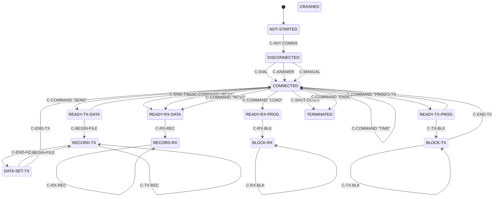

# Commstar link and session protocol

## Scope and implementation status

The Micronic 1000 external link is a byte-latch transport to a link controller
associated with two IR ports. This page states what a host-side program **may
rely on** at the M1000-facing latch boundary and what remains blocked for a
physical server.

**A historically interoperable Commstar server cannot yet be built from this
document, but the frame and object formats are largely recovered.** The logical
frame envelope, the request/response object grammar, and the program-data block
format are established from traces against real firmware. Both directions now
run end to end against real firmware in the emulator. What is missing is the
return-side handshake, a physical validation of the timed receive-arm fallback,
and the meaning of several object fields. Nothing here is proven against a
historical adapter or plinth.

| Layer | Stability | Guidance |
|---|---|---|
| Z80-to-controller register protocol | **Stable** | Safe to emulate against the latch contract below |
| Controller byte transaction | **Provisional** | Ordering is stable; electrical bit meanings are not |
| Validated frame envelope | **Provisional** | Length, type, sequence, and target-id fields are stable; other bytes are not |
| Session request/response objects | **Provisional** | Envelope and length fields are consistent; several field meanings are open |
| Program-data block format | **Provisional** | Marker and length fields are confirmed; measured host-to-handheld maximum is 126 data bytes |
| Handheld-to-host data in requests | **Provisional** | Handheld sends objects at states `0006` (`LINK-CONFIG`) and `0045` (`BLOCK-OUT`) |
| Handheld-to-host RECORD transfer | **Provisional** | Stream format is `[u8 namelen][name] (1Eh [record])* 1Ch` |
| IR wire framing | **Provisional** | Outbound 8192-bit/s capture supports `81h` delimiter interpretation; return handshake and FCS remain open |

> Emulator achievements, synthetic-peer oracle/timing provenance and
> evidence: see
> [`re-notes/commstar-evidence.md#scope-and-implementation-status`](../re-notes/commstar-evidence.md#scope-and-implementation-status).

### Server implementer summary

| Goal | Stability | Boundary |
|---|---|---|
| Model the M1000-facing `4Ah-4Fh` latches | **Provisional** | Emulator or controller model, not a physical adapter |
| Run the synthetic Load/Run peer | **Provisional** | Works with diagnostic oracle or tested 500 ms delay |
| Drive a COM/DIP download against real firmware | **Provisional** | Works in the emulator with timed arm policy |
| Download a COM/DIP image from a physical server | **Not implementable** | Blocked on return wire handshake and full received-frame link id |
| Receive data a handheld sends in a request | **Provisional** | `CommstarPeer` receives objects at states `0006` (`LINK-CONFIG`)/`0045` (`BLOCK-OUT`) |
| Receive a RECORD-mode upload | **Provisional** | `CommstarPeer` receives a record verbatim |
| Build the IR adapter hardware | **Not implementable** | Return stimulus that clears the controller handshake remains open |

> Regression and diagnostic-oracle details: see
> [`re-notes/commstar-evidence.md#server-implementer-summary`](../re-notes/commstar-evidence.md#server-implementer-summary).

## Roles and byte-level terminology

* **Handheld** — the M1000 firmware and its external-link controller.
* **Server** — an external system that would exchange data through an IR
  adapter. No interoperable server exists yet.
* **Synthetic peer** — the emulator component that feeds the controller
  receive latch and observes firmware internals.
* **Wire bytes** — bits and reconstructed bytes on the physical IR interface.
* **Controller-queue bytes** — bytes supplied to the `LINK_RXD` latch by the
  synthetic peer.
* **Logical-frame bytes** — the counted buffer validated by the frame header
  check.

`u16` denotes a little-endian 16-bit field; bare hex pairs are literal bytes
in transmission order.

The two IR ports are **V24 ADAPTOR (top)** and **PLINTH (back)**. Wire-ID bit 5
clear selects the top V24 state: `LINK_CTRL` bit 1 and port `2Ch` bit 5 are
set. The complementary state is **LIKELY** the back PLINTH state. The 8-contact
side port is the barcode-reader front end and is not part of this transport —
see [Barcode reader](../reference/barcode.md).

> Owner-confirmation provenance: see
> [`re-notes/commstar-evidence.md#roles-and-byte-level-terminology`](../re-notes/commstar-evidence.md#roles-and-byte-level-terminology).

## Layer model

```text
Commstar application/session          Provisional: object grammar; field meanings open
        │
Logical frame                         Provisional: length, type, sequence, id
        │
Controller queue / byte transaction   Provisional at M1000 boundary
        │
4Ah-4Fh controller interface          Stable as latch addresses
        │
IR wire layer and connector selection  Provisional: outbound captured; return handshake open
```

The controller interface is a byte-latch transport, not an SCC/SIO/ADLC.
Firmware writes outgoing data at `LINK_TXD` (`4Dh`), reads incoming data at
`LINK_RXD` (`4Eh`), polls `LINK_STATUS` (`4Bh`), and drives `LINK_CTRL`
(`4Ah`). `LINK_CMD` receives `81h` during the ready handshake.

## Controller transaction

The M1000 drives `LINK_CTRL` and polls `LINK_STATUS` through a fixed ordering.
No electrical names for status or control bits are proven.

### How the IR hardware works

The handheld does not drive the IR line directly. It talks to its link
controller through six latches (`4Ah`-`4Fh`), and the controller serialises
the data onto two IR emitters. The latch transaction is defined below. How a
far end completes the return handshake remains open.

A transfer is a handshake, not a stream:

1. **Open.** Select the port (`LINK_CTRL` bit 1, from the active link id),
   pulse `XFREN`, and clear `DIREN`.
2. **Present.** Poll `TXRDY`, then write `81h` to `LINK_CMD`.
3. **Address.** Write the low five bits of the link id to `LINK_TXD` as a
   prelude, outside the frame's own byte count.
4. **Turn the line.** Wait for `RXBUSY` to clear, raise `STROBE` and `DIREN`,
   wait, drop `STROBE`, then wait for `HSBUSY` to clear.
5. **Stream.** Each payload byte is written to `LINK_TXD` only while `TXRDY`
   is asserted, with a per-byte timeout.
6. **Close.** `DIREN` and `XFREN` are cleared.

Receiving inverts steps 1-4 and then reads `LINK_RXD` while `RXRDY` is
asserted. The whole receive status is fetched once and shifted.

The practical consequence is that this is a half-duplex, credit-based byte
pump. The handheld will not transmit while the controller says it has inbound
data, and it will not send a byte until the controller says it can take one.

> Capture provenance and open questions: see
> [`re-notes/commstar-evidence.md#how-the-ir-hardware-works`](../re-notes/commstar-evidence.md#how-the-ir-hardware-works).

### The transmit transaction, decoded

`Link_BlockTx` is the handheld-to-controller transmit path. In order:

1. Select the IR port from wire-ID bit 5 via `Link_PortSelect`.
2. Clear `RXARM`; toggle `LINK_CTRL` bits 0 and 4 with a short delay.
3. Poll `TXRDY` and write `81h` to `LINK_CMD` — the controller's "are you
   there" exchange. Timeout → `EBh`.
4. Write the prelude `link id & 1Fh` to `LINK_TXD`. This byte is excluded
   from the frame length and the controller may or may not forward it onto
   the IR line (OPEN — depends on the controller).
5. Handshake on `RXBUSY`/`HSBUSY` via `LINK_CTRL` bits 5/4. Timeout → `EBh`/`EEh`.
6. Stream payload bytes: each byte to `LINK_TXD` gated by `TXRDY`. Timeout →
   `EEh`.
7. Clear `LINK_CTRL` bits to idle. Final status bit 5 set → `ECh`; success
   returns `A = 0`, carry clear.

There is no checksum in this layer — no accumulating `XOR`/`ADD` in either
`Link_BlockTx` or `Link_BlockRx`. There is no FCS to validate or to add.

> Full ROM listing and byte-verification: see
> [`re-notes/commstar-evidence.md#the-transmit-transaction-decoded`](../re-notes/commstar-evidence.md#the-transmit-transaction-decoded).
> Prelude forwarding and checksum absence argument: see
> [`re-notes/commstar-evidence.md#what-this-settles`](../re-notes/commstar-evidence.md#what-this-settles).

### Timing budget

Three timeout constants, counted in `DEC DE` spin loops on a **3.6864 MHz**
Z80:

| Where | Count | Loop | Waiting for | Deadline |
|---|---|---:|---|---:|
| `Link_WaitReady` | `02DAh` = 730 | 49 T | `TXRDY` | **9.70 ms** |
| handshake | `026Ch` = 620 | 59 T | handshake response | **9.92 ms** |
| per-byte | `06F9h` = 1785 | 51 T | readiness for next payload byte | **24.69 ms** |

Plus fixed `DJNZ` settling delays. These are the numbers an adapter has to
beat. An adapter that bridges to a host over USB should service the latch
handshake locally rather than round-tripping each byte.

> Cycle-count derivation and prior-clock correction: see
> [`re-notes/commstar-evidence.md#timing-budget`](../re-notes/commstar-evidence.md#timing-budget).

### The receive transaction, decoded

`Link_BlockRx` is the mirror. The receive status register `4Bh` decodes as:

| Bit | Meaning on receive |
|---|---|
| 0 | a byte is waiting in the data-in latch |
| 1 | end of frame |
| 2 | one further byte to take |
| 3 | the controller reports an error |

The payload loop reads with `INI` from `4Eh` gated by status bit 0. After the
block is drained, status bit 2 gates a single extra `INI` — this is what the
two "trailing excluded bytes" in captures are: not part of the counted frame,
signalled out of band. The frame's own length field never covers them.

The per-byte timeout is the same `06F9h` = 1785; failure code is `EEh`.

> Full listing and trailing-byte interpretation: see
> [`re-notes/commstar-evidence.md#the-receive-transaction-decoded`](../re-notes/commstar-evidence.md#the-receive-transaction-decoded).

### The command and probe latches

`LINK_CMD` (`4Ch`) has exactly one writer and exactly one value: **`81h`**
(the fixed "begin" token). `LINK_PROBE` (`4Fh`) is computed as `7Fh AND 1Fh
→ 1Fh`, addressing id `7Fh` — the same constant the handheld writes at frame
offset +4. Whether `7Fh` means broadcast or unassigned is OPEN, but it is
used as an id in at least one place.

> Writer search and listing: see
> [`re-notes/commstar-evidence.md#the-command-and-probe-latches`](../re-notes/commstar-evidence.md#the-command-and-probe-latches).

## What the status and control bits do

Electrical names remain unproven, but each bit's role is recoverable from the
branch it drives — and that is what a controller model must reproduce.

`LINK_STATUS` (`4Bh`), read by the handheld (names **INFERRED**):

| Bit | Inferred name | Role | Required of a controller model |
|---:|---|---|---|
| 0 | `RXRDY` | A received byte is available | Assert while bytes remain |
| 1 | `RXEND` | Block finished, status valid | Assert once the block is drained |
| 2 | `RXTAIL` | One further byte to take | Assert to have exactly one extra byte read |
| 3 | `RXERR` | Transfer failed | Assert to fail with `ECh` |
| 4 | `RXBUSY` | Inbound data pending | Must be **clear** before transmitting |
| 5 | `TXERR` | Error latch, sampled at end of transmit | Leave clear; set yields `ECh` |
| 6 | `HSBUSY` | Handshake busy | Must go **clear** to complete handshake |
| 7 | `TXRDY` | Ready to accept a transmit byte | Assert; polled before every `LINK_TXD` write |

The receive decode shifts one status byte read once at `ROM00:33CF` (bits 0-3
in order), not four separate polls.

`LINK_CTRL` (`4Ah`), driven by the handheld:

| Bit | Inferred name | Role |
|---:|---|---|
| 0 | `XFREN` | Transfer active |
| 1 | `PORTSEL` | Port select, driven from active-link-ID bit 5 |
| 4 | `DIREN` | Direction/enable |
| 5 | `STROBE` | Strobe |
| 6, 7 | `RXARM` | Receive-armed, driven as a pair |

## The receive-armed handshake

`RXARM` (`LINK_CTRL` bits 6+7) tells the controller the handheld is ready to
be given data. The interrupt poll at `ROM00:31B6` is the mechanism: an idle
handheld sits with `RXARM` set; a controller asserting `RXBUSY` clears it and
dispatches the receive. `Link_BlockTx` also clears `RXARM` before
transmitting.

For a physical adapter: **`RXARM` set means the handheld is listening.**

**Transmit ordering (stable as latch sequence):**

1. Port-select latch follows active-link-ID bit 5.
2. Toggle `LINK_CTRL` bits around a short delay.
3. Poll `LINK_STATUS` bit 7 and write `0x81` to `LINK_CMD` when ready.
4. Write low five bits of link id (`link_id & 1Fh`) to `LINK_TXD` as prelude.
5. Handshake on `LINK_STATUS` bits 4 and 6 via `LINK_CTRL` bits 5/4.
6. Stream payload bytes to `LINK_TXD` gated by bit 7.
7. Clear `LINK_CTRL` bits to idle.

**Turn-taking rule (provisional):** the synthetic peer asserts `LINK_STATUS`
bit 4 while inbound bytes remain; a controller model must drain and deassert
before the next M1000 transmission. This is a latch constraint, not a proven
half-duplex wire rule.

**Receive ordering (provisional):** clear bit 0, set bit 5, single read from
`LINK_RXD`, set bit 4 with delay, clear bit 5, then continue reading while
status bit 0 is set. Bits 1-3 participate in the decode. Cleanup toggles bit
1, sets then clears bit 0, and clears bit 4.

An adapter emulator must model the stateful handshake, not merely present a
flat byte stream.

> Interrupt disassembly, polling-rate and synthetic-peer experiments: see
> [`re-notes/commstar-evidence.md#the-receive-armed-handshake`](../re-notes/commstar-evidence.md#the-receive-armed-handshake).

## Validated frame envelope

| Offset | Size | Field | Stability |
|---:|---:|---|---|
| 0 | 2 | total received length (`u16le`) — must equal byte count | **Stable** |
| 2 | 1 | frame type — values 2, 3, 4 are dispatched | **Provisional** |
| 3 | 1 | per-link sequence — compared with per-link slot | **Provisional** |
| 4 | 1 | active link id — equality-checked on receive | **Stable** |
| 5 | 1 | unread by examined ROM link code | **Not implementable** |
| 6 | n | session payload — request/response object, see below | **Provisional** |

Validation rejects frames shorter than six bytes, frames whose embedded length
differs from the received count, and frames whose byte 4 differs from the
active link id. The TX path writes `0x7F` at offset 4; the RX path requires
offset 4 to equal the link id. No checksum is examined.

For descriptor shapes see
[RE notes: Commstar evidence](../re-notes/commstar-evidence.md#validated-frame-envelope).

## Externally observable subset

From M1000 traffic alone an observer can obtain the controller prelude `id &
1Fh` (five bits), the length at offset +0, type at +2, and sequence at +3. It
cannot obtain the full eight-bit link id, which a server must reproduce at
offset +4. Captured length is `1 + u16le(tx[1:3])` including the prelude.

| Link id bits | Observable from wire? | Source |
|---|---|---|
| 0-4 | Yes | Controller prelude |
| 5 | No | Port select; clear is top V24, set is LIKELY back PLINTH |
| 6-7 | No | Never transmitted; two samples are not a rule |

The remaining bits and the per-link sequence slot are not directly visible.
No connector signal for the fresh program-receive arm is known.

> Raw harness captures: see
> [`re-notes/commstar-evidence.md#captured-m1000-session-requests-controller-boundary-tx`](../re-notes/commstar-evidence.md#captured-m1000-session-requests-controller-boundary-tx).

## Request and response object format

Every captured exchange fits one grammar. **Provisional** — shapes hold across
all captures, but field meanings beyond the envelope are stated separately.

A type-1 request payload is three `u16` fields, optionally followed by an
object:

```text
frame:   [u16 length][u8 type=1][u8 seq][u8 7F][u8 00] payload
payload: [u16 state][u16 arg][u16 count] object[count]
```

The first two rows are the initial and second requests of a session; the
rest are illustrative wire states.

| Wire state | Label | length | arg | size | object | size = object length? |
|---|---|---:|---:|---:|---:|---|
| `0x00` | `LINK-INIT` | 12 | 0 | `0000` | 0 | yes |
| `0x06` | `LINK-CONFIG` | 21 | 0 | `0080` | 9 | **no** |
| `0x61` | `CONNECT-ANSWER` | 12 | 0 | `0000` | 0 | yes |
| `0x64` | `BEGIN-TX` | 12 | 0 | `0000` | 0 | yes |
| `0x45` | `BLOCK-OUT` | 66 | 1 | `0036` | 54 | yes |
| `0x44` | `BLOCK-IN` | 12 | 0 | `00FF` | 0 | **no** |

The third `u16` is a size field whose role is state-dependent. It equals the
trailing object length for states `00` (`LINK-INIT`), `45` (`BLOCK-OUT`), `61` (`CONNECT-ANSWER`), `64` (`BEGIN-TX`) (state-45 confirms
54 = 66 − 12). It does not for states `06` (`0x0080` with nine bytes) or `44`
(`0x00FF` with none) — those solicit data from the peer, so a
requested-maximum reading fits but is not proven.

A type-2 response payload takes one of two shapes:

```text
control ack:  [u8 00]
data object:  [u16 status][u16 marker][u16 N] data[N] [u16 00]
```

| Response | Label | length | status | marker | N |
|---|---|---:|---:|---:|---:|
| Control | `CONNECT-ANSWER`/`BEGIN-TX`/`BLOCK-OUT` | 7 | — | — | single `00` byte |
| Control object (state `0x44`) | `BLOCK-IN` | 20 | 0 | 1 | 6 |
| Program data chunk | — | variable | 0 | 0 or 1 | payload bytes |

`marker` 0 permits another refill; `marker` 1 ends the stream. `N` matched the
data length exactly in every captured object.

## The wire states

The `state` field in a type-1 request is set by `Session_SetParams` and has
twelve call sites, so the complete set of wire states is enumerable:

> **Label column.** The labels in this table are **documentation-assigned
> convenience names**, not ROM strings or firmware vocabulary. The firmware's
> only names are the [session-state names](#the-firmwares-own-state-names)
> and the [command names](#the-firmwares-own-command-names).

| State | Label | Routine | Payload | Meaning |
|---|---:|---|---|---|
| `0000` | `LINK-INIT` | `5B79` | none | link init |
| `0006` | `LINK-CONFIG` | `5BF7`, `5CD7` | up to 128 | link configure, from `C-INIT-COMMS` |
| `0043` | `BLOCK-QUERY` | `62C7` | none | short query preceding `0044` |
| `0044` | `BLOCK-IN` | `620B`, `62C7` | up to 128 | data block **in** |
| `0045` | `BLOCK-OUT` | `612A` | variable | data block **out** |
| `0060` | `CONNECT-DIAL` | `5E2A` | variable | connect: **dial** (link type 6 only) |
| `0061` | `CONNECT-ANSWER` | `606C` | none | connect: **answer** |
| `0062` | `CONNECT-DIRECT` | `5DFD` | none | connect: **direct** (seen in every IR capture) |
| `0064` | `BEGIN-TX` | `60D6` | none | begin transmission |
| `0065` | `END-TX` | `5BA6` | none | end of transaction |

`Session_TxFrameAndRx` (`ROM00:5B79`) is the `LINK-INIT` (`0000`) exchange that both
`LINK-CONFIG` (`0006`) builders call first. A nonzero result aborts the enclosing
builder.

**`CONNECT-DIRECT` (`0062`) is the direct-connection substitute for dialling.** `ROM00:5DFD` is
identical to the `END-TX` (`0065`)/`LINK-INIT` (`0000`) routines but for the one immediate: a bare
six-byte control frame. It is what `C-DIAL`/`C-ANSWER` send when the link type
is not 6, and what `C-MANUAL` sends unconditionally. Only when the link type
is 6 (a modem) do `C-DIAL`/`C-ANSWER` take the `CONNECT-DIAL` (`0060`)/`CONNECT-ANSWER` (`0061`) paths. Since an IR
link is never type 6, **a peer for real hardware should expect `CONNECT-DIRECT` here and
never `CONNECT-DIAL`.**

`END-TX` (`0065`) is emitted at the tail of every data routine, so a peer sees it after
each exchange.

**The `BLOCK-OUT` (`0045`) arg field is a last-block marker.** It is 0 when the frame comes
from the automatic 128-byte flush and 1 from the explicit end-of-transmission
flush. A 200-byte record is segmented into two frames: `arg=0 len=128` then
`arg=1 len=83`. **Frames carry no internal headers** — concatenating them
reproduces the byte stream. A peer reassembles by plain concatenation and
knows the transfer is complete when it sees `arg = 1`.

> Call-site enumeration and measured transcripts: see
> [`re-notes/commstar-evidence.md#the-wire-states`](../re-notes/commstar-evidence.md#the-wire-states).

### <a id="state-45-object-layout"></a>Wire-state-0x45 (`BLOCK-OUT`) object layout

The 54-byte object is the **command record**, assembled at `ram:E492` and
transmitted whole by `C-COMMAND` (wire state `0x45` (`BLOCK-OUT`)). **Stable as measured**
and field-for-field confirmed against the ROM:

| Object | Frame | Size | Field | Encoding |
|---:|---:|---:|---|---|
| +0 | +12 | 8 | identity (opaque) | `ram:E6D0`; caller-supplied, NUL-terminated |
| +8 | +20 | 6 | identity (opaque) | `ram:E6E8`; caller-supplied, NUL-terminated |
| +14 | +26 | 4 | **operation name** | `LOAD`, `SEND`, etc. |
| +18 | +30 | 8 | **workstation number** | **right-justified, space-padded** |
| +26 | +38 | 8 | identity (opaque) | `ram:E6C4`; caller-supplied, NUL-terminated |
| +34 | +46 | 8 | identity (opaque) | `ram:E6D9`; caller-supplied, NUL-terminated |
| +42 | +54 | 12 | **command parameter** | **left-justified, NUL-padded**; program name |

Workstation `ABC` serialises as `20 20 20 20 20 41 42 43`, program name `XY`
as `58 59 00 00 00 00 00 00`. The operation-name field varies by
`C-COMMAND`'s first argument (`RCV1`, `RCV2`, `SEND`, `LOAD`, `PROG`, `TIME`,
`ENDC` — see [How READY-RX-PROG, READY-TX-DATA and READY-TX-PROG are entered](#how-ready-rx-prog-ready-tx-data-and-ready-tx-prog-are-entered)).
The four identity fields are latched by `C-INIT-COMMS` from the V24 Log-on
form buffers and are empty in Load/Run traces (the form is not filled).
Sources and readings are on the
[Commstar API page](../reference/commstar-api.md#c-init-comms): `+0` = Group id
(`ram:ECAB`), `+8` = vestigial blank (`ram:D120`), `+26` = User id (`ram:EC99`),
`+34` = Password (`ram:ECA2`) — the ROM's own `g_acLogon*` labels, CONFIRMED.

> Variation experiments and assembly provenance: see
> [`re-notes/commstar-evidence.md#state-45-object-layout`](../re-notes/commstar-evidence.md#state-45-object-layout).

### Frame sequence numbers and duplicate suppression

The link layer keeps **one sequence byte per peer**, in a 64-entry table at
`ram:FE43` initialised to `01`. The index is the low six bits of the peer's
link id (`fdd4 & 3Fh`).

| Received sequence | Result |
|---|---|
| equals expected | accepted normally |
| equals **expected − 1**, and link state is 2 | treated as a **retransmission** |
| anything else | **error `01EF`** |

#### Why a host implementer must care

The handheld retries a request up to 50 times and a reply up to 20. When a
reply goes missing it resends the same frame with the same sequence number. A
host must therefore **echo sequence numbers rather than inventing them** and
**be idempotent on a repeat** — the same sequence twice means the handheld did
not see your answer.

`CommstarPeer` echoes request sequences and now caches outstanding exchanges.
A repeated unacknowledged request replays its reply without invoking the
application policy again; duplicate acknowledgements replay completion
without advancing the download. A sequence can be reused after its exchange
is acknowledged. Regression tests cover lost replies/completions, conflicting
reuse and sequence wrap. This fixes the defect reproduced in the
[2026-09-22 audit](../research/reviews/ir-protocol-audit-2026-09-22.md#4-the-session-peer-is-not-retry-safe);
it does not establish electrical return-frame acceptance.

> Table initialisation and branch listing: see
> [`re-notes/commstar-evidence.md#frame-sequence-numbers-and-duplicate-suppression`](../re-notes/commstar-evidence.md#frame-sequence-numbers-and-duplicate-suppression).

## Who starts a session

**The handheld does, always.** A Commstar server is purely reactive.

`C-COMMAND` is a generator, not a parser: it assembles the 54-byte command
record and transmits it, then looks at the reply. There is no inbound decode
in the routine.

> Routine-address proof: see
> [`re-notes/commstar-evidence.md#c-command-is-a-generator-not-a-parser`](../re-notes/commstar-evidence.md#c-command-is-a-generator-not-a-parser).

### The receive path is always armed, but dead-ends

The handheld will take bytes at any time via the interrupt poll at
`ROM00:31B6` (`RXARM` management), with no session-state test. What an
unsolicited frame cannot do is reach the session layer: the only
continuation an inbound frame can vector into is one the handheld installed
when it began its own request (`ram:FDD2`).

> Interrupt-table and computed-jump proof: see
> [`re-notes/commstar-evidence.md#the-receive-path-is-always-armed-but-dead-ends`](../re-notes/commstar-evidence.md#the-receive-path-is-always-armed-but-dead-ends).

### `C-ANSWER` is not a listen primitive

It reads `ram:E520` and dispatches: link type 6 sends wire state `0061` (`CONNECT-ANSWER`),
anything else sends `CONNECT-DIRECT` (`0062`). Either way the handheld transmits.

### What a host can do

* **Be ready and answer.** The signal is `LINK_CTRL` bits 6+7 (`RXARM`)
  **set** — the handheld is listening.
* **Take a reasonable time.** The handheld retries a request up to `32h` = 50
  times and a reply up to `14h` = 20 times. Miss the window and the operator
  sees `Plinth not connected.`
* **Serve any operation.** The handheld names it; the host reacts.

### Do not send unsolicited frames

**LIKELY.** With the link idle, an unsolicited frame whose length and id
match may be accepted, but a frame of a type other than 2 or 3 that reaches
`JP (HL)` through `FDD2` (which is `0000` on a cold machine) lands on the
reset vector. Type 2 is the safe one: it draws a three-byte reply and moves
the link state to 3, nothing more. **A host should send only solicited
frames.**

> Cold-RAM jump-path argument: see
> [`re-notes/commstar-evidence.md#do-not-send-unsolicited-frames`](../re-notes/commstar-evidence.md#do-not-send-unsolicited-frames).

### There is no Plinth detection

`Plinth not connected.` is not a detection result — the handheld prints it
when the peer fails to answer its link-configure request, whatever is
physically attached. `Link_Probe` returns a status byte but both callers
discard it; it is a cold-boot reset.

Plinth versus V24 is a **menu choice**, not a detection. There is no
electrical connector to detect: both are IR ports. `Link_BlockTx` routes on
**bit 5 of the link id** via `Link_PortSelect`, which drives `LINK_CTRL`
bit 1 and port `2Ch` bit 5 together:

| `fdd4` wire ID | wire-ID bit 5 | `LINK_CTRL` bit 1 | port `2Ch` bit 5 |
|---|---:|---:|---:|
| `43h` | **clear** | **set** | **set** |
| `63h` | **set** | **clear** | **clear** |

More generally, the `43h` path applies `LINK_CTRL = old | 02h` and
`2Ch = (old & FCh) | 20h`; the `63h` path applies `LINK_CTRL = old & FDh`
and `2Ch = old & DCh`.

**CONFIRMED for the top window:** selecting V24 ADAPTOR and capturing at the
top window used `fdd4=43h` — so wire-ID-bit-5-clear drives the top V24 window.
The complementary state is **LIKELY** the back PLINTH window by elimination.

> Listings, device-table archaeology and correction history: see
> [`re-notes/commstar-evidence.md#there-is-no-plinth-detection`](../re-notes/commstar-evidence.md#there-is-no-plinth-detection).

## Session states

### The firmware's own state names

`ROM00:6A4A` is a table of 16 pointers to display strings — the firmware's own
vocabulary:

| Index | Name | Index | Name |
|---:|---|---:|---|
| 0 | `NOT-STARTED` | 8 | `BLOCK-RX` |
| 1 | `DISCONNECTED` | 9 | `RECORD-TX` |
| 2 | `CONNECTED` | 10 | `DATA-SET-TX` |
| 3 | `READY-RX-DATA` | 11 | `BLOCK-TX` |
| 4 | `READY-RX-PROG` | 12 | `TERMINATED` |
| 5 | `READY-TX-DATA` | 13 | `CRASHED` |
| 6 | `READY-TX-PROG` | 14 | `REPLY-START` |
| 7 | `RECORD-RX` | 15 | `REPLY-END` |

> ROM-table provenance: see
> [`re-notes/commstar-evidence.md#the-firmwares-own-state-names`](../re-notes/commstar-evidence.md#the-firmwares-own-state-names).

### The firmware's own command names

`ROM00:6B67` is a parallel table of 17 pointers to command-name strings:

| Index | Name | Group |
|---:|---|---|
| 0 | `C-INIT-COMMS` | link setup |
| 1 | `C-DIAL` | link setup |
| 2 | `C-ANSWER` | link setup |
| 3 | `C-MANUAL` | link setup |
| 4 | `C-DROP-LINE` | link teardown |
| 5 | `C-COMMAND` | command exchange |
| 6 | `C-RX-CMD` | command exchange |
| 7 | `C-TX-REPLY` | command exchange |
| 8 | `C-SHUT-DOWN` | termination |
| 9 | `C-RX-REC` | record transfer |
| 10 | `C-RX-BLK` | block transfer |
| 11 | `C-BEGIN-FILE` | file framing |
| 12 | `C-TX-REC` | record transfer |
| 13 | `C-END-FILE` | file framing |
| 14 | `C-TX-BLK` | block transfer |
| 15 | `C-END-TX` | file framing |
| 16 | `C_ABORT` | termination |

Index 16 is verbatim with an underscore. **Neither table's index is a proven
wire value** — do not assume wire `44` is `READY-RX-PROG` from its high nibble.

> Pointer-table proof: see
> [`re-notes/commstar-evidence.md#the-firmwares-own-command-names`](../re-notes/commstar-evidence.md#the-firmwares-own-command-names).

### The four operations

Load/Run is the Commstar session screen. `ROM00:6C8E` holds the four
user-facing operations:

| Operation | Title | In progress | Completion |
|---|---|---|---|
| Data TX | `Data Transmission` | `Sending data` | `Data transmitted` |
| Program TX | `Program Transmission` | `Sending prog` | `Program transmitted` |
| Data RX | `Data Reception` | `Receiving data` | `Data received` |
| Program RX | `Program Reception` | `Receiving prog` | `Program received` |

This lines up with states `READY-TX-DATA`, `READY-TX-PROG`,
`READY-RX-DATA`, `READY-RX-PROG`. The row is selected by `C-COMMAND`'s first
argument (`RCV1`/`RCV2` → Data RX, `SEND` → Data TX, `LOAD` → Program RX,
`PROG` → Program TX).

> Owner-confirmation and call-site provenance: see
> [`re-notes/commstar-evidence.md#the-four-operations`](../re-notes/commstar-evidence.md#the-four-operations).

### The protocol state machine

`ROM00:692A` is a state-transition matrix `table[state * 17 + command]`. Bit 7
marks illegal; `entry & 0x7F` is the next state. The figure is generated from
the ROM by `analysis/decode_state_machine.py --mermaid`:



This diagram uses the firmware's own names. The corresponding numeric
indices are defined in
[The firmware's own state names](#the-firmwares-own-state-names):

| Index | Session state |
|---:|---|
| 0 | `NOT-STARTED` |
| 1 | `DISCONNECTED` |
| 2 | `CONNECTED` |
| 3 | `READY-RX-DATA` |
| 4 | `READY-RX-PROG` |
| 5 | `READY-TX-DATA` |
| 6 | `READY-TX-PROG` |
| 7 | `RECORD-RX` |
| 8 | `BLOCK-RX` |
| 9 | `RECORD-TX` |
| 10 | `DATA-SET-TX` |
| 11 | `BLOCK-TX` |
| 12 | `TERMINATED` |
| 13 | `CRASHED` |
| 14 | `REPLY-START` |
| 15 | `REPLY-END` |

Dashed states have no incoming legal transition in the matrix; the
`C-COMMAND "NAME"` edges are the operation table's direct entries, which
overwrite the matrix result. Two near-universal commands are folded out:
`C-DROP-LINE` is legal from all 14 states returning to `NOT-STARTED`, and
`C_ABORT` reaches `CRASHED` from session states DISCONNECTED through TERMINATED (indices 1–12). `REPLY-START`/`REPLY-END`
are display-only.

A data upload is `C-BEGIN-FILE` → `C-TX-REC` per record → `C-END-FILE` →
`DATA-SET-TX` → `C-END-TX`. A program transfer loops `C-TX-BLK` in `BLOCK-TX`
until `C-END-TX`.

> Table-base and extent proof, generation provenance: see
> [`re-notes/commstar-evidence.md#the-protocol-state-machine`](../re-notes/commstar-evidence.md#the-protocol-state-machine).

### RECORD carries data, BLOCK carries programs

Each of the four transfer operations calls `Session_StartDataMode` and then
loads its own display string:

| Command | Index | Display string |
|---|---:|---|
| `C-RX-REC` | 9 | `Receiving data` |
| `C-RX-BLK` | 10 | `Receiving prog` |
| `C-BEGIN-FILE` | 11 | `Sending data` |
| `C-TX-BLK` | 14 | `Sending prog` |

> Prior-guess history and call-site table: see
> [`re-notes/commstar-evidence.md#record-carries-data-block-carries-programs`](../re-notes/commstar-evidence.md#record-carries-data-block-carries-programs).

### What selects the operation

Three states — `READY-RX-PROG`, `READY-TX-DATA`, `READY-TX-PROG` — have no
incoming legal transition. The only route out of `CONNECTED` via the matrix
is `C-COMMAND` → `READY-RX-DATA`. `C-COMMAND` **overwrites** that staged
state from its own operation table. See
[How READY-RX-PROG, READY-TX-DATA and READY-TX-PROG are entered](#how-ready-rx-prog-ready-tx-data-and-ready-tx-prog-are-entered).

> Writer census: see
> [`re-notes/commstar-evidence.md#what-selects-the-operation`](../re-notes/commstar-evidence.md#what-selects-the-operation).

### What the table permits, and how `C-COMMAND` gets past it

Breadth-first walk of the matrix from `NOT-STARTED` over legal transitions:

| Reachable | Path |
|---|---|
| `DISCONNECTED` | `C-INIT-COMMS` |
| `CONNECTED` | `C-INIT-COMMS` → `C-DIAL` |
| `READY-RX-DATA` | … → `C-COMMAND` |
| `RECORD-RX` | … → `C-RX-REC` |
| `TERMINATED` | `C-INIT-COMMS` → `C-DIAL` → `C-SHUT-DOWN` |
| `CRASHED` | `C-INIT-COMMS` → `C_ABORT` |

Not reachable through the table: `READY-RX-PROG`, `READY-TX-DATA`,
`READY-TX-PROG`, `BLOCK-RX`, `RECORD-TX`, `DATA-SET-TX`, `BLOCK-TX`. The only
complete transfer reachable by table alone is Data Reception. READY-RX-PROG,
READY-TX-DATA and READY-TX-PROG are entered by `C-COMMAND`'s operation
table; once there, the matrix describes the rest.

> Decoder-script methodology: see
> [`re-notes/commstar-evidence.md#what-the-table-permits-and-how-c-command-gets-past-it`](../re-notes/commstar-evidence.md#what-the-table-permits-and-how-c-command-gets-past-it).

### How READY-RX-PROG, READY-TX-DATA and READY-TX-PROG are entered

`C-COMMAND` is validated normally against the matrix, then sets the resulting
state itself from `ROM00:731B` (`ram:E247`) — seven 6-byte records
`{char name[5]; u8 target_state;}`:

| Index | Name | Target state |
|---|---|---|
| 0 | `RCV1` | 3 `READY-RX-DATA` |
| 1 | `RCV2` | 3 `READY-RX-DATA` |
| 2 | `SEND` | **5 `READY-TX-DATA`** |
| 3 | `LOAD` | **4 `READY-RX-PROG`** |
| 4 | `PROG` | **6 `READY-TX-PROG`** |
| 5 | `TIME` | 2 `CONNECTED` |
| 6 | `ENDC` | 12 `TERMINATED` |

`C-COMMAND`'s first argument is the index (no bounds check). The firmware
itself uses index 3 (`LOAD`) or 4 (`PROG`) at `ROM01:135F`/`1365`; index 2
(`SEND`) is reachable via `ram:EE0C` and has been demonstrated by a loaded COM
uploading a file to session-state sequence `DISCONNECTED → CONNECTED → READY-TX-DATA → RECORD-TX → RECORD-TX → DATA-SET-TX → CONNECTED` (session states 1, 2, 5, 9, 9, 10, 2) with mode 0. The READY-RX-PROG, READY-TX-DATA and
READY-TX-PROG rows are wired as transition sources while having no
incoming cell.

> Copy-descriptor and call-site listings: see
> [`re-notes/commstar-evidence.md#how-states-4-5-and-6-are-entered`](../re-notes/commstar-evidence.md#how-states-4-5-and-6-are-entered).

## Historical server readiness

| Responsibility | Stability | Known | Still blocked |
|---|---|---|---|
| Controller transport | **Provisional** | Latch handshake and validation | Connector timing if hardware required |
| Type-2/3/4 exchange | **Provisional** | Request/reply/completion ordering | Why queue repeats type/sequence |
| Wire states `0x45` (`BLOCK-OUT`), `0x44` (`BLOCK-IN`), `0x61` (`CONNECT-ANSWER`), `0x64` (`BEGIN-TX`) | **Provisional** | Progression to program receive | Historical operation meanings |
| Request/response objects | **Provisional** | Three-`u16` request header, status/marker/length response object, 54-byte `BLOCK-OUT` record | Remaining field meanings |
| V24 form staging | **Provisional** | Buffers reach mode-dependent dispatch | Authentication encoding |
| Program stream | **Provisional** | Inner bytes reach loader unchanged; marker 0/1 delimits stream; max 126 data bytes | Why 126 rather than 128; historical EOF frame |
| Errors, aborts, retries | **Provisional** | Timeouts and a few result codes | Application-visible grammar |
| Physical port | **Provisional** | Wire-ID bit 5 clear → top V24 | Direct observation of complementary state at back PLINTH |

## Diagnostic reference

Firmware-observed results, not a server error protocol:

| Result | Context | Implication |
|---|---|---|
| `EBh` | Pre-payload ready wait expires | Queue/turn-taking prevented TX |
| `ECh` | Final status bit 5 set | Status-bit meaning is open |
| `EDh` then `0x1F76` Line failure | 16-byte type-4 queue exhausts fixed descriptor | Use only six-byte type-4 shape |
| `EEh` | Per-byte wait fails | Timing/status condition failed |
| `01EF` | Type-4 sequence mismatch | Sequence lifecycle is open |
| `0x1F75` Invalid reply | Control object not `OK`/`NO`/`DM` | Applies to control caller, not program bytes |
| `0x1FAE` Line failure | Blank V24 form, and synthetic object of 128 data bytes | Cap host objects at 126 data bytes |
| `C-RX-BLK` returns 4 | Every host object silently dropped | An object carried 127+ data bytes |

For the evidence and next captures that would unblock a server, see
[RE notes: Commstar evidence](../re-notes/commstar-evidence.md#blocking-evidence)
and [RE notes: Open questions](../re-notes/open-questions.md).

## Appendix: session mode `ram:E48D` — summary

The session mode at `ram:E48D` is a caller-supplied parameter owned by the
[Commstar application API](../reference/commstar-api.md#suppressing-validation).
Mode 0 validates every command and transmits; mode 1 still validates but
suppresses transmission for three commands; mode 2 suppresses validation
entirely. A real session uses mode 0.

> Writers and reachability: see
> [`re-notes/commstar-evidence.md#rame48d-the-session-mode`](../re-notes/commstar-evidence.md#rame48d-the-session-mode).
> Link-type `ram:E520` (4 = IR, 6 = modem): see
> [`re-notes/commstar-evidence.md#rame520-the-link-type`](../re-notes/commstar-evidence.md#rame520-the-link-type).

## Appendix: captured M1000 session requests — summary

One worked type-1 request (from the V24 mode-1 capture) is shown in the
[Request and response object format](#request-and-response-object-format)
grammar above. The full captured set is evidence, not part of this protocol
contract.

> Raw harness captures and byte tables: see
> [`re-notes/commstar-evidence.md#captured-m1000-session-requests-controller-boundary-tx`](../re-notes/commstar-evidence.md#captured-m1000-session-requests-controller-boundary-tx).

## Appendix: entry points used by the firmware

The shipped firmware only completes Program Reception via `C-RX-BLK`; transmit
primitives have no ROM caller and are application-facing. Catalogue is owned
by the [Commstar application API](../reference/commstar-api.md).

> Image-search reachability: see
> [`re-notes/commstar-evidence.md#which-entry-points-the-firmware-itself-uses`](../re-notes/commstar-evidence.md#which-entry-points-the-firmware-itself-uses).
> End-to-end state-machine confirmation: see
> [`re-notes/commstar-evidence.md#end-to-end-confirmation-of-the-state-machine`](../re-notes/commstar-evidence.md#end-to-end-confirmation-of-the-state-machine).
