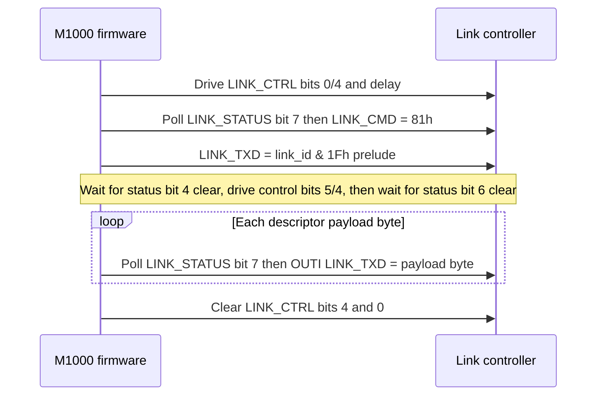

# Commstar link and session protocol

## Scope and implementation status

This is the normative record of what the firmware establishes about the
Commstar external link. It deliberately separates the controller-facing
transport from the higher-level session protocol: the former is sufficiently
known to model, while the latter is not yet sufficient to reimplement a file
transfer peer.

| Layer | Status | Implementation guidance |
|---|---|---|
| Z80-to-link-controller register protocol | **CONFIRMED** | Safe to emulate against the firmware. |
| Link-controller byte transaction | **CONFIRMED** in the M1000 direction | Use the strobe, status, and timeout rules below. |
| Validated frame envelope | **CONFIRMED** in part | Preserve the length and target-id fields; do not invent missing fields. |
| Session commands and replies | **PARTIAL** | Do not claim command names or payload formats from display strings. |
| RECORD/BLOCK file transfer | **OPEN** | Requires a live Commstar or hardware capture. |

The owner confirms that the two IR connectors are **V24 ADAPTOR (top)**
and **PLINTH (back)**. Firmware selects one of two line states using bit 5
of the active link id, but does not identify which bit value maps to which
physical connector. The 5-pin side port is the barcode-reader front end;
it is not part of this transport. See
[the barcode-reader guide](../manual/barcode-reader.md).

## Layer model

```text
Commstar application/session          OPEN: command and payload grammar
        │
Validated link frame                  partial: length, type, sequence, id
        │
Byte transaction / controller strobes CONFIRMED
        │
4Ah-4Fh controller interface          CONFIRMED
        │
IR connector selected by link-id bit5 owner-labelled, polarity OPEN
```

The controller interface is a byte-latch transport, not an SCC, SIO, or
ADLC. The firmware writes outgoing data at `LINK_TXD` (4Dh), reads incoming
data at `LINK_RXD` (4Eh), polls `LINK_STATUS` (4Bh), and drives
`LINK_CTRL` (4Ah). `LINK_CMD` receives `81h` during the present/ready
handshake. The exact register catalogue is in
[the I/O map](../internals/io-map.md).

## Controller transaction

LinkBlockTx (ROM00:3277-3377) and LinkBlockRx (ROM00:3378-3453) mechanically
drive `LINK_CTRL` (4Ah) and poll `LINK_STATUS` (4Bh). **No electrical names
for status or control bits are proven** — the descriptions below list only the
bit numbers polled/driven and the timeout constants observed in the bytes.

### Transmit

**CONFIRMED:** `LinkBlockTx` (ROM00:3277-3377) ordered controller-facing
sequence (byte-verified):

1. Clear `LINK_CTRL` bit 0, set `LINK_CTRL` bit 0, clear `LINK_CTRL` bit 4;
   `B=0x80` DJNZ delay.
2. `LinkPresent` then `LinkWaitReady`: each polls `LINK_STATUS` bit 7 with
   timeout `DE=0x02DA`; the first successful wait writes `0x81` to
   `LINK_CMD` (4Ch).
3. Write low five bits of input `A` (held in `C`, `link_id & 1Fh`) to
   `LINK_TXD` (4Dh) as a controller prelude. This byte is not part of the
   in-memory frame descriptor payload.
4. Wait for `LINK_STATUS` bit 4 to clear (`DE=0x026C` timeout → `EBh`);
   then set
   `LINK_CTRL` bit 5, set `LINK_CTRL` bit 4; `B=0x20` DJNZ delay; clear
   `LINK_CTRL` bit 5; wait for `LINK_STATUS` bit 6 to clear
   (`DE=0x026C` timeout → `EEh`).
5. Stream descriptor payload bytes: each `OUTI` to `LINK_TXD` is gated by
   `LINK_STATUS` bit 7 with per-byte timeout `DE=0x06F9` (timeout → `EEh`).
6. Cleanup: clear `LINK_CTRL` bit 4, clear `LINK_CTRL` bit 0 before returning.

The payload source is a **descriptor list** in RAM. Each four-byte entry is
`{ count_lo, count_hi, ptr_lo, ptr_hi }`; `LinkReadBufferDescriptor`
(ROM00:3508) advances to the next entry until a zero count terminates the
list. These descriptors are not transmitted.

The diagram below is the confirmed controller-facing transmit ordering. It is
not a Commstar session exchange and makes no claim about the external
controller's electrical timing or the meaning of any status/control bit beyond
the mechanical poll/drive listed above.



### Receive

**CONFIRMED:** `LinkBlockRx` (ROM00:3378-3453) mechanically drives
`LINK_CTRL` and polls `LINK_STATUS`; no electrical names for status or control
bits are proven. Byte-verified sequence: clear `LINK_CTRL` bit 0, set
`LINK_CTRL` bit 5, single `IN` from `LINK_RXD` (4Eh), set `LINK_CTRL` bit 4,
`B=0x20` DJNZ delay, clear `LINK_CTRL` bit 5; then `INI` from `LINK_RXD`
only while `LINK_STATUS` bit 0 is set. If bit 0 is clear, bit 1 set continues
to bits 2/3 decode while bit 1 clear waits/retries with `DE=0x06F9`; bit 2 set
performs an extra `INI`; bit 3 set returns `EC`. Cleanup toggles
`LINK_CTRL` bit 1, sets then clears `LINK_CTRL` bit 0, clears `LINK_CTRL`
bit 4, toggles `LINK_CTRL` bit 1.

An adapter emulator must model the stateful handshake, not merely present a
flat byte stream. The current experimental Python model is not a conformance
implementation.

### Probe

**CONFIRMED:** `LinkProbe` starts at ROM00:348A and writes `0x1F` to
`LINK_PROBE` (4Fh) then executes a `LINK_CTRL` latch sequence. The
physical or reset effect remains **OPEN**.

## Validated frame envelope

The following is established by `LinkValidateFrameHeader` (ROM00:30DC) and
the receive dispatcher (ROM00:2FBD). It describes the buffer after the
controller has received the prelude and payload; it is not a complete
session-message specification.

| Offset | Size | Field | Status |
|---:|---:|---|---|
| 0 | 2 | Total received length, little-endian | **CONFIRMED**: must equal the received byte count. |
| 2 | 1 | Frame type | **CONFIRMED**: dispatcher tests 2, 3, and 4. |
| 3 | 1 | Per-link sequence | **CONFIRMED**: `LinkProcessCommandFrame` compares it with `FE43h + (fdd4 & 3Fh)` (init 1); mismatch path yields `01EF`. |
| 4 | 1 | Active link id | **CONFIRMED**: `LinkValidateFrameHeader` (ROM00:30DC) XOR-compares byte 4 to `fdd4`. |
| 5 | 1 | Unread by ROM link code | **OPEN**: never read by ROM link code; may be writable by loaded code — do not assume unused. |
| 6 | n | Session payload | **OPEN**: format depends on the runtime session module; the examined ROM transport/header path performs no checksum. |

Validation rejects frames shorter than six bytes, frames whose embedded
length differs from the caller-supplied logical count, and frames whose
byte 4 differs from the active link id (`fdd4`). The comparison is an
equality test implemented with XOR; it is an address filter, not a
checksum. `LinkValidateFrameHeader` does not inspect byte +5.

`LinkFramePrefixWrite` (ROM00:316B) writes TX offsets 0..4 as
`{len LE, type, sequence, 0x7F}` and leaves offset +5 untouched. The
TX offset-4 constant `0x7F` is **SUSPECTED**; do not call it an id or
broadcast. `+5` is untouched by that path.

`LinkProcessCommandFrame` reads byte 3, compares it with the per-link
byte at `FE43h + (fdd4 & 3Fh)` (initialised to 1), and accepts either
the expected value or one behind it in a specific retry state. It does
**not** establish a generic 16-bit command word. Do not encode the
values `{2B,2A,23,03}` as session commands: they belong to a separate
local device-route lookup.

`LinkBlockTx` sends the low 5-bit prelude (`link_id & 1Fh`) before the
descriptor payload; the prelude is excluded from the descriptor byte
count. `LinkBlockRx` on success returns `DE = controller bytes consumed
minus 2`; the identities of those two excluded bytes are **OPEN**.

Descriptor lists (byte-verified, structurally mutable where noted): RX
`FE0E` = `{6 -> FDE4, 3 -> FE38, 0}` (mutable); RX `FE32` =
`{9 -> FE3A, 0}`; TX `FDEA` = `{6 -> FDDE, 0}`. The sequence table is
`FE43h + (fdd4 & 3Fh)`.

`LinkBlockTx` outcomes (CONFIRMED, `A` and carry on return):

* `EBh` — either pre-payload bit-7 wait or the bit-4-clear wait timed out.
* `EEh` — bit-6-clear, per-byte bit-7, or post-payload bit-7
  failure.
* `ECh` — final status bit5 set.
* success `A=00h` carry clear.

Retry scheduler (CONFIRMED): initial `fdd6=32h` / `fdd8=6`, later
`fdd6=14h` / `fdd8=3`; the caller reschedules after `LinkBlockTx`
without testing returned `A`/carry.

## Types, replies, and session state

The receiver dispatches type 2, 3, and 4 differently. The state labels
`CONNECTED`, `READY-RX-DATA`, `RECORD-RX`, `BLOCK-TX`, and related C-*
texts are firmware UI/state vocabulary. They are useful research anchors,
but they are not a wire-command dictionary.

The loaded session module also uses `InlineTableDispatch` (ram:E0B2) for
local control flow. **CONFIRMED:** a CALL is followed by an inline table
with `{count: u16le} {case: u16le, handler: u16le} x count
{default_handler: u16le}`. The dispatcher probes the declared number of
cases, then tail-jumps to the trailing default when none matches. This
mechanism is local module control flow, not evidence that the case values
are wire-command identifiers. Numeric case values observed at `5A69` (abort `44,45,60,61,64`), `53C7` (`0..5`), `5410` (`0,4,8,9`), and `5291` (`0,4,9`) are **CONFIRMED** inline cases — do not name them as wire commands. The table at `6A4A` is **CONFIRMED** as 16 state-display pointers, not a wire map.

The firmware writes these numeric little-endian words into a reply
buffer on seven static paths (treat as numeric words/types, not named
semantic commands unless the bytes prove a meaning):

* `01EE` — attempt exhaustion with `fdd5=1`.
* `02EE` — attempt exhaustion with other state.
* `02E0`, `04E0`, `05E0` — numeric unexpected-type paths.
* `01EF` — type-4 sequence mismatch (per-link sequence at
  `FE43h + (fdd4 & 3Fh)`).
* `03EE` — error/reset path from ROM00:2E72.

The complete reply envelope, payload, and any session meaning remain
**OPEN**. The examined ROM transport/header path has no checksum.
Integrity inside unresolved loaded-session payloads remains **OPEN**.

Consequently, no state diagram or host/peer session sequence is normative
yet. A capture must establish each transition as:

| Current state | Received bytes | Guard | Transmitted bytes | Next state |
|---|---|---|---|---|
| _pending capture_ | | | | |

## Addressing and connector selection

The active link id is retained in `fdd4`.

* Its low five bits are transmitted first as the controller prelude
  (excluded from descriptor counts).
* Its bit 5 selects one of two external link configurations through
  `LinkPortSelect` (ROM00:3454).
* The complete id appears at validated-frame byte 4 (RX offset +4,
  XOR-compared to `fdd4` at ROM00:30DC) and selects a per-link sequence
  slot `FE43h + (fdd4 & 3Fh)` (init 1).

Which polarity maps to owner-confirmed V24 ADAPTOR (top) versus PLINTH
(back) remains **OPEN**. Where the EXT STORAGE ADAPTER attaches also
remains **OPEN**. This does not prove a multidrop physical topology or
address allocation policy; treat those as open hardware questions.

`E701`/`E6FF` are the width-3 decimal RCV1/RCV2 status fields
shown on the session status screen (**CONFIRMED provenance**):
`E701` is a zero-extended snapshot of the received numeric frame type at
`E5BE` before local substitutions (transport error may put `EEh` (238)
there); `E6FF` is the zero-extended received sequence at `E5BF`. They are
displayed as `RCV1`/`RCV2`. Broader UI meaning beyond that display remains
**OPEN**.

## Bounded synthetic session-builder traces (CONFIRMED mechanics only)

Two bounded synthetic traces were captured by calling the session TX
builders with synthetic stack arguments and bypassing only a separate
preflight at `5C1F`/`5D05` (forcing successful `HL=0` at `5C22`/`5D08`).
`E6E6=0` in both traces. The physical low-five-bit prelude
(`link_id & 1Fh`) is excluded from the quoted logical frames. Meanings of
payload constants/fields and complete RECORD/BLOCK/C-COMMAND semantics
remain **OPEN**.

* `g_wSessionDeviceSelector` at `E52E` is a service-33 device selector,
  mapped through `FE83 + selector - 1`; it is **not** logical frame type.
  `g_wSessionTxPayloadLength` at `E530` counts payload bytes starting at
  `E534`; bytes `E532-E533` are skipped. Logical frame type `1` is written
  independently by `ROM00:2F6D`.

* **Trace 4 — Session_TxBlock4 path (CONFIRMED):** synthetic stack args
  `(1,6,22h,33h)`, `E6E6=0`; bypassed only the separate preflight at
  `5C1F` by forcing successful `HL=0` at `5C22`. Payload length `15`;
  payload `06 00 00 00 80 00 00 4C 00 00 22 33 00 00 05`; complete logical
  frame `15 00 01 01 7F 00 06 00 00 00 80 00 00 4C 00 00 22 33 00 00 05`.

* **Trace 5 — Session_TxBlock5 path (CONFIRMED):** args
  `(1,6,1,44h,55h)`, `E6E6=0`; bypassed only the preflight at `5D05` by
  forcing `HL=0` at `5D08`. Payload length `19`; payload
  `06 00 00 00 80 00 01 55 02 00 44 3C 00 00 00 00 00 00 01`; logical frame
  `19 00 01 01 7F 00 06 00 00 00 80 00 01 55 02 00 44 3C 00 00 00 00 00 00 01`.

These traces establish framing mechanics only. The meaning of any payload
constant or field, and the complete RECORD/BLOCK/C-COMMAND session
semantics, remain **OPEN**.

## What is not specified yet

An interoperable Commstar peer still needs captured evidence for:

* the complete session-command table and any command-name mapping;
* every command payload and RECORD/BLOCK format;
* reply-frame envelope and reply payloads (beyond the seven numeric
  words above);
* startup, abort, retry, and completion transitions;
* maximum lengths, framing boundaries, and controller timing on the
  connector-facing side; and
* the physical connector/electrical interface required outside the M1000.

Do not claim a grammar such as `[type][16-bit big-endian command]
[payload]`, symmetric protocol roles, payload checksums, filenames, or
a verified bidirectional Commstar exchange — none are proven for the
examined ROM transport/header path. Until captures exist, an
implementation may emulate the M1000-side register and validator
behaviour, but must not claim Commstar file-transfer compatibility.

## Evidence and next captures

The implementation evidence is in `LinkBlockTx` (ROM00:3277),
`LinkBlockRx` (ROM00:3378), `LinkValidateFrameHeader` (ROM00:30DC),
`LinkProcessCommandFrame` (ROM00:3084), `LinkFramePrefixWrite`
(ROM00:316B), `LinkProbe` (ROM00:348A), and the descriptor helper
(ROM00:3508). The research worklist records the capture tasks in
`research/TASKS.md` in the source tree; research files are excluded from
the published site.

The next useful golden trace is one complete valid session exchange, including
the prelude, received-count boundary, every transmitted reply byte, and the
RAM frame buffer before and after dispatch. That trace should become both a
table in this document and an assertion-based regression test.
