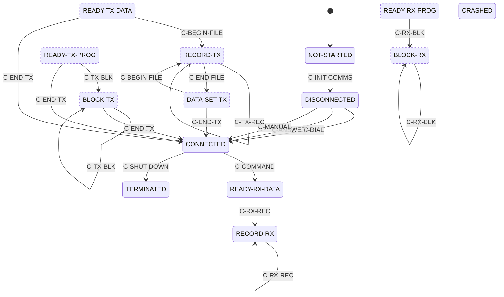

# Commstar link and session protocol

## Scope and implementation status

The Micronic 1000 external link is a byte-latch transport to an off-board
controller associated with two IR ports. This page states what a host-side
program **may rely on** at the M1000-facing latch boundary and what remains
blocked for a physical server.

**A historically interoperable Commstar server cannot yet be built from
this document, but the frame and object formats are largely recovered.**
The logical frame envelope, the request/response object grammar, and the
program-data block format are established from traces against real
firmware and are described below. What is missing is the IR wire framing,
a wire-visible session-arming signal, the meaning of several object
fields, and any handheld-to-host transfer. A peer built to this page
drives real firmware through a complete program download in the emulator;
it is not proven against historical hardware.

| Layer | Stability | Guidance |
|---|---|---|
| Z80-to-controller register protocol | **Stable** | Safe to emulate against the latch contract below |
| Controller byte transaction | **Provisional** | Ordering is stable; electrical bit meanings are not |
| Validated frame envelope | **Provisional** | Length, type, sequence, and target-id fields are stable; other bytes are not |
| Session request/response objects | **Provisional** | Envelope and length fields are consistent across all captures; several field meanings are open |
| Program-data block format | **Provisional** | Marker and length fields are confirmed; chunk maximum and EOF convention are open |
| Handheld-to-host data in requests | **Provisional** | Captured and decoded: the handheld sends objects to the host in its type-1 requests — 9 bytes at state `0006`, 54 bytes at state `0045` carrying operator text. `CommstarPeer` receives them |
| Handheld-to-host RECORD transfer | **Not implementable** | The command sequence is known (`C-BEGIN-FILE` / `C-TX-REC` / `C-END-FILE` / `C-END-TX`) but no RECORD exchange has been captured, so its object format is not |
| IR wire framing | **Not implementable** | Requires a hardware capture |

The synthetic peer in the repository is regression infrastructure, not a
server profile. Its RAM and program-counter observations are unavailable
to a physical peer.

For the firmware evidence behind each claim, see
[RE notes: Commstar evidence](../re-notes/commstar-evidence.md).

### Server implementer summary

| Goal | Stability | Boundary |
|---|---|---|
| Model the M1000-facing `4Ah-4Fh` latches | **Provisional** | Emulator or controller model, not a physical adapter |
| Run the synthetic Load/Run peer | **Provisional** | Requires emulator access to M1000 RAM/execution state |
| Drive a COM/DIP download against real firmware | **Provisional** | Works in the emulator; needs RAM visibility for the receive arm |
| Download a COM/DIP image from a physical server | **Not implementable** | Blocked on the wire layer and a wire-visible arm |
| Receive data a handheld sends in a request | **Provisional** | Works: `CommstarPeer` receives and decodes the objects the handheld sends at states `0006` and `0045` |
| Receive a RECORD-mode file from a handheld | **Not implementable** | No RECORD exchange has been captured |
| Build the IR adapter hardware | **Not implementable** | Connector-facing modulation and timing are open |

## Roles and byte-level terminology

* **Handheld** — the M1000 firmware and its external-link controller.
* **Server** — an external system that would exchange data with a
  handheld through an IR adapter. No interoperable server exists yet.
* **Synthetic peer** — the emulator component that feeds the controller
  receive latch and observes firmware internals.
* **Wire bytes** — bytes on the physical IR interface. Framing and even
  correspondence to controller bytes are open.
* **Controller-queue bytes** — bytes supplied to the `LINK_RXD` latch by
  the synthetic peer. They can include an uncounted sync byte and two
  trailing excluded bytes.
* **Logical-frame bytes** — the counted buffer validated by the frame
  header check. They begin with the six-byte header below.

Byte strings are labelled by level where established. A
controller-boundary capture is not a claim about IR serialisation.

`u16` denotes a little-endian 16-bit field; bare hex pairs are literal
bytes in transmission order.

The two IR connectors are **V24 ADAPTOR (top)** and **PLINTH (back)**
(owner-confirmed). Firmware selects one of two line states using bit 5 of
the active link id; which bit value maps to which connector is open. The
5-pin side port is the barcode-reader front end and is not part of this
transport — see [Barcode reader](../reference/barcode.md).

## Layer model

```text
Commstar application/session          Provisional: object grammar; field meanings open
        │
Logical frame                         Provisional: length, type, sequence, id
        │
Controller queue / byte transaction   Provisional at M1000 boundary
        │
4Ah-4Fh controller interface          Stable as latch addresses
        │
IR wire layer and connector selection  Not implementable: framing/polarity open
```

The controller interface is a byte-latch transport, not an SCC/SIO/ADLC.
Firmware writes outgoing data at `LINK_TXD` (`4Dh`), reads incoming data
at `LINK_RXD` (`4Eh`), polls `LINK_STATUS` (`4Bh`), and drives
`LINK_CTRL` (`4Ah`). `LINK_CMD` receives `81h` during the ready
handshake. The exact port catalogue is in
[Memory and I/O map](../reference/memory-io.md).

## Controller transaction

The M1000 drives `LINK_CTRL` and polls `LINK_STATUS` through a fixed
ordering. No electrical names for status or control bits are proven.

### How the IR hardware works

The handheld does not drive the IR line directly. It talks to an off-board
link controller through six latches (`4Ah`-`4Fh`), and the controller does
the serialising. Everything below describes that latch boundary, which is the
part the firmware defines; what the controller then puts on the IR line is
not established.

A transfer is a handshake, not a stream:

1. **Open.** The handheld selects the port (`LINK_CTRL` bit 1, from the
   active link id), pulses `XFREN`, and clears `DIREN`.
2. **Present.** It polls `TXRDY`, then writes `81h` to `LINK_CMD` — the
   controller's "are you there" exchange.
3. **Address.** It writes the low five bits of the link id to `LINK_TXD` as a
   prelude, outside the frame's own byte count.
4. **Turn the line.** It waits for `RXBUSY` to clear, raises `STROBE` and
   `DIREN`, waits, drops `STROBE`, then waits for `HSBUSY` to clear.
5. **Stream.** Each payload byte is written to `LINK_TXD` only while `TXRDY`
   is asserted, with a per-byte timeout.
6. **Close.** `DIREN` and `XFREN` are cleared.

Receiving inverts steps 1-4 and then reads `LINK_RXD` while `RXRDY` is
asserted. The whole receive status is fetched **once** and shifted, so the
four receive bits are one decision, not four polls.

The practical consequence for anyone building a controller — emulated or
real — is that this is a half-duplex, credit-based byte pump. The handheld
will not transmit while the controller says it has inbound data, and it will
not send a byte until the controller says it can take one.

### The command and probe latches

`LINK_CMD` (`4Ch`) has exactly one writer and exactly one value. `LinkPresent`
(`ROM00:34EC`) waits for `TXRDY`, then writes **`81h`** and shadows it at
`ram:F796`. There is no second value anywhere in ROM00, ROM01 or the battery
RAM, so nothing can be inferred from variation — it is a fixed "begin"
token in the present/ready handshake rather than a command byte with fields.

`LINK_PROBE` (`4Fh`) is more interesting. `LinkProbe` (`ROM00:348A`) computes
its value rather than loading it:

```text
348A  3E 7F     LD A,7Fh
348C  E6 1F     AND 1Fh        ; -> 1Fh
348E  32 99 F7  LD (0F799h),A  ; shadowed
3491  D3 4F     OUT (4Fh),A
```

`7Fh AND 1Fh` is exactly the masking that forms a **prelude** from a link id.
So the probe addresses id `7Fh` — the same constant the handheld writes at
frame offset +4. That is new evidence about `7Fh`: it is used *as an id* in at
least one place, rather than being an arbitrary filler. Whether it means
"broadcast" or "unassigned" is still open, but "not an id" is no longer
tenable.

### What the status and control bits do

Electrical names remain unproven, but each bit's **role in the protocol** is
recoverable from how the firmware uses it — and that is what a controller
model has to reproduce. Every row below is read from the drivers; the
"required of a model" column is what the repository's synthetic peer does,
which is sufficient to drive real firmware through a complete session.

`LINK_STATUS` (`4Bh`), read by the handheld. The names are **INFERRED** from
the branch each bit drives — they are a naming convenience, not a datasheet:

| Bit | Inferred name | Role | Required of a controller model |
|---:|---|---|---|
| 0 | `RXRDY` | A received byte is available | Assert while bytes remain to hand over; the handheld reads one per assertion |
| 1 | `RXEND` | Block finished, status valid | Assert once the block is drained. While bits 0 and 1 are both clear the handheld keeps waiting, then gives up with `EEh` |
| 2 | `RXTAIL` | One further byte to take | Assert to have exactly one extra byte read after the block |
| 3 | `RXERR` | Transfer failed | Assert to fail the transfer with `ECh` |
| 4 | `RXBUSY` | Inbound data pending | Must be **clear** before the handheld will begin transmitting |
| 5 | `TXERR` | Error latch, sampled at end of transmit | Leave clear; set yields `ECh` |
| 6 | `HSBUSY` | Handshake busy | Must go **clear** to complete the transmit handshake |
| 7 | `TXRDY` | Ready to accept a transmit byte | Assert; polled before every byte written to `LINK_TXD` |

The receive decode is a chain of `RRCA` at `ROM00:33CF`, testing bits 0, 1,
2, 3 in that order — so the four receive bits are one status byte read once
and shifted, not four separate polls.

`LINK_CTRL` (`4Ah`), driven by the handheld:

| Bit | Inferred name | Role |
|---:|---|---|
| 0 | `XFREN` | Transfer active — cleared then set to open, cleared to close |
| 1 | `PORTSEL` | Port select, driven from active-link-id bit 5 by `LinkPortSelect` |
| 4 | `DIREN` | Direction/enable — cleared at open, set during the handshake, cleared at close |
| 5 | `STROBE` | Strobe — set, short delay, cleared |

**Confidence.** The roles are CONFIRMED in the sense that they are read
directly from the branch each bit drives. What is *not* established is what
any bit means electrically at the connector, or whether a real controller
derives them the same way. Two behaviours corroborate the reading: the
turn-taking rule below follows from bit 4, and a peer implementing exactly
this table completes real sessions.

**Transmit ordering (stable as latch sequence):**

1. The port-select latch follows active-link-id bit 5 (one of two IR
   line states; which state is V24 ADAPTOR vs PLINTH is open).
2. Toggle `LINK_CTRL` bits around a short delay.
3. Poll `LINK_STATUS` bit 7 and write `0x81` to `LINK_CMD` when ready.
4. Write the low five bits of the link id (`link_id & 1Fh`) to `LINK_TXD`
   as a controller prelude — excluded from the frame length.
5. Handshake on `LINK_STATUS` bits 4 and 6 via `LINK_CTRL` bits 5/4.
6. Stream payload bytes: each byte to `LINK_TXD` gated by `LINK_STATUS`
   bit 7.
7. Clear `LINK_CTRL` bits to idle.

**Turn-taking rule (provisional):** the synthetic peer asserts
`LINK_STATUS` bit 4 while inbound bytes remain; a controller model must
drain and deassert before accepting the next M1000 transmission or the
transmission fails. This is a latch-level constraint, not a proven
half-duplex wire rule.

Mechanically the payload source is a descriptor list of
`{count, pointer}` entries terminated by a zero count; descriptors are
not transmitted.

**Receive ordering (provisional):** clear bit 0, set bit 5, single read
from `LINK_RXD`, set bit 4 with delay, clear bit 5, then continue reading
while status bit 0 is set. Bits 1-3 participate in the decode. The
cleanup toggles bit 1, sets then clears bit 0, and clears bit 4.

An adapter emulator must model the stateful handshake, not merely present
a flat byte stream.

## Validated frame envelope

The buffer after the controller has delivered the prelude and payload
carries this header:

| Offset | Size | Field | Stability |
|---:|---:|---|---|
| 0 | 2 | total received length (`u16le`) — must equal byte count | **Stable** |
| 2 | 1 | frame type — values 2, 3, 4 are dispatched | **Provisional** |
| 3 | 1 | per-link sequence — compared with per-link slot | **Provisional** |
| 4 | 1 | active link id — equality-checked on receive | **Stable** |
| 5 | 1 | unread by examined ROM link code | **Not implementable** |
| 6 | n | session payload — request/response object, see below | **Provisional** |

Validation rejects frames shorter than six bytes, frames whose embedded
length differs from the received count, and frames whose byte 4 differs
from the active link id. The TX path writes `0x7F` at offset 4; the RX
path requires offset 4 to equal the link id. The meaning of `0x7F` on the
wire is open. The examined ROM path has no checksum.

The sequence-number lifecycle — who advances it, when, and whether
directions share a counter — is open.

For the comparison and the descriptor shapes that carry this envelope,
see [RE notes: Commstar evidence](../re-notes/commstar-evidence.md#validated-frame-envelope).

## Externally observable subset

From M1000 traffic alone an observer can obtain the controller prelude
`id & 1Fh` (five bits), the length at offset +0, type at +2, and sequence
at +3. It cannot obtain the full eight-bit link id, which a server must
reproduce at offset +4.

Captured length is `1 + u16le(tx[1:3])` including the prelude — the only
confirmed rule for delimiting a captured M1000 transmission.

| Link id bits | Observable from wire? | Source |
|---|---|---|
| 0-4 | Yes | Controller prelude |
| 5 | No | Port select; polarity is open |
| 6-7 | No | Never transmitted; two samples are not a rule |

The remaining three bits, the per-link sequence slot, and the
fresh program-receive arm are not wire-visible.

## Captured M1000 session requests (controller-boundary TX)

V24 Mode 1 captures of pre-stream requests. First byte is the
controller prelude; remaining bytes are the logical frame. These bytes
are **stable as observed traces for this harness**; their field
semantics beyond the envelope are provisional.

| Request | Prelude | Logical frame |
|---|---|---|
| Initial | `03` | `0C 00 01 00 7F 00 00 00 00 00 00 00` |
| State 61 | `03` | `0C 00 01 01 7F 00 61 00 00 00 00 00` |
| State 64 | `03` | `0C 00 01 01 7F 00 64 00 00 00 00 00` |
| State 45 | `03` | `42 00 01 01 7F 00 45 00 01 00 36 00 00 00 00 00 00 00 00 00 00 00 00 00 00 00 4C 4F 41 44 31 32 33 34 35 36 37 38 00 00 00 00 00 00 00 00 00 00 00 00 00 00 00 00 00 00 00 00 00 00 00 00 00 00 00 00` |
| State 44 | `03` | `0C 00 01 01 7F 00 44 00 00 00 FF 00` |

### Request and response object format

Every captured exchange fits one grammar. **Provisional**: the shapes below
hold across all captured exchanges, but they rest on a handful of samples and
the meaning of individual fields is stated separately.

A type-1 request payload is three `u16` fields, optionally followed by an
object:

```text
frame:   [u16 length][u8 type=1][u8 seq][u8 7F][u8 00] payload
payload: [u16 state][u16 arg][u16 count] object[count]
```

| Request | length | state | arg | size | object | size = object length? |
|---|---:|---:|---:|---:|---:|---|
| Initial | 12 | `0000` | 0 | `0000` | 0 | yes |
| Second | 21 | `0006` | 0 | `0080` | 9 | **no** |
| State 61 | 12 | `0061` | 0 | `0000` | 0 | yes |
| State 64 | 12 | `0064` | 0 | `0000` | 0 | yes |
| State 45 | 66 | `0045` | 1 | `0036` | 54 | yes |
| State 44 | 12 | `0044` | 0 | `00FF` | 0 | **no** |

The third `u16` is a size field whose role is state-dependent, and it must not
be read as a general length. It equals the trailing object length for states
`00`, `45`, `61`, and `64` — the state-45 frame confirms it exactly, 54 =
66 − 12. It does not for state `06` (`0x0080` with a nine-byte object) or
state `44` (`0x00FF` with none). Those two are the requests that solicit data
from the peer, so a requested-maximum reading fits both values, but it is not
proven and the state-`06` object is unexplained under either reading.

A type-2 response payload takes one of two shapes:

```text
control ack:  [u8 00]
data object:  [u16 status][u16 marker][u16 N] data[N] [u16 00]
```

| Response | length | status | marker | N |
|---|---:|---:|---:|---:|
| Control (states 61/64/45) | 7 | — | — | single `00` byte |
| State-44 control object | 20 | 0 | 1 | 6 |
| Program data chunk | variable | 0 | 0 or 1 | payload bytes |

`marker` 0 permits another refill; `marker` 1 ends the stream. `N` matched the
data length exactly in every captured object.

#### State-45 object layout

Measured by varying one input at a time and comparing captures
(`--serial` and `--trace-loadrun-name`); each field was confirmed by
observing that it, and nothing else in the frame, changed. **Stable as
measured**; the frame length stayed 66 throughout.

| Object | Frame | Size | Field | Encoding |
|---:|---:|---:|---|---|
| +0 | +12 | 14 | zero in every capture | — |
| +14 | +26 | 4 | `LOAD` | fixed; unchanged by every input varied |
| +18 | +30 | 8 | workstation number | **right-justified, space-padded** |
| +26 | +38 | 16 | zero in every capture | — |
| +42 | +54 | 8 | program name | **left-justified, NUL-padded** |
| +50 | +62 | 4 | zero in every capture | — |

The two padding conventions differ and are each confirmed by a short value:
workstation `ABC` serialises as `20 20 20 20 20 41 42 43`, program name `XY`
as `58 59 00 00 00 00 00 00`.

`LOAD` did not change when either text input was varied and is not a ROM
string literal, so it is a runtime constant for this operation rather than
user data. Whether it is an operation name that other Commstar operations
replace is open — no second operation is reachable on the tested path.

For harness provenance see
[RE notes: Commstar evidence](../re-notes/commstar-evidence.md#captured-session-requests).
For the experiment that would settle the object field offsets by measurement,
see [RE notes: Open questions](../re-notes/open-questions.md#state-45-payload-structure).

## Session states

### The firmware's own state names

`ROM00:6A4A` is a table of 16 little-endian pointers to display strings —
the firmware's own vocabulary for its session states. **Stable** (byte-read
from ROM); this is what the device calls its states, not necessarily what
travels on the wire.

| Index | Name | Index | Name |
|---:|---|---:|---|
| 0 | `NOT-STARTED` | 8 | `BLOCK-RX` |
| 1 | `DISCONNECTED` | 9 | `RECORD-TX` |
| 2 | `CONNECTED` | 10 | `DATA-SET-TX` |
| 3 | `READY-RX-DATA` | 11 | `BLOCK-TX` |
| 4 | `READY-RX-PROG` | 12 | `TERMINATED` |
| 5 | `READY-TX-DATA` | 13 | `CRASHED` |
| 6 | `READY-TX-PROG` | 14 | `REPLY-START` |
| 7 | `RECORD-RX` | 15 | `REPLY-END` |

The names confirm the shape of the protocol the firmware implements: a
connect/disconnect lifecycle, separate readiness states for data versus
program in each direction, and distinct `RECORD` and `BLOCK` transfer modes
each with an RX and a TX form. `DATA-SET-TX` has no RX counterpart.

### The firmware's own command names

`ROM00:6B67` is a parallel table of 17 pointers to command-name strings.
**Stable** (byte-read from ROM; every pointer resolves inside the string
block that immediately follows the table).

| Index | Name | Group |
|---:|---|---|
| 0 | `C-INIT-COMMS` | link setup |
| 1 | `C-DIAL` | link setup |
| 2 | `C-ANSWER` | link setup |
| 3 | `C-MANUAL` | link setup |
| 4 | `C-DROP-LINE` | link teardown |
| 5 | `C-COMMAND` | command exchange |
| 6 | `C-RX-CMD` | command exchange |
| 7 | `C-TX-REPLY` | command exchange |
| 8 | `C-SHUT-DOWN` | termination |
| 9 | `C-RX-REC` | record transfer |
| 10 | `C-RX-BLK` | block transfer |
| 11 | `C-BEGIN-FILE` | file framing |
| 12 | `C-TX-REC` | record transfer |
| 13 | `C-END-FILE` | file framing |
| 14 | `C-TX-BLK` | block transfer |
| 15 | `C-END-TX` | file framing |
| 16 | `C_ABORT` | termination |

Index 16 is spelled with an underscore where every other entry uses a
hyphen; that is verbatim from ROM, not a transcription slip.

This is the operation vocabulary the firmware implements, and it accounts
for the transfer modes the state table names: `RECORD` and `BLOCK` each have
an RX and a TX command, wrapped by `C-BEGIN-FILE` / `C-END-FILE` /
`C-END-TX`, with `C-COMMAND` / `C-RX-CMD` / `C-TX-REPLY` for the
command-and-reply exchange and four link-setup entries covering direct,
dialled, answered, and manual connection.

**Neither table's index is a proven wire value.** The state table is indexed 0-15 and the
command table 0-16, while the values carried in request payload +0 are
`00`, `06`, `44`, `45`, `61`, and `64`. A seventh, `65`, is passed to
`SessionSetParams` and `SessionTxSendFrame33` on the `C_ABORT` path
(`ROM00:5BA6`) — direct evidence that these numeric values are the parameter
an operation *sends*, rather than merely an internal label.
No mapping between these numbering
systems is established. Neither table has a static xref — both indices are
supplied by the RAM-resident session module — and the Load/Run path never
displays a name from either table, so the traces cannot correlate them
either. Do not assume, for example, that wire `44` is `READY-RX-PROG`
because of its high nibble.

What the two tables do establish is the **shape** of the protocol,
independently of any capture: which operations exist, that record and block
transfer are distinct modes with separate directions, and that file framing
is a wrapper around them rather than a property of individual blocks.

### The four operations

Load/Run **is** the Commstar session screen (owner-confirmed), so the traced
program download is a Commstar session. `ROM00:6C8E` holds the user-facing
strings that screen actually renders, and they form a 2x2 matrix — data
versus program, transmit versus receive:

| Operation | Title | In progress | Completion |
|---|---|---|---|
| Data TX | `Data Transmission` | `Sending data` | `Data transmitted` |
| Program TX | `Program Transmission` | `Sending prog` | `Program transmitted` |
| Data RX | `Data Reception` | `Receiving data` | `Data received` |
| Program RX | `Program Reception` | `Receiving prog` | `Program received` |

**Stable** (byte-read from ROM). The traced session exercises the fourth row
only: it displays `Receiving prog`.

This matrix lines up exactly with four of the internal state names —
`READY-TX-DATA`, `READY-TX-PROG`, `READY-RX-DATA`, `READY-RX-PROG` — and the
state machine below confirms that `RECORD` operations carry data and `BLOCK`
operations carry program images.

The practical consequence is that the uncaptured handheld-to-host direction
is not behind a different screen or a different mode — it is the top row of
the same screen the traces already reach. What selects the row is the open
question.

### The protocol state machine

`ROM00:692A` is a state-transition matrix indexed
`table[state * 17 + command]`. Bit 7 of an entry marks an **illegal**
transition (the firmware shows a message box); bit 7 clear means legal, and
`entry & 0x7F` is the next state. **Stable** — the `*17` multiply and the
table base are byte-verified at `ROM00:3C06`, the extent is exactly
14 states x 17 commands = 238 bytes (`692A`-`6A17`, with unrelated data
beginning at `6A18`), and the decoded machine is internally consistent.



The figure is generated from the ROM by
`analysis/decode_state_machine.py --mermaid`, so it cannot drift from the
firmware. Dashed states are those no legal path can reach.

Two near-universal commands are folded out of the figure to keep it legible:
`C-DROP-LINE` is legal from **all 14** states and returns to `NOT-STARTED`,
and `C_ABORT` reaches `CRASHED` from **states 1-12 only** — it is an illegal
transition from `NOT-STARTED` (nothing to abort) and from `CRASHED` (already
aborted), so `CRASHED` accepts only `C-DROP-LINE`. `REPLY-START` and `REPLY-END` have no row
in the matrix and are display-only.

The shape is now explicit. A data upload is
`C-BEGIN-FILE`, then `C-TX-REC` per record, then `C-END-FILE` to
`DATA-SET-TX`, and either another file or `C-END-TX` back to `CONNECTED`. A
program transfer needs no file wrapper: `C-TX-BLK` loops in `BLOCK-TX` until
`C-END-TX`. Receive is symmetric but has no file framing in either mode.

### RECORD carries data, BLOCK carries programs

This was a guess in the previous revision; it is now **stable**. Each of the
four transfer operations calls `SessionStartDataMode` (`ROM00:452D`) with its
command index and then loads its own display string:

| Command | Index | Display string | Site |
|---|---:|---|---|
| `C-RX-REC` | 9 | `Receiving data` | `ROM00:4EA3` |
| `C-RX-BLK` | 10 | `Receiving prog` | `ROM00:4F90` |
| `C-BEGIN-FILE` | 11 | `Sending data` | `ROM00:506A` |
| `C-TX-BLK` | 14 | `Sending prog` | `ROM00:5222` |

`452D` is called from 15 sites carrying command indices 0..16; only 6
(`C-RX-CMD`) and 7 (`C-TX-REPLY`) have no call site in ROM00.

### What selects the operation

Three states — `READY-RX-PROG`, `READY-TX-DATA`, `READY-TX-PROG` — have **no
incoming legal transition** in the matrix. The only route out of `CONNECTED`
is `C-COMMAND`, which leads to `READY-RX-DATA`.

The answer is that the transition table is **gated off** on the traced path,
and the state is driven directly instead.

`Session_SetState` (`ROM00:3BF5`) contains the only instruction in any image
that writes `g_bSessionState`, but it has **46 callers**. Only one of them is
inside `SessionCoroJumpTable`; the other 45 set the state directly:

* 26 pass a literal, and only ever `0` `NOT-STARTED`, `2` `CONNECTED` or
  `13` `CRASHED`.
* 17 pass `(ram:E48C)` and 2 pass `(ram:E491)` — computed. `E48C` is the cell
  `SessionCoroJumpTable` writes with `entry & 0x7F`, so those sites *commit*
  a transition the table computed earlier. The dispatcher stages the next
  state; the caller commits it.

**No site sets `READY-RX-PROG`, `READY-TX-DATA` or `READY-TX-PROG` from a
literal.** Those three are reachable only through the `E48C` path — that is,
only when the transition table actually runs.

The gate is the mode byte `ram:E48D`, and it reads the opposite way round to
what its name suggests: `SessionStartDataMode` dispatches a command to the
state machine when `E48D` is **not** 2, and returns 0 without dispatching
when it **is** 2. The comparison helper it uses (`ram:E04B`) returns with the
zero flag set when its operands *differ*, and the branch is `JP Z`.

So on Load/Run, where `E48D` measures 0, the table **is** consulted — and
`g_bSessionState` advancing `00` -> `02` is consistent with that rather than
evidence against it.

`E48D` has exactly two writers, both reached only as runtime-stub slots:

| Stub slot | Routine | Effect |
|---|---|---|
| `ram:EE20` (index 65) | `ROM00:4563` | sets `E48D` from its argument, then issues `C-INIT-COMMS` |
| `ram:EE24` (index 66) | `Session_InitState` (`ROM00:46E9`) | sets `E48D = 2`, `ram:E6FC = 0x37`, clears a dozen session cells, and displays `Comms in progress` |

So enabling the protocol state machine is itself a stub-slot call — the same
mechanism that selects the four transfer operations.

### What the table permits, and why the firmware works around it

The table is the authority on legal command sequences, so the question "what
order must a peer issue commands in?" is answered by walking it, not by
experiment. `analysis/decode_state_machine.py` does that from the ROM image;
breadth-first from `NOT-STARTED` over legal transitions only:

| Reachable | Path |
|---|---|
| `DISCONNECTED` | `C-INIT-COMMS` |
| `CONNECTED` | `C-INIT-COMMS` → `C-DIAL` |
| `READY-RX-DATA` | … → `C-COMMAND` |
| `RECORD-RX` | … → `C-RX-REC` |
| `TERMINATED` | `C-INIT-COMMS` → `C-DIAL` → `C-SHUT-DOWN` |
| `CRASHED` | `C-INIT-COMMS` → `C_ABORT` |

**Unreachable:** `READY-RX-PROG`, `READY-TX-DATA`, `READY-TX-PROG`,
`BLOCK-RX`, `RECORD-TX`, `DATA-SET-TX`, `BLOCK-TX`. And no cell anywhere in
the table yields state 4, 5 or 6 — not on the legal path, and not on the
illegal path either, where the entry's low seven bits would still become the
new state.

So the only complete transfer the table permits is **Data Reception**
(`C-INIT-COMMS` → `C-DIAL` → `C-COMMAND` → `C-RX-REC`). Every other
operation — including the Program Reception the firmware actually performs —
enters a state the table cannot reach.

That is not a contradiction; it is what the mode gate is for. With
`ram:E48D = 2`, `SessionStartDataMode` returns without consulting the table
at all, so an operation runs whatever the current state. **CONFIRMED by
experiment:** an application that sets `E48D = 2` itself and then issues
`C_ABORT` from `NOT-STARTED` gets no message box and `ram:E512 = 0`, the
early-return marker — where the identical call with `E48D = 0` raises the
illegal-transition box.

The practical reading is that the transition table is a *partial* validator.
It fully describes the RECORD-RX path and is bypassed for everything else.
Treat it as evidence of the protocol's intended shape, not as a constraint
the firmware enforces on itself.

### End-to-end confirmation of the state machine

Calling `C_ABORT` (`ram:EE00`) from a loaded COM, with the session in its
boot state, puts this on the screen:

```text
      C_ABORT
    called from
    NOT-STARTED
Press >> to continue
```

That is `SessionCoroJumpTable`'s illegal-transition path, and it confirms
several separate readings at once from a single live run:

* the transition table is indexed as documented — row `NOT-STARTED` (0),
  column `C_ABORT` (16);
* that cell is `0x80`, and **bit 7 set does mean illegal**;
* both name tables are what render the message — the command name from
  `ROM00:6B67` and the state name from `ROM00:6A4A`;
* `g_bSessionState` really is the row index, and it really does boot to 0.

It also explains why the call never returns: the firmware is sitting in
`SessionWaitContinue`, waiting for a keypress that a headless application
never sends.

### Nothing in the firmware calls it

Searching every image for a `CALL` or `JP` to each slot address — ROM00,
ROM01, the upper RAM dumped live after a completed session, and the banked
RAM pages — finds only two of the six invoked:

| Slot | Operation | Invoked from |
|---|---|---|
| 65 `EE20` | set mode, `C-INIT-COMMS` | `ROM01:1305` |
| 68 `EE2C` | `C-RX-BLK` — Receiving prog | `ROM01:141F` |
| 59 `EE08` | `C-BEGIN-FILE` — Sending data | **nothing** |
| 66 `EE24` | enable the state machine | **nothing** |
| 70 `EE34` | `C-RX-REC` — Receiving data | **nothing** |
| 73 `EE40` | `C-TX-BLK` — Sending prog | **nothing** |

That is consistent with the measurement: slot 66 is what would set
`E48D = 2`, nothing calls it, and `E48D` is 0 at the end of a full session.
**The transition table is never consulted by the firmware at runtime.**

So of the four operations, the shipped firmware only ever drives *Program
Reception*. The other three, and the state machine itself, are present and
correct but unreferenced.

**LIKELY — the missing caller is the application, not the firmware.** The
stub slots are fixed addresses in the transfer-vector table (`ED1C`-`F17F`),
which is the documented mechanism for loaded code to reach firmware
services. A loaded COM or DIP program can call `EE08` / `EE24` / `EE34` /
`EE40` directly, and its code appears in none of the images searched. That
matches the shape of a Commstar deployment: the firmware loads an
application, and the *application* uploads collected records. It also means
the handheld-to-host direction is an application-facing API rather than a
firmware UI feature — which is why no amount of driving the Load/Run screen
will produce one.

**CONFIRMED by experiment.** A 16-byte COM that calls `EE24` leaves the mode
gate at 2 and its companion cell at `0x37`, where a control program that does
not make the call leaves both at 0. So the entry points do work from an
application. The twenty of them are catalogued as an ABI in
[Commstar application API](../reference/commstar-api.md).

This is the most useful thing yet established for a server implementer, and
it is a redirection rather than an answer: stop looking for a UI path to the
upload, and look at what a loaded application does with these entry points.

## Historical server readiness

| Responsibility | Stability | Known | Still blocked |
|---|---|---|---|
| Controller transport | **Provisional** | Latch handshake and validation | Connector timing if hardware is required |
| Type-2/3/4 exchange | **Provisional** | Request/reply/completion ordering | Why the queue repeats type/sequence |
| Session states 61,64,45,44 | **Provisional** | Progression to program receive, and the state value is carried in request payload +0 | Historical operation meanings |
| Request/response objects | **Provisional** | Three-`u16` request header, status/marker/length response object | Meaning of `arg`, the state-44 `00FF`, and the state-45 object layout |
| V24 form staging | **Provisional** | Buffers reach mode-dependent dispatch | Authentication encoding |
| Program stream | **Provisional** | Inner bytes reach loader unchanged; marker 0/1 delimits the stream | Chunk maximum and whether a historical EOF frame exists |
| Errors, aborts, retries | **Provisional** | Timeouts and a few result codes | Application-visible grammar |
| Physical port | **Not implementable** | Bit 5 selects a line state | Which state is V24 ADAPTOR vs PLINTH |

## Diagnostic reference

Firmware-observed results, not a server error protocol:

| Result | Context | Implication |
|---|---|---|
| `EBh` | Pre-payload ready wait expires | Queue/turn-taking prevented TX |
| `ECh` | Final status bit 5 set | Status-bit meaning is open |
| `EDh` then `0x1F76` Line failure | 16-byte type-4 queue exhausts fixed descriptor | Use only the six-byte type-4 shape in the synthetic path |
| `EEh` | Per-byte wait fails | Timing/status condition failed |
| `01EF` | Type-4 sequence mismatch | Sequence lifecycle is open |
| `0x1F75` Invalid reply | Control object not `OK`/`NO`/`DM` | Applies to the control caller, not program bytes |
| `0x1FAE` Line failure | Blank V24 form and oversized synthetic object | Separate paths; not a server precondition |

For the evidence and next captures that would unblock a server, see
[RE notes: Commstar evidence](../re-notes/commstar-evidence.md#blocking-evidence)
and [RE notes: Open questions](../re-notes/open-questions.md).
