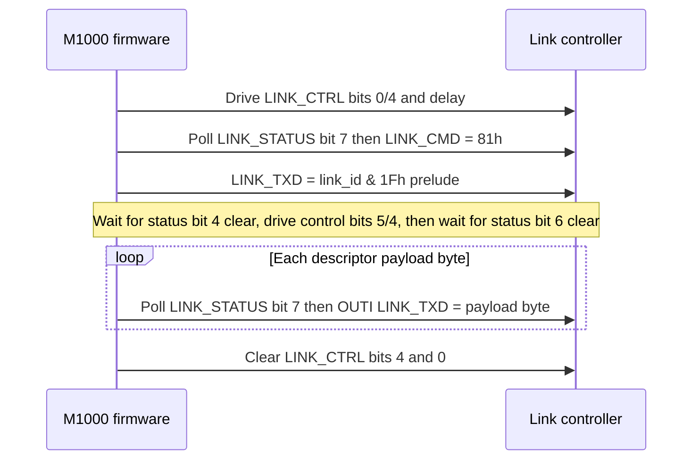
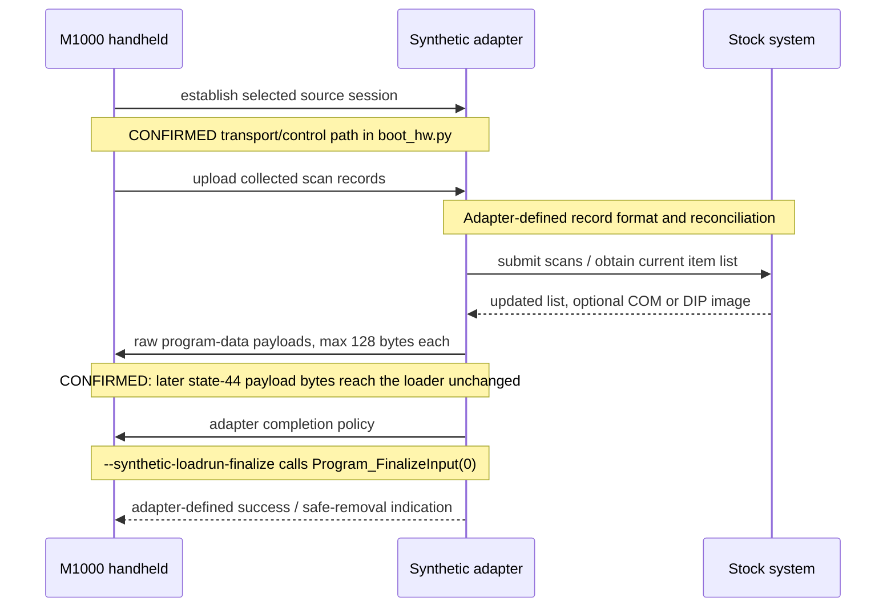

# Commstar link and session protocol

## Scope and implementation status

This is the normative record of what the firmware establishes about the
Commstar external link. It deliberately separates the controller-facing
transport from the higher-level session protocol: the former is sufficiently
known to model, while the latter is not yet sufficient to reimplement a file
transfer peer.

| Layer | Status | Implementation guidance |
|---|---|---|
| Z80-to-link-controller register protocol | **CONFIRMED** | Safe to emulate against the firmware. |
| Link-controller byte transaction | **CONFIRMED** in the M1000 direction | Use the strobe, status, and timeout rules below. |
| Validated frame envelope | **CONFIRMED** in part | Preserve the length and target-id fields; do not invent missing fields. |
| Session commands and replies | **PARTIAL** | Do not claim command names or payload formats from display strings. |
| RECORD/BLOCK file transfer | **OPEN** | Requires a live Commstar or hardware capture. |

The owner confirms that the two IR connectors are **V24 ADAPTOR (top)**
and **PLINTH (back)**. Firmware selects one of two line states using bit 5
of the active link id, but does not identify which bit value maps to which
physical connector. The 5-pin side port is the barcode-reader front end;
it is not part of this transport. See
[the barcode-reader guide](../manual/barcode-reader.md).

## Layer model

```text
Commstar application/session          OPEN: command and payload grammar
        │
Validated link frame                  partial: length, type, sequence, id
        │
Byte transaction / controller strobes CONFIRMED
        │
4Ah-4Fh controller interface          CONFIRMED
        │
IR connector selected by link-id bit5 owner-labelled, polarity OPEN
```

The controller interface is a byte-latch transport, not an SCC, SIO, or
ADLC. The firmware writes outgoing data at `LINK_TXD` (4Dh), reads incoming
data at `LINK_RXD` (4Eh), polls `LINK_STATUS` (4Bh), and drives
`LINK_CTRL` (4Ah). `LINK_CMD` receives `81h` during the present/ready
handshake. The exact register catalogue is in
[the I/O map](../internals/io-map.md).

## Controller transaction

LinkBlockTx (ROM00:3277-3377) and LinkBlockRx (ROM00:3378-3453) mechanically
drive `LINK_CTRL` (4Ah) and poll `LINK_STATUS` (4Bh). **No electrical names
for status or control bits are proven** — the descriptions below list only the
bit numbers polled/driven and the timeout constants observed in the bytes.

### Transmit

**CONFIRMED:** `LinkBlockTx` (ROM00:3277-3377) ordered controller-facing
sequence (byte-verified):

1. Clear `LINK_CTRL` bit 0, set `LINK_CTRL` bit 0, clear `LINK_CTRL` bit 4;
   `B=0x80` DJNZ delay.
2. `LinkPresent` then `LinkWaitReady`: each polls `LINK_STATUS` bit 7 with
   timeout `DE=0x02DA`; the first successful wait writes `0x81` to
   `LINK_CMD` (4Ch).
3. Write low five bits of input `A` (held in `C`, `link_id & 1Fh`) to
   `LINK_TXD` (4Dh) as a controller prelude. This byte is not part of the
   in-memory frame descriptor payload.
4. Wait for `LINK_STATUS` bit 4 to clear (`DE=0x026C` timeout → `EBh`);
   then set
   `LINK_CTRL` bit 5, set `LINK_CTRL` bit 4; `B=0x20` DJNZ delay; clear
   `LINK_CTRL` bit 5; wait for `LINK_STATUS` bit 6 to clear
   (`DE=0x026C` timeout → `EEh`).
5. Stream descriptor payload bytes: each `OUTI` to `LINK_TXD` is gated by
   `LINK_STATUS` bit 7 with per-byte timeout `DE=0x06F9` (timeout → `EEh`).
6. Cleanup: clear `LINK_CTRL` bit 4, clear `LINK_CTRL` bit 0 before returning.

The payload source is a **descriptor list** in RAM. Each four-byte entry is
`{ count_lo, count_hi, ptr_lo, ptr_hi }`; `LinkReadBufferDescriptor`
(ROM00:3508) advances to the next entry until a zero count terminates the
list. These descriptors are not transmitted.

The diagram below is the confirmed controller-facing transmit ordering. It is
not a Commstar session exchange and makes no claim about the external
controller's electrical timing or the meaning of any status/control bit beyond
the mechanical poll/drive listed above.



### Receive

**CONFIRMED:** `LinkBlockRx` (ROM00:3378-3453) mechanically drives
`LINK_CTRL` and polls `LINK_STATUS`; no electrical names for status or control
bits are proven. Byte-verified sequence: clear `LINK_CTRL` bit 0, set
`LINK_CTRL` bit 5, single `IN` from `LINK_RXD` (4Eh), set `LINK_CTRL` bit 4,
`B=0x20` DJNZ delay, clear `LINK_CTRL` bit 5; then `INI` from `LINK_RXD`
only while `LINK_STATUS` bit 0 is set. If bit 0 is clear, bit 1 set continues
to bits 2/3 decode while bit 1 clear waits/retries with `DE=0x06F9`; bit 2 set
performs an extra `INI`; bit 3 set returns `EC`. Cleanup toggles
`LINK_CTRL` bit 1, sets then clears `LINK_CTRL` bit 0, clears `LINK_CTRL`
bit 4, toggles `LINK_CTRL` bit 1.

An adapter emulator must model the stateful handshake, not merely present a
flat byte stream. The current experimental Python model is not a conformance
implementation.

### Probe

**CONFIRMED:** `LinkProbe` starts at ROM00:348A and writes `0x1F` to
`LINK_PROBE` (4Fh) then executes a `LINK_CTRL` latch sequence. The
physical or reset effect remains **OPEN**.

## Validated frame envelope

The following is established by `LinkValidateFrameHeader` (ROM00:30DC) and
the receive dispatcher (ROM00:2FBD). It describes the buffer after the
controller has received the prelude and payload; it is not a complete
session-message specification.

| Offset | Size | Field | Status |
|---:|---:|---|---|
| 0 | 2 | Total received length, little-endian | **CONFIRMED**: must equal the received byte count. |
| 2 | 1 | Frame type | **CONFIRMED**: dispatcher tests 2, 3, and 4. |
| 3 | 1 | Per-link sequence | **CONFIRMED**: `LinkProcessCommandFrame` compares it with `FE43h + (fdd4 & 3Fh)` (init 1); mismatch path yields `01EF`. |
| 4 | 1 | Active link id | **CONFIRMED**: `LinkValidateFrameHeader` (ROM00:30DC) XOR-compares byte 4 to `fdd4`. |
| 5 | 1 | Unread by ROM link code | **OPEN**: never read by ROM link code; may be writable by loaded code — do not assume unused. |
| 6 | n | Session payload | **OPEN**: format depends on the runtime session module; the examined ROM transport/header path performs no checksum. |

Validation rejects frames shorter than six bytes, frames whose embedded
length differs from the caller-supplied logical count, and frames whose
byte 4 differs from the active link id (`fdd4`). The comparison is an
equality test implemented with XOR; it is an address filter, not a
checksum. `LinkValidateFrameHeader` does not inspect byte +5.

`LinkFramePrefixWrite` (ROM00:316B) writes TX offsets 0..4 as
`{len LE, type, sequence, 0x7F}` and leaves offset +5 untouched. The
TX offset-4 constant `0x7F` is **SUSPECTED**; do not call it an id or
broadcast. `+5` is untouched by that path.

`LinkProcessCommandFrame` reads byte 3, compares it with the per-link
byte at `FE43h + (fdd4 & 3Fh)` (initialised to 1), and accepts either
the expected value or one behind it in a specific retry state. It does
**not** establish a generic 16-bit command word. Do not encode the
values `{2B,2A,23,03}` as session commands: they belong to a separate
local device-route lookup.

`LinkBlockTx` sends the low 5-bit prelude (`link_id & 1Fh`) before the
descriptor payload; the prelude is excluded from the descriptor byte
count. `LinkBlockRx` on success returns `DE = controller bytes consumed
minus 2`; in the examined bounded session the two excluded bytes are
**CONFIRMED** as copies of the logical frame's type (`+2`) and sequence
(`+3`) — observed as the trailing `02 01` after the six-byte logical
frame `06 00 02 01 63 00` in the form-4 controller queues
(`00 06 00 02 01 63 00 02 01` and `00 06 00 04 01 63 00 04 01`);
the controller-level reason for the exclusion remains **OPEN**.

Descriptor lists (byte-verified, structurally mutable where noted): RX
`FE0E` = `{6 -> FDE4, 3 -> FE38, 0}` (mutable); RX `FE32` =
`{9 -> FE3A, 0}`; TX `FDEA` = `{6 -> FDDE, 0}`. The sequence table is
`FE43h + (fdd4 & 3Fh)`.

`LinkBlockTx` outcomes (CONFIRMED, `A` and carry on return):

* `EBh` — either pre-payload bit-7 wait or the bit-4-clear wait timed out.
* `EEh` — bit-6-clear, per-byte bit-7, or post-payload bit-7
  failure.
* `ECh` — final status bit5 set.
* success `A=00h` carry clear.

Retry scheduler (CONFIRMED): initial `fdd6=32h` / `fdd8=6`, later
`fdd6=14h` / `fdd8=3`; the caller reschedules after `LinkBlockTx`
without testing returned `A`/carry.

## Types, replies, and session state

The receiver dispatches type 2, 3, and 4 differently. The state labels
`CONNECTED`, `READY-RX-DATA`, `RECORD-RX`, `BLOCK-TX`, and related C-*
texts are firmware UI/state vocabulary. They are useful research anchors,
but they are not a wire-command dictionary.

The loaded session module also uses `InlineTableDispatch` (ram:E0B2) for
local control flow. **CONFIRMED:** a CALL is followed by an inline table
with `{count: u16le} {case: u16le, handler: u16le} x count
{default_handler: u16le}`. The dispatcher probes the declared number of
cases, then tail-jumps to the trailing default when none matches. This
mechanism is local module control flow, not evidence that the case values
are wire-command identifiers. Numeric case values observed at `5A69` (abort `44,45,60,61,64`), `53C7` (`0..5`), `5410` (`0,4,8,9`), and `5291` (`0,4,9`) are **CONFIRMED** inline cases — do not name them as wire commands. The table at `6A4A` is **CONFIRMED** as 16 state-display pointers, not a wire map.

The firmware writes these numeric little-endian words into a reply
buffer on seven static paths (treat as numeric words/types, not named
semantic commands unless the bytes prove a meaning):

* `01EE` — attempt exhaustion with `fdd5=1`.
* `02EE` — attempt exhaustion with other state.
* `02E0`, `04E0`, `05E0` — numeric unexpected-type paths.
* `01EF` — type-4 sequence mismatch (per-link sequence at
  `FE43h + (fdd4 & 3Fh)`).
* `03EE` — error/reset path from ROM00:2E72.

The complete reply envelope, payload, and any session meaning remain
**OPEN**. The examined ROM transport/header path has no checksum.
Integrity inside unresolved loaded-session payloads remains **OPEN**.

Consequently, no state diagram or host/peer session sequence is normative
yet. A capture must establish each transition as:

| Current state | Received bytes | Guard | Transmitted bytes | Next state |
|---|---|---|---|---|
| _pending capture_ | | | | |

## Addressing and connector selection

The active link id is retained in `fdd4`.

* Its low five bits are transmitted first as the controller prelude
  (excluded from descriptor counts).
* Its bit 5 selects one of two external link configurations through
  `LinkPortSelect` (ROM00:3454).
* The complete id appears at validated-frame byte 4 (RX offset +4,
  XOR-compared to `fdd4` at ROM00:30DC) and selects a per-link sequence
  slot `FE43h + (fdd4 & 3Fh)` (init 1).

Which polarity maps to owner-confirmed V24 ADAPTOR (top) versus PLINTH
(back) remains **OPEN**. Where the EXT STORAGE ADAPTER attaches also
remains **OPEN**. This does not prove a multidrop physical topology or
address allocation policy; treat those as open hardware questions.

`E701`/`E6FF` are the width-3 decimal RCV1/RCV2 status fields
shown on the session status screen (**CONFIRMED provenance**):
`E701` is a zero-extended snapshot of the received numeric frame type at
`E5BE` before local substitutions (transport error may put `EEh` (238)
there); `E6FF` is the zero-extended received sequence at `E5BF`. They are
displayed as `RCV1`/`RCV2`. Broader UI meaning beyond that display remains
**OPEN**.

## Bounded synthetic session-builder traces (CONFIRMED mechanics only)

Two bounded synthetic traces were captured by calling the session TX
builders with synthetic stack arguments and bypassing only a separate
preflight at `5C1F`/`5D05` (forcing successful `HL=0` at `5C22`/`5D08`).
`E6E6=0` in both traces. The physical low-five-bit prelude
(`link_id & 1Fh`) is excluded from the quoted logical frames. Meanings of
payload constants/fields and complete RECORD/BLOCK/C-COMMAND semantics
remain **OPEN**.

* `g_wSessionDeviceSelector` at `E52E` is a service-33 device selector,
  mapped through `FE83 + selector - 1`; it is **not** logical frame type.
  `g_wSessionTxPayloadLength` at `E530` counts payload bytes starting at
  `E534`; bytes `E532-E533` are skipped. Logical frame type `1` is written
  independently by `ROM00:2F6D`.

* **Trace 4 — Session_TxBlock4 path (CONFIRMED):** synthetic stack args
  `(1,6,22h,33h)`, `E6E6=0`; bypassed only the separate preflight at
  `5C1F` by forcing successful `HL=0` at `5C22`. Payload length `15`;
  payload `06 00 00 00 80 00 00 4C 00 00 22 33 00 00 05`; complete logical
  frame `15 00 01 01 7F 00 06 00 00 00 80 00 00 4C 00 00 22 33 00 00 05`.

* **Trace 5 — Session_TxBlock5 path (CONFIRMED):** args
  `(1,6,1,44h,55h)`, `E6E6=0`; bypassed only the preflight at `5D05` by
  forcing `HL=0` at `5D08`. Payload length `19`; payload
  `06 00 00 00 80 00 01 55 02 00 44 3C 00 00 00 00 00 00 01`; logical frame
  `19 00 01 01 7F 00 06 00 00 00 80 00 01 55 02 00 44 3C 00 00 00 00 00 00 01`.

These traces establish framing mechanics only. The meaning of any payload
constant or field, and the complete RECORD/BLOCK/C-COMMAND session
semantics, remain **OPEN**.

## Bounded real transaction — form 4 through service 33 / link IRQ path (CONFIRMED mechanics only)

A bounded harness option `--trace-session-transaction 4` runs builder
form 4 through the **actual service-33/link IRQ path**, bypassing only
the already documented separate preflight as builder trace 4 does
(forcing `HL=0` at `5C22`). It is a mechanically valid firmware exercise,
not an interoperable Commstar specification.

**Service identities (CONFIRMED):** actual service-33 entry is
`ROM00:2E02` (`DeviceSelectOpen`, retained name); `ROM00:2E72` is
`Device_Service33Timeout`, not the entry; `ROM00:2E85` is
`Device_Service33Complete`, the completion callback registered through
`ram:FDD2` (`g_pSvc33Callback`). Successful type-4 processing falls
through at `30BC` into shared completion `30BD`; the callback discards the
synthetic return address `30DB` and returns to `31C1` in the IRQ path. `59D0` is
the initial async-launch return before completion.

**Exact successful transaction (CONFIRMED byte-verified):**

* Initial wire bytes captured from `LINK_TXD`: `03 15 00 01 01 7F 00 06 00
  00 00 80 00 00 4C 00 00 22 33 00 00 05` — first `03` is the low-five-bit
  selector prelude (`link_id & 1Fh`), the remainder is the logical frame
  `15 00 01 01 7F 00 06 00 00 00 80 00 00 4C 00 00 22 33 00 00 05` (type 1).

* Phase-1 controller queue presented to `LinkBlockRx`: `00 06 00 02 01 63
  00 02 01` = one uncounted sync `00`, six-byte logical numeric type-2
  frame `06 00 02 01 63 00`, then two excluded copies `02 01` (type and
  sequence copies; controller-level reason remains **OPEN**).

* Exact response bytes captured: `03 06 00 03 01 7F 00` = prelude `03` plus
  six-byte logical numeric type-3 frame `06 00 03 01 7F 00`.

* Phase-2 controller queue: `00 06 00 04 01 63 00 04 01` with the same
  sync/logical/excluded shape (logical frame `06 00 04 01 63 00`).

* Service receive object at `E5BC-E5C2` after phase 2 becomes `00 00 02 01
  00 00 00` (seven bytes; first bytes retain the zero-payload mapping).

**Peer scaffold requirements (CONFIRMED):** the harness peer must expose
`LINK_STATUS` bit4 while inbound bytes remain (so IRQ poll `31B6`
dispatches), bit0 while bytes remain, and bit1 after drain. Do not assign
electrical names to these bits.

**Zero-payload endpoint (CONFIRMED):** the zero-payload object reaches
`SessionRxStateMachine` (`ROM00:5A81`, via thunk `5A63`
`Session_RxStateMachineThunk`), retains length `0` and numeric value `2`,
then takes `5B07 -> 5A13` to resume internal receive polling. It does
**NOT** return a final numeric result and does **NOT** relaunch service
33. Requiring `5B57` would need an invented nonzero object/UI outcome, so
the regression correctly stops at one completed zero-payload poll cycle.

**Scope warning:** complete command/payload meaning, the broader meaning
of numeric types `2/3/4`, and whether a real peer naturally emits these
exact controller queues remain **OPEN**. This section documents exact bytes
and state transitions only.

## Load/Run receive sequencing (CONFIRMED mechanics only)

The software-only PLINTH Load/Run trace reaches the screen states
`Logged on` then `Receiving prog` using real service-33/IRQ transport.
This establishes controller sequencing and coroutine ownership, not an
interoperable program-transfer grammar.

State `44h` uses a variable phase-1 receive descriptor (`FDDC=FE0E`) and a
fixed phase-2 descriptor (`FDDC=FE32`). The latter is exactly one
nine-byte descriptor at `FE3A`, followed by its terminator. Therefore a
variable payload must be supplied in phase-1 type 2; a six-byte type-4
completion is the only byte-verified phase-2 shape. A 16-byte type-4 frame
exhausts `FE32` and returns transport result `EDh`, later displayed as
`0x1F76 (8054), "Line failure"`.

For the examined state-44 path, this phase-1 payload is received at
`E5BE`; `Device_Service33Complete` (`ROM00:2E85`) writes only its completed
payload length to `E5BC-E5BD`. A ten-byte phase-1 payload
`00 00 01 00 02 00 4F 4B 00 00`, followed by the normal six-byte type-4
completion, yields `DE=000A` at the completion callback and `HL=0008` from
`SessionRxStateMachine`. The nested object is then copied intact into a
packed caller buffer and classified by its first two bytes: `OK` -> 0,
`NO` -> 1, `DM` -> 2, otherwise 3 -> `0x1F75 (8053), "Invalid reply"`.
The classifier does not strip `OK`; trailing bytes are not compared but
remain in the copied object. The peer-level meanings of these tokens remain
**OPEN**.

The result first unwinds through the RAM coroutine epilogue at `D84C` to
`ROM00:624B`; it is not a direct return to the outer result dispatcher.
The next service transaction is stale-owner-safe only after `ROM00:2F78`,
where `FDDC=FE0E`, `FDD5=01`, `FDC5=E530`, `FDC7=E5BA`, and `FDD2=2E85`.
At that point a zero-payload peer-initiated type-2 frame and normal type-4
completion are accepted by the new service, and the UI reaches `Logged on` /
`Receiving prog`. Do not inject such a frame while `FDDC=FE32`: it is then
consumed by the preceding state-44 phase-2 operation.

### Loader-stream boundary

The accepted state-44 `OK` scaffold is not a Commstar program-data grammar.
After the receive-first exchange, its bytes arrive at the Load/Run staging
buffer and are consumed by `Program_ConsumeInputChunk` (`ROM01:0BAC`).

**CONFIRMED:** the fresh parser requests 14 bytes at `ROM01:0D08-0D0B`.
Its initial routing is:

* fewer than 14 received bytes -> raw COM at `ROM01:0D3B`;
* 14 or more with first little-endian word `0xC8C9` (`C9 C8`) -> DIP at
  `ROM01:0DD7`;
* 14 or more with any other first word -> raw COM.

Thus `4F 4B A5 5A 3C C3` is a six-byte raw-COM prefix, not a DIP header and
not a token the loader removes. A later byte cannot repair that stream into a
DIP: a DIP experiment must restart with `C9 C8` at offset zero. A normal
zero-status `Program_FinalizeInput` completion resumes this parser, so EOF
after the six bytes follows the short-COM route; it is not necessary to pad
the outstanding 14-byte request.

**CONFIRMED:** each DIP block receives an eight-byte serialized prefix into a
resident descriptor whose stride is 10 bytes (`ROM01:0E2D-0E43`). The first
eight bytes are type, bank offset, destination address, and payload length;
the purpose of the two remaining resident bytes is not established here.

The later `0x1F9A (8090), "Line failure"` is likewise not a loader-format
error. `ROM00:4E4E` dispatches the session result word:
only values `0`, `4`, `6`, `8`, and `9` have explicit arms. Its default arm
at `ROM00:4E3D` stores result `6` and passes `0x1F9A` to the line-failure
message routine. The upstream result value in the stalled harness remains
**OPEN**.

### Program-data receive path

The control object and program bytes use separate state-44 call paths.
`OK`/`NO`/`DM` classification applies only to the earlier control caller;
it does not constrain the inner bytes of a later program-data receive.

**CONFIRMED, cross-provider reviewed:** `ROM00:4F5A` begins program receive
mode `0x000A` and calls `Session_ReadStreamChunk` (`ROM00:3E6A`) at `4FB9`
with a maximum of 128 bytes. The path `3E6A -> 3DCB -> 3D59 -> 58B8 -> 620B`
validates state-44 outer metadata but does not inspect `E5C4`, the inner
payload start. On success it copies payload bytes from `E5C4` unchanged into
the stream buffer. `Session_ReadStreamChunk` returns a caller-facing packed
object `{u8 count, payload[count]}`; it adds the count but does not alter the
payload.

A program-data object may therefore start its inner payload with `C9 C8`,
which reaches the loader stream as its first two data bytes. This is the
correct location for a DIP header experiment; putting `C9 C8` in the earlier
classified control object is not. The exact peer command/envelope that causes
this later state-44 receive remains **OPEN**.

### Synthetic peer policy

`boot_hw.py --trace-loadrun-source plinth|v24 --synthetic-loadrun FILE`
provides a deliberately scoped compatibility peer. It runs the confirmed
control exchanges, then supplies the validated COM/DIP file as raw inner
program-data payloads of at most 128 bytes. The harness has an opt-in
regression using a 50-byte DIP file which reaches the explicit
end-of-stream boundary.

This is **not** a claim that the historical Commstar peer used this command
ordering or envelope. The control-path and raw-payload copies are
**CONFIRMED**; chunk selection, EOF representation, retries, and a final
safe-removal acknowledgement are configurable compatibility policy and remain
**OPEN**.

`--synthetic-loadrun-finalize` supplies one useful adapter policy: after the
last synthetic payload it calls the real `Program_FinalizeInput` callback with
zero status, reaching loader state 3 in the emulator. This completes the
software-facing transfer but is deliberately not represented as a received
Commstar EOF command or a user-facing safe-removal acknowledgement.

## Appendix: synthetic stock-check workflow example

This is an example adapter workflow, not recovered historical Commstar
behavior. It illustrates how a stock-check deployment could sequence its own
application policy around the ROM-confirmed Load/Run path. The order of the
application steps is adapter-defined.



The executable upload portion of this example is:

```sh
analysis/venv/bin/python3 analysis/boot_hw.py \
  --trace-loadrun-source plinth \
  --synthetic-loadrun item-list.dip \
  --synthetic-loadrun-finalize
```

`item-list.dip` may instead be a COM image. The harness validates the file,
serves it in 128-byte-or-smaller raw program-data payloads, and uses the
real loader finalizer. Scan-record encoding, the database/list schema,
software-update decision, final user feedback, and safe-removal signal are
adapter policy, not claims about a historical deployed system.

## What is not specified yet

An interoperable Commstar peer still needs captured evidence for:

* the complete session-command table and any command-name mapping;
* every command payload and RECORD/BLOCK format;
* reply-frame envelope and reply payloads (beyond the seven numeric
  words above);
* startup, abort, retry, and completion transitions;
* maximum lengths, framing boundaries, and controller timing on the
  connector-facing side; and
* the physical connector/electrical interface required outside the M1000.

Do not claim a grammar such as `[type][16-bit big-endian command]
[payload]`, symmetric protocol roles, payload checksums, filenames, or
a verified bidirectional Commstar exchange — none are proven for the
examined ROM transport/header path. Until captures exist, an
implementation may emulate the M1000-side register and validator
behaviour, but must not claim Commstar file-transfer compatibility.

## Evidence and next captures

The implementation evidence is in `LinkBlockTx` (ROM00:3277),
`LinkBlockRx` (ROM00:3378), `LinkValidateFrameHeader` (ROM00:30DC),
`LinkProcessCommandFrame` (ROM00:3084), `LinkFramePrefixWrite`
(ROM00:316B), `LinkProbe` (ROM00:348A), and the descriptor helper
(ROM00:3508). The research worklist records the capture tasks in
`research/TASKS.md` in the source tree; research files are excluded from
the published site.

The next useful golden trace is one complete valid session exchange, including
the prelude, received-count boundary, every transmitted reply byte, and the
RAM frame buffer before and after dispatch. That trace should become both a
table in this document and an assertion-based regression test.
