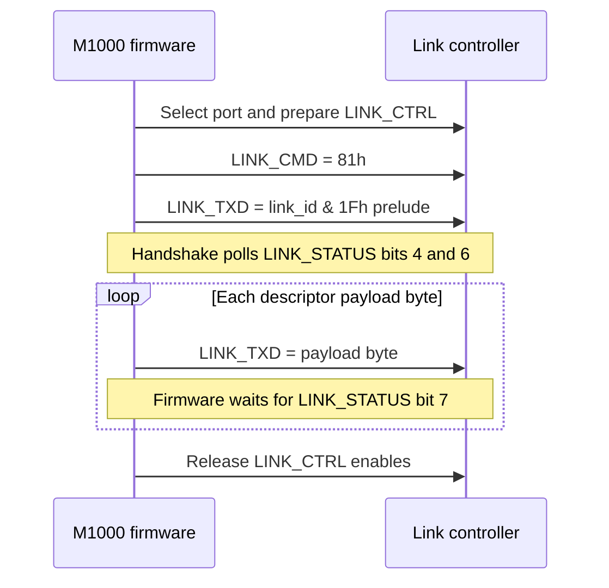

# Commstar link and session protocol

## Scope and implementation status

This is the normative record of what the firmware establishes about the
Commstar external link. It deliberately separates the controller-facing
transport from the higher-level session protocol: the former is sufficiently
known to model, while the latter is not yet sufficient to reimplement a file
transfer peer.

| Layer | Status | Implementation guidance |
|---|---|---|
| Z80-to-link-controller register protocol | **CONFIRMED** | Safe to emulate against the firmware. |
| Link-controller byte transaction | **CONFIRMED** in the M1000 direction | Use the strobe, status, and timeout rules below. |
| Validated frame envelope | **CONFIRMED** in part | Preserve the length and target-id fields; do not invent missing fields. |
| Session commands and replies | **PARTIAL** | Do not claim command names or payload formats from display strings. |
| RECORD/BLOCK file transfer | **OPEN** | Requires a live Commstar or hardware capture. |

The owner confirms that the two IR connectors are **V24 ADAPTOR (top)**
and **PLINTH (back)**. Firmware selects one of two line states using bit 5
of the active link id, but does not identify which bit value maps to which
physical connector. The 5-pin side port is the barcode-reader front end;
it is not part of this transport. See
[the barcode-reader guide](../manual/barcode-reader.md).

## Layer model

```text
Commstar application/session          OPEN: command and payload grammar
        │
Validated link frame                  partial: length, type, sequence, id
        │
Byte transaction / controller strobes CONFIRMED
        │
4Ah-4Fh controller interface          CONFIRMED
        │
IR connector selected by link-id bit5 owner-labelled, polarity OPEN
```

The controller interface is a byte-latch transport, not an SCC, SIO, or
ADLC. The firmware writes outgoing data at `LINK_TXD` (4Dh), reads incoming
data at `LINK_RXD` (4Eh), polls `LINK_STATUS` (4Bh), and drives
`LINK_CTRL` (4Ah). `LINK_CMD` receives `81h` during the present/ready
handshake. The exact register catalogue is in
[the I/O map](../internals/io-map.md).

## Controller transaction

### Transmit

**CONFIRMED:** `LinkBlockTx` (ROM00:3277) performs the following sequence.

1. Mask the active link id with `20h` and call the port-select helper.
2. Reset/prepare the control latch, then issue `LINK_CMD = 81h` after the
   ready poll.
3. Write `link_id & 1Fh` to `LINK_TXD`. This is a controller prelude, not
   part of the in-memory frame descriptor.
4. Wait for `LINK_STATUS` bit 4 and bit 6 at the two controller handshake
   stages; timeout returns `EBh` or `ECh` as applicable.
5. Stream each payload byte to `LINK_TXD`, waiting for `LINK_STATUS` bit 7
   before each `OUTI`. A per-byte timeout returns `EEh`.
6. Release the control-latch enables before returning.

The payload source is a **descriptor list** in RAM. Each four-byte entry is
`{ count_lo, count_hi, ptr_lo, ptr_hi }`; `LinkReadBufferDescriptor`
(ROM00:3508) advances to the next entry until a zero count terminates the
list. These descriptors are not transmitted.

The diagram below is the confirmed controller-facing transmit ordering. It is
not a Commstar session exchange and makes no claim about the external
controller's electrical timing.



### Receive

**CONFIRMED:** `LinkBlockRx` (ROM00:3378) uses control-latch strobes,
performs one synchronising `LINK_RXD` read, and drains descriptor-directed
buffers with `INI` while `LINK_STATUS` bit 0 indicates a byte is available.
Bits 1 and 2 participate in end/phase handling. Their exact external timing
and polarity still require a trace.

An adapter emulator must model the stateful handshake, not merely present a
flat byte stream. The current experimental Python model is not a conformance
implementation.

## Validated frame envelope

The following is established by `LinkValidateFrameHeader` (ROM00:30DC) and
the receive dispatcher (ROM00:2FBD). It describes the buffer after the
controller has received the prelude and payload; it is not a complete
session-message specification.

| Offset | Size | Field | Status |
|---:|---:|---|---|
| 0 | 2 | Total received length, little-endian | **CONFIRMED**: must equal the received byte count. |
| 2 | 1 | Frame type | **CONFIRMED**: dispatcher tests 2, 3, and 4. |
| 3 | 1 | Per-link sequence/expected-byte field | **CONFIRMED**: type-4 processing compares it with the link slot. |
| 4 | 1 | Header field | **OPEN**: helper-built frames initialise it to `7Fh`; meaning unproven. |
| 5 | 1 | Target link id | **CONFIRMED**: must equal `fdd4`. |
| 6 | n | Session payload | **OPEN**: format depends on the runtime session module. |

Validation rejects frames shorter than six bytes, frames whose embedded
length differs from the received count, and frames whose byte 5 differs from
the active link id. The comparison is an equality test implemented with XOR;
it is an address filter, not a checksum.

`LinkProcessCommandFrame` reads byte 3, compares it with the per-link byte
at `FE43h + (fdd4 & 3Fh)`, and accepts either the expected value or one
behind it in a specific retry state. It does **not** establish a generic
16-bit command word. Do not encode the values `{2B,2A,23,03}` as session
commands: they belong to a separate local device-route lookup.

## Types, replies, and session state

The receiver dispatches type 2, 3, and 4 differently. The state labels
`CONNECTED`, `READY-RX-DATA`, `RECORD-RX`, `BLOCK-TX`, and related C-*
texts are firmware UI/state vocabulary. They are useful research anchors,
but they are not a wire-command dictionary.

The loaded session module also uses `InlineTableDispatch` (ram:E0B2) for
local control flow. **CONFIRMED:** a CALL is followed by an inline table
with `{count: u16le} {case: u16le, handler: u16le} x count
{default_handler: u16le}`. The dispatcher probes the declared number of
cases, then tail-jumps to the trailing default when none matches. This
mechanism is local module control flow, not evidence that the case values
are wire-command identifiers.

The firmware writes these little-endian words into a reply buffer on some
paths: `01EE`, `02E0`, `02EE`, `04E0`, `05E0`, and `01EF`. Only
`01EF` is directly tied to the type-4 sequence mismatch. The complete
reply envelope, payload, and mapping of the remaining values to session
meaning remain open.

Consequently, no state diagram or host/peer session sequence is normative
yet. A capture must establish each transition as:

| Current state | Received bytes | Guard | Transmitted bytes | Next state |
|---|---|---|---|---|
| _pending capture_ | | | | |

## Addressing and connector selection

The active link id is retained in `fdd4`.

* Its low five bits are transmitted first as the controller prelude.
* Its bit 5 selects one of two firmware-controlled line states through
  `LinkPortSelect` (ROM00:3454).
* The complete id appears at validated-frame byte 5 and selects a
  per-link sequence slot by `id & 3Fh`.

This does not prove a multidrop physical topology, address allocation policy,
or a PLINTH/V24 mapping. Treat those as open hardware questions.

## What is not specified yet

An interoperable Commstar peer still needs captured evidence for:

* the complete session-command table and command-name mapping;
* every command payload and RECORD/BLOCK format;
* reply-frame envelope and reply payloads;
* startup, abort, retry, and completion transitions;
* maximum lengths, framing boundaries, and controller timing on the
  connector-facing side; and
* the physical connector/electrical interface required outside the M1000.

Until those captures exist, an implementation may emulate the M1000-side
register and validator behaviour, but must not claim Commstar file-transfer
compatibility.

## Evidence and next captures

The implementation evidence is in `LinkBlockTx` (ROM00:3277),
`LinkBlockRx` (ROM00:3378), `LinkValidateFrameHeader` (ROM00:30DC),
`LinkProcessCommandFrame` (ROM00:3084), and the descriptor helper
(ROM00:3508). The research worklist records the capture tasks in
`research/TASKS.md` in the source tree; research files are excluded from
the published site.

The next useful golden trace is one complete valid session exchange, including
the prelude, received-count boundary, every transmitted reply byte, and the
RAM frame buffer before and after dispatch. That trace should become both a
table in this document and an assertion-based regression test.
