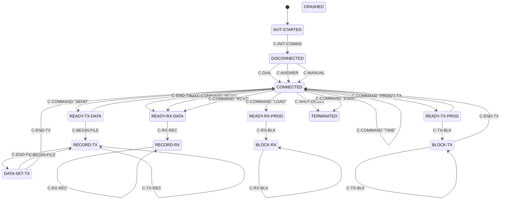

# Commstar link and session protocol

## Scope and implementation status

The Micronic 1000 external link is a byte-latch transport to an off-board
controller associated with two IR ports. This page states what a host-side
program **may rely on** at the M1000-facing latch boundary and what remains
blocked for a physical server.

**A historically interoperable Commstar server cannot yet be built from
this document, but the frame and object formats are largely recovered.**
The logical frame envelope, the request/response object grammar, and the
program-data block format are established from traces against real
firmware and are described below. What is missing is the IR wire framing,
a wire-visible session-arming signal, the meaning of several object
fields, and any handheld-to-host transfer. A peer built to this page
drives real firmware through a complete program download in the emulator;
it is not proven against historical hardware.

| Layer | Stability | Guidance |
|---|---|---|
| Z80-to-controller register protocol | **Stable** | Safe to emulate against the latch contract below |
| Controller byte transaction | **Provisional** | Ordering is stable; electrical bit meanings are not |
| Validated frame envelope | **Provisional** | Length, type, sequence, and target-id fields are stable; other bytes are not |
| Session request/response objects | **Provisional** | Envelope and length fields are consistent across all captures; several field meanings are open |
| Program-data block format | **Provisional** | Marker and length fields are confirmed; chunk maximum and EOF convention are open |
| Handheld-to-host data in requests | **Provisional** | Captured and decoded: the handheld sends objects to the host in its type-1 requests — 9 bytes at state `0006`, 54 bytes at state `0045` carrying operator text. `CommstarPeer` receives them |
| Handheld-to-host RECORD transfer | **Provisional** | Works with controlled content; the stream format is `[u8 namelen][name] (1Eh [record])* 1Ch`, multi-record confirmed. The transfer must run with validation suppressed, so the session ends in an abort rather than a clean teardown — `C-END-TX` is legal only from states the table cannot reach |
| IR wire framing | **Not implementable** | Requires a hardware capture |

The synthetic peer in the repository is regression infrastructure, not a
server profile. Its RAM and program-counter observations are unavailable
to a physical peer.

For the firmware evidence behind each claim, see
[RE notes: Commstar evidence](../re-notes/commstar-evidence.md).

### Server implementer summary

| Goal | Stability | Boundary |
|---|---|---|
| Model the M1000-facing `4Ah-4Fh` latches | **Provisional** | Emulator or controller model, not a physical adapter |
| Run the synthetic Load/Run peer | **Provisional** | Requires emulator access to M1000 RAM/execution state |
| Drive a COM/DIP download against real firmware | **Provisional** | Works in the emulator; needs RAM visibility for the receive arm |
| Download a COM/DIP image from a physical server | **Not implementable** | Blocked on the wire layer and a wire-visible arm |
| Receive data a handheld sends in a request | **Provisional** | Works: `CommstarPeer` receives and decodes the objects the handheld sends at states `0006` and `0045` |
| Receive a RECORD-mode upload from a handheld | **Provisional** | Works: `CommstarPeer` receives an application-nominated record verbatim. Pinned by `CommstarRecordUploadTest` |
| Build the IR adapter hardware | **Not implementable** | Connector-facing modulation and timing are open |

## Roles and byte-level terminology

* **Handheld** — the M1000 firmware and its external-link controller.
* **Server** — an external system that would exchange data with a
  handheld through an IR adapter. No interoperable server exists yet.
* **Synthetic peer** — the emulator component that feeds the controller
  receive latch and observes firmware internals.
* **Wire bytes** — bytes on the physical IR interface. Framing and even
  correspondence to controller bytes are open.
* **Controller-queue bytes** — bytes supplied to the `LINK_RXD` latch by
  the synthetic peer. They can include an uncounted sync byte and two
  trailing excluded bytes.
* **Logical-frame bytes** — the counted buffer validated by the frame
  header check. They begin with the six-byte header below.

Byte strings are labelled by level where established. A
controller-boundary capture is not a claim about IR serialisation.

`u16` denotes a little-endian 16-bit field; bare hex pairs are literal
bytes in transmission order.

The two IR connectors are **V24 ADAPTOR (top)** and **PLINTH (back)**
(owner-confirmed). Firmware selects one of two line states using bit 5 of
the active link id; which bit value maps to which connector is open. The
5-pin side port is the barcode-reader front end and is not part of this
transport — see [Barcode reader](../reference/barcode.md).

## Layer model

```text
Commstar application/session          Provisional: object grammar; field meanings open
        │
Logical frame                         Provisional: length, type, sequence, id
        │
Controller queue / byte transaction   Provisional at M1000 boundary
        │
4Ah-4Fh controller interface          Stable as latch addresses
        │
IR wire layer and connector selection  Not implementable: framing/polarity open
```

The controller interface is a byte-latch transport, not an SCC/SIO/ADLC.
Firmware writes outgoing data at `LINK_TXD` (`4Dh`), reads incoming data
at `LINK_RXD` (`4Eh`), polls `LINK_STATUS` (`4Bh`), and drives
`LINK_CTRL` (`4Ah`). `LINK_CMD` receives `81h` during the ready
handshake. The exact port catalogue is in
[Memory and I/O map](../reference/memory-io.md).

## Controller transaction

The M1000 drives `LINK_CTRL` and polls `LINK_STATUS` through a fixed
ordering. No electrical names for status or control bits are proven.

### How the IR hardware works

The handheld does not drive the IR line directly. It talks to an off-board
link controller through six latches (`4Ah`-`4Fh`), and the controller does
the serialising. Everything below describes that latch boundary, which is the
part the firmware defines; what the controller then puts on the IR line is
not established.

A transfer is a handshake, not a stream:

1. **Open.** The handheld selects the port (`LINK_CTRL` bit 1, from the
   active link id), pulses `XFREN`, and clears `DIREN`.
2. **Present.** It polls `TXRDY`, then writes `81h` to `LINK_CMD` — the
   controller's "are you there" exchange.
3. **Address.** It writes the low five bits of the link id to `LINK_TXD` as a
   prelude, outside the frame's own byte count.
4. **Turn the line.** It waits for `RXBUSY` to clear, raises `STROBE` and
   `DIREN`, waits, drops `STROBE`, then waits for `HSBUSY` to clear.
5. **Stream.** Each payload byte is written to `LINK_TXD` only while `TXRDY`
   is asserted, with a per-byte timeout.
6. **Close.** `DIREN` and `XFREN` are cleared.

Receiving inverts steps 1-4 and then reads `LINK_RXD` while `RXRDY` is
asserted. The whole receive status is fetched **once** and shifted, so the
four receive bits are one decision, not four polls.

The practical consequence for anyone building a controller — emulated or
real — is that this is a half-duplex, credit-based byte pump. The handheld
will not transmit while the controller says it has inbound data, and it will
not send a byte until the controller says it can take one.

### The transmit transaction, decoded

`LinkBlockTx` (`ROM00:3277`, 257 bytes) is the whole handheld-to-controller
transmit path, and it is now decoded end to end. **CONFIRMED** — every step
below is byte-read from the ROM.

It takes the link id in `A`. `ram:F794` shadows the control latch, so every
control write is read-modify-write against that shadow.

```text
3277  LD   C,A / AND 20h / CALL 3454h   ; select the IR port from id bit 5
327D  CALL 34D2h                        ; clear RXARM -- stop listening
3280  (F794) &= FEh -> OUT (4Ah)        ; bit 0 low
328A  (F794) |= 01h -> OUT (4Ah)        ;   then high: a start-of-transaction edge
3294  (F794) &= EFh -> OUT (4Ah)        ; bit 4 low
329E  LD B,80h / DJNZ $                 ; settle, 128 iterations
32A4  CALL 34ECh / JP Z,335Ah           ; link present?  no -> EBh
32AA  CALL 34F8h / JP Z,335Ah           ; ready?         no -> EBh
32B0  LD A,C / AND 1Fh
32B3  LD (F797),A / OUT (4Dh),A         ; the PRELUDE: link id, low 5 bits
32B8  LD DE,026Ch                       ; 620-count timeout
32BB  IN A,(4Bh) / CPL / AND 10h        ; wait for status bit 4 (active low)
32CC  (F794) |= 20h -> OUT (4Ah)        ; bit 5 high
32D6  (F794) |= 10h -> OUT (4Ah)        ; bit 4 high
32E0  LD B,20h / DJNZ $                 ; 32 iterations
32E6  (F794) &= DFh -> OUT (4Ah)        ; bit 5 low again -- a strobe pulse
32F0  LD DE,026Ch
32F3  IN A,(4Bh) / CPL / AND 40h        ; wait for status bit 6 (active low)
```

Then the payload, one descriptor at a time (`ROM00:3508` yields the next
run), with `OUTI` to the data latch:

```text
3315  LD DE,06F9h                       ; 1785-count timeout, per byte
3318  IN A,(4Bh) / RLCA / JR NC,334Eh   ; status bit 7 high = ready for a byte
331D  OUTI                              ; OUT (4Dh),(HL) ; HL++ ; B--
3322  JP NZ,3318h                       ; more bytes in this run
3328  DJNZ 3311h                        ; more runs
332B  JP 3309h                          ; next descriptor
```

and finally the completion check:

```text
332E  CALL 34ECh / JR Z,3356h           ; still present?   no -> EEh
3336  IN A,(4Bh) / CPL / AND 40h        ; wait status bit 6 (active low)
3343  JR Z,3356h                        ; timed out        -> EEh
3346  AND 20h / JR NZ,335Eh             ; status bit 5 set -> ECh
334A  XOR A                             ; success: A = 0, carry clear
3362  (F794) &= EFh -> OUT (4Ah)        ; bit 4 low
336C  (F794) &= FEh -> OUT (4Ah)        ; bit 0 low -- end of transaction
```

**Result convention:** carry clear and `A = 0` on success; carry set with
`A = EBh` (controller absent or not ready), `ECh` (controller reported an
error in status bit 5) or `EEh` (timed out waiting for completion).

#### What this settles

**The prelude byte comes from `ROM00:32B3`, and it is `link id & 1Fh`.** That
is why a peer cannot recover the full eight-bit id from the wire — the
firmware masks it to five bits before it ever leaves the machine. The peer
library's `link_id_from_prelude` reconstruction is guessing at the other
three bits, and now we know it must.

**There is no checksum, anywhere.** Neither `LinkBlockTx` nor `LinkBlockRx`
contains a single accumulating `XOR` or `ADD` — I checked every opcode in
both. Integrity is not this layer's job, and the link's physical character is
why that is reasonable: it is a **synchronous, clocked link** (clock and data
in each direction) between emitter/detector pairs that sit almost in contact,
so very little stray light reaches them. A host implementation should not
expect to find a checksum to validate, and should not add one.

**One thing the ROM cannot tell us.** The prelude is written to the *same*
data latch as the payload (`4Dh`), but *before* the strobe sequence, whereas
payload bytes follow it. So whether the controller forwards the prelude onto
the IR line or consumes it as addressing is **not determinable from the
firmware** — it depends on the controller. This matters for a real adapter:
it decides whether the prelude is a byte you will see. A logic capture of the
line during a transfer settles it immediately.

#### Timing budget

Two timeout constants, both counted in `DEC DE / LD A,D / OR E` spin loops on
a 3.579545 MHz Z80:

| Where | Count | Waiting for |
|---|---|---|
| `32B8`, `32F0`, `3333` | `026Ch` = 620 | a handshake response |
| `3315`, `331F` | `06F9h` = 1785 | readiness for the next payload byte |

Plus fixed settling delays of 128, 32 and 2 `DJNZ` iterations. These are the
numbers an adapter has to beat. They are generous for hardware on the same
board and much less so for anything with a round trip measured in
milliseconds — **an adapter that bridges to a host over USB should service
the latch handshake locally rather than round-tripping each byte.**

### The receive transaction, decoded

`LinkBlockRx` (`ROM00:3378`, 221 bytes) is the mirror. The payload loop reads
with `INI` from the data-in latch `4Eh`, gated by the status register, and it
is the **status bits that carry the framing** — there is no in-band delimiter:

```text
33CD  LD   C,4Eh                  ; the data-in latch
33CF  IN   A,(4Bh)                ; status
33D1  RRCA / JR NC,33E0h          ; bit 0: a byte is waiting?  no -> 33E0
33D4  INI                         ; IN (HL),(4Eh) ; HL++ ; B--
33D6  LD   DE,06F9h               ; reset the per-byte timeout
33D9  JP   NZ,33CFh               ; more bytes in this run

33E0  RRCA / JR C,33F0h           ; bit 1: end of frame -> 33F0
33E3  DEC  DE / ... / JP NZ,33CFh ; else keep spinning
33EB  LD   A,0EEh                 ; timed out

33F0  RRCA / JR NC,33F7h          ; bit 2: one more byte to take?
33F3  PUSH AF / INI / POP AF      ;   yes -- take exactly one
33F7  RRCA / JR C,341Ch           ; bit 3: controller reported an error
```

So the **receive status register `4Bh`** decodes as:

| Bit | Meaning on receive |
|---|---|
| 0 | a byte is waiting in the data-in latch |
| 1 | end of frame |
| 2 | one further byte to take |
| 3 | the controller reports an error |

This is what the two "trailing excluded bytes" in the captured frames are
about: they are **not** part of the counted frame, and the handheld does not
find them by counting. The controller signals them out of band, and
`ROM00:33F3` takes one byte when status bit 2 says so. The frame's own length
field never covers them, which is exactly why the peer library has to append
them separately and why they are excluded from the length.

**A note on how far this goes.** The mechanism is CONFIRMED — status bit 2
gates a single extra `INI`. What those bytes *mean* is still open: the peer
sends the frame's type and sequence there because that is what the firmware
accepts, but nothing in `LinkBlockRx` interprets them, so their purpose is a
controller-level convention this ROM cannot explain.

The per-byte timeout is `06F9h` = 1785, the same constant the transmit path
uses, and the failure code is `EEh` as before.

### The command and probe latches

`LINK_CMD` (`4Ch`) has exactly one writer and exactly one value. `LinkPresent`
(`ROM00:34EC`) waits for `TXRDY`, then writes **`81h`** and shadows it at
`ram:F796`. There is no second value anywhere in ROM00, ROM01 or the battery
RAM, so nothing can be inferred from variation — it is a fixed "begin"
token in the present/ready handshake rather than a command byte with fields.

`LINK_PROBE` (`4Fh`) is more interesting. `LinkProbe` (`ROM00:348A`) computes
its value rather than loading it:

```text
348A  3E 7F     LD A,7Fh
348C  E6 1F     AND 1Fh        ; -> 1Fh
348E  32 99 F7  LD (0F799h),A  ; shadowed
3491  D3 4F     OUT (4Fh),A
```

`7Fh AND 1Fh` is exactly the masking that forms a **prelude** from a link id.
So the probe addresses id `7Fh` — the same constant the handheld writes at
frame offset +4. That is new evidence about `7Fh`: it is used *as an id* in at
least one place, rather than being an arbitrary filler. Whether it means
"broadcast" or "unassigned" is still open, but "not an id" is no longer
tenable.

### What the status and control bits do

Electrical names remain unproven, but each bit's **role in the protocol** is
recoverable from how the firmware uses it — and that is what a controller
model has to reproduce. Every row below is read from the drivers; the
"required of a model" column is what the repository's synthetic peer does,
which is sufficient to drive real firmware through a complete session.

`LINK_STATUS` (`4Bh`), read by the handheld. The names are **INFERRED** from
the branch each bit drives — they are a naming convenience, not a datasheet:

| Bit | Inferred name | Role | Required of a controller model |
|---:|---|---|---|
| 0 | `RXRDY` | A received byte is available | Assert while bytes remain to hand over; the handheld reads one per assertion |
| 1 | `RXEND` | Block finished, status valid | Assert once the block is drained. While bits 0 and 1 are both clear the handheld keeps waiting, then gives up with `EEh` |
| 2 | `RXTAIL` | One further byte to take | Assert to have exactly one extra byte read after the block |
| 3 | `RXERR` | Transfer failed | Assert to fail the transfer with `ECh` |
| 4 | `RXBUSY` | Inbound data pending | Must be **clear** before the handheld will begin transmitting |
| 5 | `TXERR` | Error latch, sampled at end of transmit | Leave clear; set yields `ECh` |
| 6 | `HSBUSY` | Handshake busy | Must go **clear** to complete the transmit handshake |
| 7 | `TXRDY` | Ready to accept a transmit byte | Assert; polled before every byte written to `LINK_TXD` |

The receive decode is a chain of `RRCA` at `ROM00:33CF`, testing bits 0, 1,
2, 3 in that order — so the four receive bits are one status byte read once
and shifted, not four separate polls.

`LINK_CTRL` (`4Ah`), driven by the handheld:

| Bit | Inferred name | Role |
|---:|---|---|
| 0 | `XFREN` | Transfer active — cleared then set to open, cleared to close |
| 1 | `PORTSEL` | Port select, driven from active-link-id bit 5 by `LinkPortSelect` |
| 4 | `DIREN` | Direction/enable — cleared at open, set during the handshake, cleared at close |
| 5 | `STROBE` | Strobe — set, short delay, cleared |
| 6, 7 | `RXARM` | Receive-armed, always driven as a pair. Set when the handheld has nothing to receive, cleared while it services a receive or runs a transfer |

Bits 0, 1, 4 and 5 are driven only by the transfer routines; bits 6 and 7 are
driven only by the interrupt poll and by `LinkBlockTx`, which clears them
before transmitting.

### The receive-armed handshake

`RXARM` is how the handheld tells the controller it is ready to be given data.
The interrupt poll at `ROM00:31B6` is the whole mechanism:

```text
31B6  CALL 34D2    ; clear RXARM
31B9  CALL 34E7    ; IN (4Bh) / AND 10h -- is RXBUSY set?
31BC  JR Z,31C2    ; nothing pending ->
31BE  CALL 2FBD    ; something pending: run the receive dispatcher,
31C1  RET          ;   leaving RXARM clear for the duration
31C2  CALL 34BD    ; idle: set RXARM
31C5  RET
```

So an idle handheld sits with `RXARM` set. A controller wanting to deliver
data asserts `RXBUSY`; the poll sees it, clears `RXARM`, and dispatches. When
the handheld transmits instead, `LinkBlockTx` clears `RXARM` at its start
(`ROM00:327D`).

For a physical adapter this is the signal to watch: **`RXARM` set means the
handheld is listening.** Without it, an adapter has no way to know when it may
begin a delivery, and `LINK_CTRL` is the only place the handheld says so.


**Confidence.** The roles are CONFIRMED in the sense that they are read
directly from the branch each bit drives. What is *not* established is what
any bit means electrically at the connector, or whether a real controller
derives them the same way. Two behaviours corroborate the reading: the
turn-taking rule below follows from bit 4, and a peer implementing exactly
this table completes real sessions.

**Transmit ordering (stable as latch sequence):**

1. The port-select latch follows active-link-id bit 5 (one of two IR
   line states; which state is V24 ADAPTOR vs PLINTH is open).
2. Toggle `LINK_CTRL` bits around a short delay.
3. Poll `LINK_STATUS` bit 7 and write `0x81` to `LINK_CMD` when ready.
4. Write the low five bits of the link id (`link_id & 1Fh`) to `LINK_TXD`
   as a controller prelude — excluded from the frame length.
5. Handshake on `LINK_STATUS` bits 4 and 6 via `LINK_CTRL` bits 5/4.
6. Stream payload bytes: each byte to `LINK_TXD` gated by `LINK_STATUS`
   bit 7.
7. Clear `LINK_CTRL` bits to idle.

**Turn-taking rule (provisional):** the synthetic peer asserts
`LINK_STATUS` bit 4 while inbound bytes remain; a controller model must
drain and deassert before accepting the next M1000 transmission or the
transmission fails. This is a latch-level constraint, not a proven
half-duplex wire rule.

Mechanically the payload source is a descriptor list of
`{count, pointer}` entries terminated by a zero count; descriptors are
not transmitted.

**Receive ordering (provisional):** clear bit 0, set bit 5, single read
from `LINK_RXD`, set bit 4 with delay, clear bit 5, then continue reading
while status bit 0 is set. Bits 1-3 participate in the decode. The
cleanup toggles bit 1, sets then clears bit 0, and clears bit 4.

An adapter emulator must model the stateful handshake, not merely present
a flat byte stream.

## Validated frame envelope

The buffer after the controller has delivered the prelude and payload
carries this header:

| Offset | Size | Field | Stability |
|---:|---:|---|---|
| 0 | 2 | total received length (`u16le`) — must equal byte count | **Stable** |
| 2 | 1 | frame type — values 2, 3, 4 are dispatched | **Provisional** |
| 3 | 1 | per-link sequence — compared with per-link slot | **Provisional** |
| 4 | 1 | active link id — equality-checked on receive | **Stable** |
| 5 | 1 | unread by examined ROM link code | **Not implementable** |
| 6 | n | session payload — request/response object, see below | **Provisional** |

Validation rejects frames shorter than six bytes, frames whose embedded
length differs from the received count, and frames whose byte 4 differs
from the active link id. The TX path writes `0x7F` at offset 4; the RX
path requires offset 4 to equal the link id. The meaning of `0x7F` on the
wire is open. The examined ROM path has no checksum.

The sequence-number lifecycle — who advances it, when, and whether
directions share a counter — is open.

For the comparison and the descriptor shapes that carry this envelope,
see [RE notes: Commstar evidence](../re-notes/commstar-evidence.md#validated-frame-envelope).

## Externally observable subset

From M1000 traffic alone an observer can obtain the controller prelude
`id & 1Fh` (five bits), the length at offset +0, type at +2, and sequence
at +3. It cannot obtain the full eight-bit link id, which a server must
reproduce at offset +4.

Captured length is `1 + u16le(tx[1:3])` including the prelude — the only
confirmed rule for delimiting a captured M1000 transmission.

| Link id bits | Observable from wire? | Source |
|---|---|---|
| 0-4 | Yes | Controller prelude |
| 5 | No | Port select; polarity is open |
| 6-7 | No | Never transmitted; two samples are not a rule |

The remaining three bits, the per-link sequence slot, and the
fresh program-receive arm are not wire-visible.

## Captured M1000 session requests (controller-boundary TX)

V24 Mode 1 captures of pre-stream requests. First byte is the
controller prelude; remaining bytes are the logical frame. These bytes
are **stable as observed traces for this harness**; their field
semantics beyond the envelope are provisional.

| Request | Prelude | Logical frame |
|---|---|---|
| Initial | `03` | `0C 00 01 00 7F 00 00 00 00 00 00 00` |
| State 61 | `03` | `0C 00 01 01 7F 00 61 00 00 00 00 00` |
| State 64 | `03` | `0C 00 01 01 7F 00 64 00 00 00 00 00` |
| State 45 | `03` | `42 00 01 01 7F 00 45 00 01 00 36 00 00 00 00 00 00 00 00 00 00 00 00 00 00 00 4C 4F 41 44 31 32 33 34 35 36 37 38 00 00 00 00 00 00 00 00 00 00 00 00 00 00 00 00 00 00 00 00 00 00 00 00 00 00 00 00` |
| State 44 | `03` | `0C 00 01 01 7F 00 44 00 00 00 FF 00` |

### Request and response object format

Every captured exchange fits one grammar. **Provisional**: the shapes below
hold across all captured exchanges, but they rest on a handful of samples and
the meaning of individual fields is stated separately.

A type-1 request payload is three `u16` fields, optionally followed by an
object:

```text
frame:   [u16 length][u8 type=1][u8 seq][u8 7F][u8 00] payload
payload: [u16 state][u16 arg][u16 count] object[count]
```

| Request | length | state | arg | size | object | size = object length? |
|---|---:|---:|---:|---:|---:|---|
| Initial | 12 | `0000` | 0 | `0000` | 0 | yes |
| Second | 21 | `0006` | 0 | `0080` | 9 | **no** |
| State 61 | 12 | `0061` | 0 | `0000` | 0 | yes |
| State 64 | 12 | `0064` | 0 | `0000` | 0 | yes |
| State 45 | 66 | `0045` | 1 | `0036` | 54 | yes |
| State 44 | 12 | `0044` | 0 | `00FF` | 0 | **no** |

The third `u16` is a size field whose role is state-dependent, and it must not
be read as a general length. It equals the trailing object length for states
`00`, `45`, `61`, and `64` — the state-45 frame confirms it exactly, 54 =
66 − 12. It does not for state `06` (`0x0080` with a nine-byte object) or
state `44` (`0x00FF` with none). Those two are the requests that solicit data
from the peer, so a requested-maximum reading fits both values, but it is not
proven and the state-`06` object is unexplained under either reading.

A type-2 response payload takes one of two shapes:

```text
control ack:  [u8 00]
data object:  [u16 status][u16 marker][u16 N] data[N] [u16 00]
```

| Response | length | status | marker | N |
|---|---:|---:|---:|---:|
| Control (states 61/64/45) | 7 | — | — | single `00` byte |
| State-44 control object | 20 | 0 | 1 | 6 |
| Program data chunk | variable | 0 | 0 or 1 | payload bytes |

`marker` 0 permits another refill; `marker` 1 ends the stream. `N` matched the
data length exactly in every captured object.

### The wire states

The `state` field in a type-1 request is set by `SessionSetParams`
(`ROM00:5973`), which has twelve call sites in ROM00. Each is a fixed tuple,
so the complete set of wire states is enumerable from the ROM:

| State | Routine | Payload | Meaning |
|---|---|---|---|
| `0000` | `5B79` | none | link init |
| `0006` | `5BF7`, `5CD7` | up to 128 | link configure, from `C-INIT-COMMS` |
| `0043` | `62C7` | none | short query preceding an `0044` |
| `0044` | `620B`, `62C7` | up to 128 | data block **in** |
| `0045` | `612A` | variable | data block **out** |
| `0060` | `5E2A` | variable | connect: **dial** (link type 6 only) |
| `0061` | `606C` | none | connect: **answer** |
| `0062` | `5DFD` | none | connect: **direct** (seen in every IR capture) |
| `0064` | `60D6` | none | begin transmission |
| `0065` | `5BA6` | none | end of transaction |

**`0062` is the direct-connection substitute for dialling.** `ROM00:5DFD` is
byte-for-byte identical to the state-`0065` and state-`0000` routines but for
the one immediate: a bare six-byte control frame expecting a six-byte reply.
It is what `C-DIAL` and `C-ANSWER` send when the link type in `ram:E520` is
**not** 6, and what `C-MANUAL` sends unconditionally. Only when the link type
is 6 — a modem — do `C-DIAL` and `C-ANSWER` take the `0060`/`0061` paths
instead. Since an IR link is never link type 6, **a peer for real hardware
should expect `0062` here and never `0060`.**

`ram:E520` is written at exactly two places, `ROM00:5676` and `ROM00:56B1`,
both reached from `C-INIT-COMMS` — so the link type is latched once at
session setup and never changes.

`0065` is emitted at the tail of every data routine, so a peer sees it after
each exchange rather than only at session end.

**CONFIRMED: the `0045` arg field is a last-block marker.** It is 0 when the
frame comes from the automatic 128-byte flush (`ROM00:6187`) and 1 from the
explicit end-of-transmission flush (`ROM00:61F9`). Measured by uploading a
200-byte record, which the 128-byte wire buffer segments into two frames:

```text
frame 0: arg=0  len=128
frame 1: arg=1  len=83
```

**Frames carry no internal headers** — concatenating them reproduces the
211-byte stream `[u8 8]"LONGFILE" 1Eh <200 bytes> 1Ch` byte for byte. So a
peer reassembles a record stream by plain concatenation, and knows the
transfer is complete when it sees `arg = 1`.

Regressions: `test_multi_frame_transfer_marks_only_the_last_frame` and
`test_multi_frame_stream_reassembles_by_concatenation`.

#### State-45 object layout

Measured by varying one input at a time and comparing captures
(`--serial` and `--trace-loadrun-name`); each field was confirmed by
observing that it, and nothing else in the frame, changed. **Stable as
measured**; the frame length stayed 66 throughout.

The 54-byte object is the **command record**, assembled at `ram:E492` and
transmitted whole by `C-COMMAND` (`ROM00:4C11`–`4C19`). Measurement and the
ROM agree field for field:

| Object | Frame | Size | Field | Source | Encoding |
|---:|---:|---:|---|---|---|
| +0 | +12 | 8 | identity 1 | `E6D0` | zero in every capture |
| +8 | +20 | 6 | identity 2 | `E6E8` | zero in every capture |
| +14 | +26 | 4 | **operation name** | `*(E48F)` | `LOAD` on this path |
| +18 | +30 | 8 | **workstation number** | `E6EF` | **right-justified, space-padded** |
| +26 | +38 | 8 | identity 4 | `E6C4` | zero in every capture |
| +34 | +46 | 8 | identity 5 | `E6D9` | zero in every capture |
| +42 | +54 | 12 | **command parameter** | `C-COMMAND` `SP+2` | **left-justified, NUL-padded**; the program name here |

The two padding conventions differ and are each confirmed by a short value:
workstation `ABC` serialises as `20 20 20 20 20 41 42 43`, program name `XY`
as `58 59 00 00 00 00 00 00`. The parameter field is 12 bytes, so a program
name of 8 characters leaves the last four zero — which is why measurement
alone read it as an 8-byte field followed by padding.

**The `LOAD` field is the operation name, and other operations do replace
it.** It comes from `tbl_sess_operations`, whose seven entries are `RCV1`,
`RCV2`, `SEND`, `LOAD`, `PROG`, `TIME` and `ENDC` —
[see below](#how-states-4-5-and-6-are-entered). It did not vary under the
inputs tested because `C-COMMAND`'s *first* argument selects it, and the
Load/Run path always passes the same index.

The four blank identity fields are latched by `C-INIT-COMMS`, which is why
they are empty here: Load/Run collects no credentials. See
[the API page](../reference/commstar-api.md#c-init-comms).

For harness provenance see
[RE notes: Commstar evidence](../re-notes/commstar-evidence.md#captured-session-requests).
For the experiment that would settle the object field offsets by measurement,
see [RE notes: Open questions](../re-notes/open-questions.md#state-45-payload-structure).

## Who starts a session

**The handheld does, always.** This matters for anyone building a host: a
Commstar server is purely reactive. It cannot poll a handheld, push a program
to it, or ask it to upload.

### `C-COMMAND` is a generator, not a parser

It is tempting to read `C-COMMAND` as the IR command interpreter. It is the
opposite: `ROM00:4AE0` assembles the 54-byte command record and **transmits**
it (`ROM00:4C19`), then looks at the reply. There is no inbound decode
anywhere in the routine. The handheld names the operation; the host obeys.

### The receive path is always armed, but dead-ends

The handheld *will* take bytes at any time. `ROM00:2352` is a five-record
interrupt table, `{u8 mask, u16 handler}`, copied to `ram:FD84` at cold start;
`IrqWorkerPollPort5` (`ROM00:230A`) reads port `05h` and calls each handler
whose bit is set. Mask `04` vectors to `ROM00:31B6`:

```text
31B6  CALL 34D2h      ; clear RXARM
31B9  CALL 34E7h      ; IN (4Bh) / AND 10h -- RXBUSY?
31BC  JR   Z,31C2h
31BE  CALL 2FBDh      ; yes: the receive dispatcher
31C1  RET
31C2  CALL 34BDh      ; no: set RXARM again
```

**There is no session-state test here.** An idle handheld sits with `RXARM`
set and services the link on interrupt. `ROM00:31B6` has no xref in Ghidra —
it is reachable only through the `ram:FD84` table — which is why it is easy to
miss.

What an unsolicited frame *cannot* do is reach the session layer. The receive
dispatcher `ROM00:2FBD` branches only on the link-layer state in `ram:FDD5`,
and its sole exit into anything above is `ROM00:30D7`,
`LD HL,(FDD2) / JP (HL)`. **`ram:FDD2` has exactly one writer in the whole
image**, `ROM00:2F36`, inside the transaction *starter* `ROM00:2F24`. So the
only continuation an inbound frame can vector into is one the handheld
installed when it began its own request.

That is "the firmware has no path", not "no path has been found".

### `C-ANSWER` is not a listen primitive

It reads `ram:E520` and dispatches: link type 6 sends wire state `0061`,
anything else sends `0062`. Either way **the handheld transmits**. "Answer"
means telling the far end to answer a phone line.

### What a host can do

* **Be ready and answer.** The signal is `LINK_CTRL` (`4Ah`) bits 6+7
  (`RXARM`) **set** — the handheld is listening. `LinkBlockTx` clears them at
  `ROM00:327D` before transmitting.
* **Take a reasonable time.** The handheld retries a request up to `32h` = 50
  times (`ROM00:2F58` sets `FDD6`, `ROM00:30FC` decrements), and a reply up to
  `14h` = 20 times (`ROM00:3042`). Miss the window and the operator sees
  `Plinth not connected.`
* **Serve any operation.** The handheld names it; the host reacts.

### Do not send unsolicited frames

**LIKELY, and worth designing around.** With the link idle, `ROM00:2FBD` will
accept any frame whose embedded length matches the byte count and whose byte
+4 equals `ram:FDD4`. A frame of a type other than 2 or 3 falls through
`ROM00:3060` -> `3078` -> `30AD` -> `30D7`, the `JP (HL)` through `FDD2` —
which is `0000` on a cold machine, so the jump lands on the reset vector. A
type-2 frame is the safe one: it draws a three-byte reply and moves the link
to state 3, nothing more.

### There is no Plinth detection

`Plinth not connected.` (`ROM00:6D6F`) is **not** a detection result. Its one
code reference is `ROM00:4463`, inside a helper reached from
`C-INIT-COMMS`'s result switch (`ROM00:46D6`): result 9 or default. The
handheld prints it when the peer fails to answer its link-configure request,
whatever is physically attached.

`LinkProbe` (`ROM00:348A`) does return a status byte, but **both its callers,
`ROM00:0202` and `ROM00:0229`, discard it** — it is a cold-boot reset of the
link controller.

Plinth versus V24 adaptor is a **menu choice**, not a detection. There is no
electrical connector to detect: both are **IR ports on the handheld** — the
Plinth port on the base, the V24 port on the top — and the "connector" is the
infrared link itself.

`LinkBlockTx` routes on **bit 5 of the link id**, which it tests on entry and
hands to `LinkPortSelect` (`ROM00:3454`):

```text
ROM00:3277  LD   C,A          ; the link id
ROM00:3278  AND  20h          ; id bit 5 -> Z set when CLEAR
ROM00:327A  CALL 3454h
```

`LinkPortSelect` drives **two** latches consistently — `LINK_CTRL` (`4Ah`)
bit 1 and port `2Ch` bit 5 move together:

| id bit 5 | `LINK_CTRL` bit 1 | port `2Ch` bit 5 |
|---|---|---|
| clear (id `43h`) | **set** | **set** |
| set (id `63h`) | clear | clear |

**Which of those is the base port and which is the top is NOT established.**
An earlier revision of this page asserted `43h` = Plinth and `63h` = V24 on
the strength of the factory default screen reading `PLINTH`. That reasoning
does not hold up, for two reasons found while trying to confirm it:

* **`43h` and `63h` are wire ids in a device table, not a picker output.**
  `ROM00:31FF` is the accessor, and it decodes as a lookup on a device
  number, **not** as four 4-byte slots:

  ```text
  31FF  CP   41h / JR C,320Bh    ; >= 'A' -> a drive letter
  3203  SUB  41h / LD HL,0FE93h  ;   index the drive-letter table
  320B  LD   HL,0FE83h           ; otherwise a device number
  320E  AND  A / JR Z,321Ch      ;   0 is invalid
  3211  DEC  A / CP 10h          ;   1-based, bounded to 16
  3216  LD   D,0 / LD E,A / ADD HL,DE / XOR A / RET
  ```

  So `ram:FE83` is a flat 16-entry array — `80 AB 63 43 80 2B 63 43 80 67 63
  43 80 67 63 43` — mapping a device number to a wire id, and `43h`/`63h` are
  the ids of two particular devices.

* **Measured: the Load/Run source picker does not change the id.** Running the
  harness both ways — `--trace-loadrun-source plinth` and `--trace-loadrun-source
  v24` — the two traces genuinely diverge (13 agreed / 1 unsolicited versus 12
  agreed / 2 unsolicited) and yet **both carry prelude `03` and link id
  `43h`**. So whatever selects the IR port, it is not that picker.

There are two separate pickers, and this is probably the confusion: the
five-entry storage picker at `micron2.bin 0x757F` (`WORKSTATION MEMORY`,
`WORKSTATION RAMDISK`, `PLINTH`, `V24 ADAPTOR`, `EXT STORAGE ADAPTOR`) is
what the harness drives, while the two-entry picker at `0x7663` (`PLINTH`,
`V24 ADAPTOR`) sits in the comms setup form and is **not** exercised by any
current trace.

What would settle it: drive the `0x7663` picker and re-read the prelude, or
watch which IR port goes active on real hardware.

### `ram:E520`, the link type

Two writers, both in `C-INIT-COMMS`'s callees (`ROM00:5676`, `ROM00:56B1`);
it is a **caller-supplied parameter, never probed from hardware**. The only
value it is ever compared against is 6. From the link-method table:
**4 = `LOCAL LINK` (the IR path), 6 = any of the three modem methods.** So
`E520 == 6` does not mean "MODEM A/ANS" specifically.

## Session states

### The firmware's own state names

`ROM00:6A4A` is a table of 16 little-endian pointers to display strings —
the firmware's own vocabulary for its session states. **Stable** (byte-read
from ROM); this is what the device calls its states, not necessarily what
travels on the wire.

| Index | Name | Index | Name |
|---:|---|---:|---|
| 0 | `NOT-STARTED` | 8 | `BLOCK-RX` |
| 1 | `DISCONNECTED` | 9 | `RECORD-TX` |
| 2 | `CONNECTED` | 10 | `DATA-SET-TX` |
| 3 | `READY-RX-DATA` | 11 | `BLOCK-TX` |
| 4 | `READY-RX-PROG` | 12 | `TERMINATED` |
| 5 | `READY-TX-DATA` | 13 | `CRASHED` |
| 6 | `READY-TX-PROG` | 14 | `REPLY-START` |
| 7 | `RECORD-RX` | 15 | `REPLY-END` |

The names confirm the shape of the protocol the firmware implements: a
connect/disconnect lifecycle, separate readiness states for data versus
program in each direction, and distinct `RECORD` and `BLOCK` transfer modes
each with an RX and a TX form. `DATA-SET-TX` has no RX counterpart.

### The firmware's own command names

`ROM00:6B67` is a parallel table of 17 pointers to command-name strings.
**Stable** (byte-read from ROM; every pointer resolves inside the string
block that immediately follows the table).

| Index | Name | Group |
|---:|---|---|
| 0 | `C-INIT-COMMS` | link setup |
| 1 | `C-DIAL` | link setup |
| 2 | `C-ANSWER` | link setup |
| 3 | `C-MANUAL` | link setup |
| 4 | `C-DROP-LINE` | link teardown |
| 5 | `C-COMMAND` | command exchange |
| 6 | `C-RX-CMD` | command exchange |
| 7 | `C-TX-REPLY` | command exchange |
| 8 | `C-SHUT-DOWN` | termination |
| 9 | `C-RX-REC` | record transfer |
| 10 | `C-RX-BLK` | block transfer |
| 11 | `C-BEGIN-FILE` | file framing |
| 12 | `C-TX-REC` | record transfer |
| 13 | `C-END-FILE` | file framing |
| 14 | `C-TX-BLK` | block transfer |
| 15 | `C-END-TX` | file framing |
| 16 | `C_ABORT` | termination |

Index 16 is spelled with an underscore where every other entry uses a
hyphen; that is verbatim from ROM, not a transcription slip.

This is the operation vocabulary the firmware implements, and it accounts
for the transfer modes the state table names: `RECORD` and `BLOCK` each have
an RX and a TX command, wrapped by `C-BEGIN-FILE` / `C-END-FILE` /
`C-END-TX`, with `C-COMMAND` / `C-RX-CMD` / `C-TX-REPLY` for the
command-and-reply exchange and four link-setup entries covering direct,
dialled, answered, and manual connection.

**Neither table's index is a proven wire value.** The state table is indexed 0-15 and the
command table 0-16, while the values carried in request payload +0 are
`00`, `06`, `44`, `45`, `61`, and `64`. A seventh, `65`, is passed to
`SessionSetParams` and `SessionTxSendFrame33` on the `C_ABORT` path
(`ROM00:5BA6`) — direct evidence that these numeric values are the parameter
an operation *sends*, rather than merely an internal label.
No mapping between these numbering
systems is established. Neither table has a static xref — both indices are
supplied by the RAM-resident session module — and the Load/Run path never
displays a name from either table, so the traces cannot correlate them
either. Do not assume, for example, that wire `44` is `READY-RX-PROG`
because of its high nibble.

What the two tables do establish is the **shape** of the protocol,
independently of any capture: which operations exist, that record and block
transfer are distinct modes with separate directions, and that file framing
is a wrapper around them rather than a property of individual blocks.

### The four operations

Load/Run **is** the Commstar session screen (owner-confirmed), so the traced
program download is a Commstar session. `ROM00:6C8E` holds the user-facing
strings that screen actually renders, and they form a 2x2 matrix — data
versus program, transmit versus receive:

| Operation | Title | In progress | Completion |
|---|---|---|---|
| Data TX | `Data Transmission` | `Sending data` | `Data transmitted` |
| Program TX | `Program Transmission` | `Sending prog` | `Program transmitted` |
| Data RX | `Data Reception` | `Receiving data` | `Data received` |
| Program RX | `Program Reception` | `Receiving prog` | `Program received` |

**Stable** (byte-read from ROM). The traced session exercises the fourth row
only: it displays `Receiving prog`.

This matrix lines up exactly with four of the internal state names —
`READY-TX-DATA`, `READY-TX-PROG`, `READY-RX-DATA`, `READY-RX-PROG` — and the
state machine below confirms that `RECORD` operations carry data and `BLOCK`
operations carry program images.

The practical consequence is that the uncaptured handheld-to-host direction
is not behind a different screen or a different mode — it is the top row of
the same screen the traces already reach. What selects the row is the open
question.

### The protocol state machine

`ROM00:692A` is a state-transition matrix indexed
`table[state * 17 + command]`. Bit 7 of an entry marks an **illegal**
transition (the firmware shows a message box); bit 7 clear means legal, and
`entry & 0x7F` is the next state. **Stable** — the `*17` multiply and the
table base are byte-verified at `ROM00:3C06`, the extent is exactly
14 states x 17 commands = 238 bytes (`692A`-`6A17`, with unrelated data
beginning at `6A18`), and the decoded machine is internally consistent.



The figure is generated from the ROM by
`analysis/decode_state_machine.py --mermaid`, so it cannot drift from the
firmware. Dashed states are those the transition table alone cannot reach;
the `C-COMMAND "NAME"` edges are the operation table's direct entries, which
bypass the table — see
[How states 4, 5 and 6 are entered](#how-states-4-5-and-6-are-entered).

Two near-universal commands are folded out of the figure to keep it legible:
`C-DROP-LINE` is legal from **all 14** states and returns to `NOT-STARTED`,
and `C_ABORT` reaches `CRASHED` from **states 1-12 only** — it is an illegal
transition from `NOT-STARTED` (nothing to abort) and from `CRASHED` (already
aborted), so `CRASHED` accepts only `C-DROP-LINE`. `REPLY-START` and `REPLY-END` have no row
in the matrix and are display-only.

The shape is now explicit. A data upload is
`C-BEGIN-FILE`, then `C-TX-REC` per record, then `C-END-FILE` to
`DATA-SET-TX`, and either another file or `C-END-TX` back to `CONNECTED`. A
program transfer needs no file wrapper: `C-TX-BLK` loops in `BLOCK-TX` until
`C-END-TX`. Receive is symmetric but has no file framing in either mode.

### RECORD carries data, BLOCK carries programs

This was a guess in the previous revision; it is now **stable**. Each of the
four transfer operations calls `SessionStartDataMode` (`ROM00:452D`) with its
command index and then loads its own display string:

| Command | Index | Display string | Site |
|---|---:|---|---|
| `C-RX-REC` | 9 | `Receiving data` | `ROM00:4EA3` |
| `C-RX-BLK` | 10 | `Receiving prog` | `ROM00:4F90` |
| `C-BEGIN-FILE` | 11 | `Sending data` | `ROM00:506A` |
| `C-TX-BLK` | 14 | `Sending prog` | `ROM00:5222` |

`452D` is called from 15 sites carrying command indices 0..16; only 6
(`C-RX-CMD`) and 7 (`C-TX-REPLY`) have no call site in ROM00.

### What selects the operation

Three states — `READY-RX-PROG`, `READY-TX-DATA`, `READY-TX-PROG` — have **no
incoming legal transition** in the matrix. The only route out of `CONNECTED`
is `C-COMMAND`, which leads to `READY-RX-DATA`.

The answer is that the transition table is **gated off** on the traced path,
and the state is driven directly instead.

`Session_SetState` (`ROM00:3BF5`) contains the only instruction in any image
that writes `g_bSessionState`, but it has **46 callers**. Only one of them is
inside `SessionCoroJumpTable`; the other 45 set the state directly:

* 26 pass a literal, and only ever `0` `NOT-STARTED`, `2` `CONNECTED` or
  `13` `CRASHED`.
* 17 pass `(ram:E48C)` and 2 pass `(ram:E491)` — computed. `E48C` is the cell
  `SessionCoroJumpTable` writes with `entry & 0x7F`, so those sites *commit*
  a transition the table computed earlier. The dispatcher stages the next
  state; the caller commits it.

**No site sets `READY-RX-PROG`, `READY-TX-DATA` or `READY-TX-PROG` from a
literal.** They are set through the **`E491` path**, which is a separate
mechanism from `E48C` and does not involve the transition table at all — see
[How states 4, 5 and 6 are entered](#how-states-4-5-and-6-are-entered).

The gate is the mode byte `ram:E48D`, and it reads the opposite way round to
what its name suggests: `SessionStartDataMode` dispatches a command to the
state machine when `E48D` is **not** 2, and returns 0 without dispatching
when it **is** 2. The comparison helper it uses (`ram:E04B`) returns with the
zero flag set when its operands *differ*, and the branch is `JP Z`.

So on Load/Run, where `E48D` measures 0, the table **is** consulted — and
`g_bSessionState` advancing `00` -> `02` is consistent with that rather than
evidence against it.

`E48D` has exactly two writers, both reached only as runtime-stub slots:

| Stub slot | Routine | Effect |
|---|---|---|
| `ram:EE20` (index 65) | `ROM00:4563` | sets `E48D` from its argument, then issues `C-INIT-COMMS` |
| `ram:EE24` (index 66) | `Session_InitState` (`ROM00:46E9`) | sets `E48D = 2`, `ram:E6FC = 0x37`, clears a dozen session cells, and displays `Comms in progress` |

So enabling the protocol state machine is itself a stub-slot call — the same
mechanism that selects the four transfer operations.

### What the table permits, and why the firmware works around it

The table is the authority on legal command sequences, so the question "what
order must a peer issue commands in?" is answered by walking it, not by
experiment. `analysis/decode_state_machine.py` does that from the ROM image;
breadth-first from `NOT-STARTED` over legal transitions only:

| Reachable | Path |
|---|---|
| `DISCONNECTED` | `C-INIT-COMMS` |
| `CONNECTED` | `C-INIT-COMMS` → `C-DIAL` |
| `READY-RX-DATA` | … → `C-COMMAND` |
| `RECORD-RX` | … → `C-RX-REC` |
| `TERMINATED` | `C-INIT-COMMS` → `C-DIAL` → `C-SHUT-DOWN` |
| `CRASHED` | `C-INIT-COMMS` → `C_ABORT` |

**Not reachable through the table:** `READY-RX-PROG`, `READY-TX-DATA`,
`READY-TX-PROG`, `BLOCK-RX`, `RECORD-TX`, `DATA-SET-TX`, `BLOCK-TX`. No cell
anywhere in the table yields state 4, 5 or 6 — not on the legal path, and not
on the illegal path either, where the entry's low seven bits would still
become the new state.

So the only complete transfer the *table* permits is **Data Reception**
(`C-INIT-COMMS` → `C-DIAL` → `C-COMMAND` → `C-RX-REC`).

This is a statement about the table, not about the machine. States 4, 5 and 6
are entered by a different route entirely.

### How states 4, 5 and 6 are entered

`C-COMMAND` sets the session state directly, from a table of named
operations, bypassing the transition matrix.

`ROM00:731B` is an array of seven 6-byte records, `{char name[5]; u8
target_state;}`, copied to `ram:E247` at boot by the descriptor at
`ROM00:7D68` (`src 7301, dst E22D, len 205`):

| Index | Name | Target state |
|---|---|---|
| 0 | `RCV1` | 3 `READY-RX-DATA` |
| 1 | `RCV2` | 3 `READY-RX-DATA` |
| 2 | `SEND` | **5 `READY-TX-DATA`** |
| 3 | `LOAD` | **4 `READY-RX-PROG`** |
| 4 | `PROG` | **6 `READY-TX-PROG`** |
| 5 | `TIME` | 2 `CONNECTED` |
| 6 | `ENDC` | 12 `TERMINATED` |

`C-COMMAND`'s first argument is the index. `ROM00:4B29`–`4B3D` multiplies it
by six, reads the state byte from `ram:E24C + 6i` into `ram:E491`, and stages
the name pointer in `ram:E48F`. **There is no bounds check.** On a successful
logon, `ROM00:4C62` reads `E491` back and calls `Session_SetState` with **no
gate of any kind** — not the table, not `E48D`.

**CONFIRMED, and the firmware itself does it.** `ROM01:1343` pushes index 3
(`LOAD`) or 4 (`PROG`) and calls `ram:EE0C`:

```text
ROM01:135F  LD   HL,0003h    ; "LOAD" -> READY-RX-PROG
ROM01:1365  LD   HL,0004h    ; "PROG" -> READY-TX-PROG
ROM01:1368  PUSH HL
ROM01:1369  CALL 0EE0Ch      ; C-COMMAND
```

So **states 4 and 6 are reached by ordinary firmware operation** — that *is*
Load/Run choosing to receive or send a program. State 5 (`SEND`, index 2) uses
the identical single instruction but no ROM caller passes index 2; an
application must, through `ram:EE0C`. **LIKELY reachable** on that basis.

The asymmetry in the table is the design signature: rows 4, 5 and 6 are fully
wired as transition *sources* while having no incoming cell anywhere. These
are states you enter by naming an operation and leave through the table.

**Correction.** An earlier revision of this page called these states
unreachable and treated that as an open puzzle. They are not unreachable; the
table simply is not the only way in.

That is not a contradiction; it is what the mode gate is for. With
`ram:E48D = 2`, `SessionStartDataMode` returns without consulting the table
at all, so an operation runs whatever the current state. **CONFIRMED by
experiment:** an application that sets `E48D = 2` itself and then issues
`C_ABORT` from `NOT-STARTED` gets no message box and `ram:E512 = 0`, the
early-return marker — where the identical call with `E48D = 0` raises the
illegal-transition box.

The practical reading is that the transition table is a *partial* validator.
It fully describes the RECORD-RX path and is bypassed for everything else.
Treat it as evidence of the protocol's intended shape, not as a constraint
the firmware enforces on itself.

### End-to-end confirmation of the state machine

Calling `C_ABORT` (`ram:EE00`) from a loaded COM, with the session in its
boot state, puts this on the screen:

```text
      C_ABORT
    called from
    NOT-STARTED
Press >> to continue
```

That is `SessionCoroJumpTable`'s illegal-transition path, and it confirms
several separate readings at once from a single live run:

* the transition table is indexed as documented — row `NOT-STARTED` (0),
  column `C_ABORT` (16);
* that cell is `0x80`, and **bit 7 set does mean illegal**;
* both name tables are what render the message — the command name from
  `ROM00:6B67` and the state name from `ROM00:6A4A`;
* `g_bSessionState` really is the row index, and it really does boot to 0.

It also explains why the call never returns: the firmware is sitting in
`SessionWaitContinue`, waiting for a keypress that a headless application
never sends.

### Nothing in the firmware calls it

Searching every image for a `CALL` or `JP` to each slot address — ROM00,
ROM01, the upper RAM dumped live after a completed session, and the banked
RAM pages — finds only two of the six invoked:

| Slot | Operation | Invoked from |
|---|---|---|
| 65 `EE20` | set mode, `C-INIT-COMMS` | `ROM01:1305` |
| 68 `EE2C` | `C-RX-BLK` — Receiving prog | `ROM01:141F` |
| 59 `EE08` | `C-BEGIN-FILE` — Sending data | **nothing** |
| 66 `EE24` | enable the state machine | **nothing** |
| 70 `EE34` | `C-RX-REC` — Receiving data | **nothing** |
| 73 `EE40` | `C-TX-BLK` — Sending prog | **nothing** |

That is consistent with the measurement: slot 66 is what would set
`E48D = 2`, nothing calls it, and `E48D` is 0 at the end of a full session.
**The transition table is never consulted by the firmware at runtime.**

So of the four operations, the shipped firmware only ever drives *Program
Reception*. The other three, and the state machine itself, are present and
correct but unreferenced.

**LIKELY — the missing caller is the application, not the firmware.** The
stub slots are fixed addresses in the transfer-vector table (`ED1C`-`F17F`),
which is the documented mechanism for loaded code to reach firmware
services. A loaded COM or DIP program can call `EE08` / `EE24` / `EE34` /
`EE40` directly, and its code appears in none of the images searched. That
matches the shape of a Commstar deployment: the firmware loads an
application, and the *application* uploads collected records. It also means
the handheld-to-host direction is an application-facing API rather than a
firmware UI feature — which is why no amount of driving the Load/Run screen
will produce one.

**CONFIRMED by experiment.** A 16-byte COM that calls `EE24` leaves the mode
gate at 2 and its companion cell at `0x37`, where a control program that does
not make the call leaves both at 0. So the entry points do work from an
application. The twenty of them are catalogued as an ABI in
[Commstar application API](../reference/commstar-api.md).

This is the most useful thing yet established for a server implementer, and
it is a redirection rather than an answer: stop looking for a UI path to the
upload, and look at what a loaded application does with these entry points.

## Historical server readiness

| Responsibility | Stability | Known | Still blocked |
|---|---|---|---|
| Controller transport | **Provisional** | Latch handshake and validation | Connector timing if hardware is required |
| Type-2/3/4 exchange | **Provisional** | Request/reply/completion ordering | Why the queue repeats type/sequence |
| Session states 61,64,45,44 | **Provisional** | Progression to program receive, and the state value is carried in request payload +0 | Historical operation meanings |
| Request/response objects | **Provisional** | Three-`u16` request header, status/marker/length response object | Meaning of `arg`, the state-44 `00FF`, and the state-45 object layout |
| V24 form staging | **Provisional** | Buffers reach mode-dependent dispatch | Authentication encoding |
| Program stream | **Provisional** | Inner bytes reach loader unchanged; marker 0/1 delimits the stream | Chunk maximum and whether a historical EOF frame exists |
| Errors, aborts, retries | **Provisional** | Timeouts and a few result codes | Application-visible grammar |
| Physical port | **Not implementable** | Bit 5 selects a line state | Which state is V24 ADAPTOR vs PLINTH |

## Diagnostic reference

Firmware-observed results, not a server error protocol:

| Result | Context | Implication |
|---|---|---|
| `EBh` | Pre-payload ready wait expires | Queue/turn-taking prevented TX |
| `ECh` | Final status bit 5 set | Status-bit meaning is open |
| `EDh` then `0x1F76` Line failure | 16-byte type-4 queue exhausts fixed descriptor | Use only the six-byte type-4 shape in the synthetic path |
| `EEh` | Per-byte wait fails | Timing/status condition failed |
| `01EF` | Type-4 sequence mismatch | Sequence lifecycle is open |
| `0x1F75` Invalid reply | Control object not `OK`/`NO`/`DM` | Applies to the control caller, not program bytes |
| `0x1FAE` Line failure | Blank V24 form and oversized synthetic object | Separate paths; not a server precondition |

For the evidence and next captures that would unblock a server, see
[RE notes: Commstar evidence](../re-notes/commstar-evidence.md#blocking-evidence)
and [RE notes: Open questions](../re-notes/open-questions.md).
