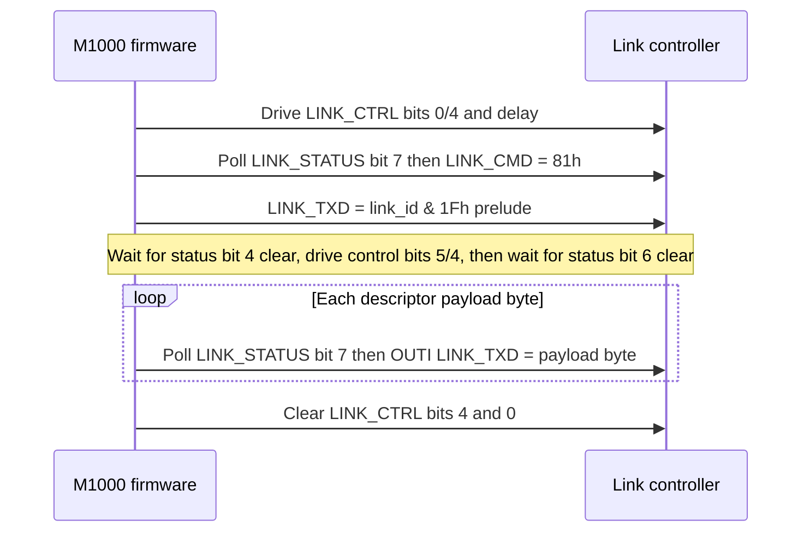
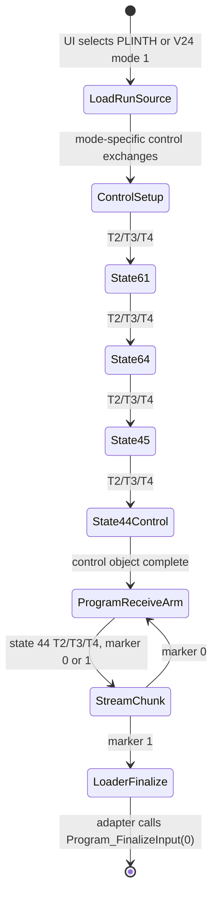
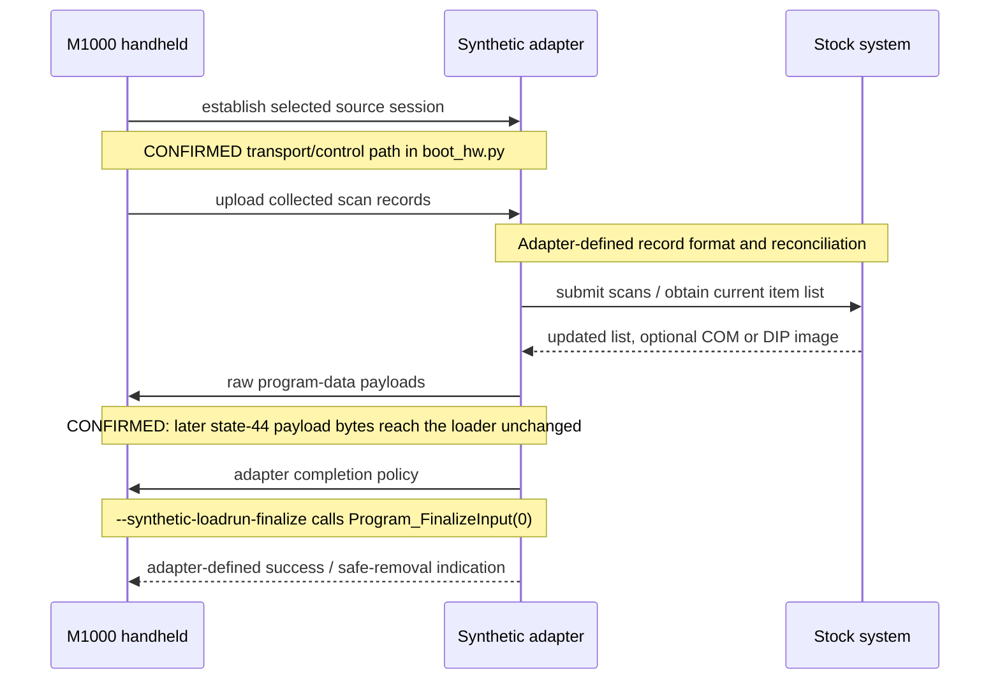

# Commstar evidence and traces

This is the **firmware evidence record** for the Commstar link. It
carries ROM addresses, evidence tags, trace bytes, and the full emulator
peer description. The programmer-facing contract is in
[Protocol: Commstar](../protocol/commstar.md); this page is the proof
behind it.

The content below is the pre-split RE record preserved here so that every
ROM address remains byte-verifiable and every trace remains citable.

---

> Contract statements for this material live in
> [Protocol reference: Commstar transport](../protocol/commstar.md).
> This page carries only the firmware evidence behind them.

## Controller transaction

LinkBlockTx (ROM00:3277-3377) and LinkBlockRx (ROM00:3378-3453) mechanically
drive `LINK_CTRL` (4Ah) and poll `LINK_STATUS` (4Bh). **No electrical names
for status or control bits are proven** — the descriptions below list only the
bit numbers polled/driven and the timeout constants observed in the bytes.

### Transmit

**CONFIRMED:** `LinkBlockTx` (ROM00:3277-3377) ordered controller-facing
sequence (byte-verified):

1. `LinkPortSelect` (ROM00:3454) has already driven `LINK_CTRL` bit 1 to
   match active-link-id bit 5. This selects one of two owner-confirmed IR line
   states; which state is V24 ADAPTOR versus PLINTH remains **OPEN**.
2. Clear `LINK_CTRL` bit 0, set `LINK_CTRL` bit 0, clear `LINK_CTRL` bit 4;
   `B=0x80` DJNZ delay.
3. `LinkPresent` (ROM00:34EC) then `LinkWaitReady` (ROM00:34F8). `34F8` is
   the poll — `LINK_STATUS` bit 7 with timeout `DE=0x02DA`; `34EC` calls it
   and, on success, writes `0x81` to `LINK_CMD` (4Ch). Either wait timing out
   returns `EBh` (`ROM00:335A`).
4. Write low five bits of input `A` (held in `C`, `link_id & 1Fh`) to
   `LINK_TXD` (4Dh) as a controller prelude. This byte is not part of the
   in-memory frame descriptor payload.
5. Wait for `LINK_STATUS` bit 4 to clear (`DE=0x026C` timeout → `EBh`);
   then set
   `LINK_CTRL` bit 5, set `LINK_CTRL` bit 4; `B=0x20` DJNZ delay; clear
   `LINK_CTRL` bit 5; wait for `LINK_STATUS` bit 6 to clear
   (`DE=0x026C` timeout → `EEh`).
6. Stream descriptor payload bytes: each `OUTI` to `LINK_TXD` is gated by
   `LINK_STATUS` bit 7 with per-byte timeout `DE=0x06F9` (timeout → `EEh`).
7. Cleanup: clear `LINK_CTRL` bit 4, clear `LINK_CTRL` bit 0 before returning.

**Controller-queue turn-taking rule (CONFIRMED):** the synthetic peer asserts
`LINK_STATUS` bit 4 while its inbound queue remains, but `LinkBlockTx` waits
for bit 4 to clear before a handheld transmission. A controller model must
drain/deassert its inbound indication before accepting the next M1000 TX
transaction, or that TX path returns `EBh`. This is a controller-facing
mechanical constraint, not a proven IR half-duplex electrical rule.

The payload source is a **descriptor list** in RAM. Each four-byte entry is
`{ count_lo, count_hi, ptr_lo, ptr_hi }`; `LinkReadBufferDescriptor`
(ROM00:3508) advances to the next entry until a zero count terminates the
list. These descriptors are not transmitted.

The diagram below is the confirmed controller-facing transmit ordering. It is
not a Commstar session exchange and makes no claim about the external
controller's electrical timing or the meaning of any status/control bit beyond
the mechanical poll/drive listed above.



### Receive

**CONFIRMED:** `LinkBlockRx` (ROM00:3378-3453) mechanically drives
`LINK_CTRL` and polls `LINK_STATUS`; no electrical names for status or control
bits are proven. Byte-verified sequence: clear `LINK_CTRL` bit 0, set
`LINK_CTRL` bit 5, single `IN` from `LINK_RXD` (4Eh), set `LINK_CTRL` bit 4,
`B=0x20` DJNZ delay, clear `LINK_CTRL` bit 5; then `INI` from `LINK_RXD`
only while `LINK_STATUS` bit 0 is set. If bit 0 is clear, bit 1 set continues
to bits 2/3 decode while bit 1 clear waits/retries with `DE=0x06F9`; bit 2 set
performs an extra `INI`; bit 3 set returns `EC`. Cleanup toggles
`LINK_CTRL` bit 1, sets then clears `LINK_CTRL` bit 0, clears `LINK_CTRL`
bit 4, toggles `LINK_CTRL` bit 1.

`LINK_CTRL` bit 1 is also the `LinkPortSelect` output (see Transmit step 1).
Whether the paired RX-cleanup toggles restore the selected value, or leave it
inverted until the next `LinkPortSelect`, is **OPEN**; a controller model
should not assume bit 1 is stable across a receive.

An adapter emulator must model the stateful handshake, not merely present a
flat byte stream. The current experimental Python model is not a conformance
implementation.

### Probe

**CONFIRMED:** `LinkProbe` starts at ROM00:348A and writes `0x1F` to
`LINK_PROBE` (4Fh) then executes a `LINK_CTRL` latch sequence. The
physical or reset effect remains **OPEN**.

It does not load `0x1F` directly — it **computes** it:

```text
348A  3E 7F     LD A,7Fh
348C  E6 1F     AND 1Fh        ; -> 1Fh
348E  32 99 F7  LD (0F799h),A  ; shadowed
3491  D3 4F     OUT (4Fh),A
```

`7Fh AND 1Fh` is exactly the masking `LinkBlockTx` applies to form a prelude
from a link id (transmit step 4), so the probe addresses id `7Fh` — the same
constant the TX builder writes at frame offset +4. **CONFIRMED** that `0x7F`
is used *as an id* in at least one place; whether it means "broadcast" or
"unassigned" remains **OPEN**.

Both callers of `LinkProbe` — `ROM00:0202` and `ROM00:0229` — discard its
return value, so it is a cold-boot reset of the link controller and not a
detection primitive.

## Validated frame envelope {#validated-frame-envelope}

The following is established by `LinkValidateFrameHeader` (ROM00:30DC) and
the receive dispatcher (ROM00:2FBD). It describes the buffer after the
controller has received the prelude and payload; it is not a complete
session-message specification.

| Offset | Size | Field | Status |
|---:|---:|---|---|
| 0 | 2 | Total received length, little-endian | **CONFIRMED**: must equal the received byte count. |
| 2 | 1 | Frame type | **CONFIRMED**: dispatcher tests 2, 3, and 4. |
| 3 | 1 | Per-link sequence | **CONFIRMED**: `LinkProcessCommandFrame` compares it with `FE43h + (fdd4 & 3Fh)` (init 1); mismatch path yields `01EF`. |
| 4 | 1 | Active link id | **CONFIRMED**: `LinkValidateFrameHeader` (ROM00:30DC) XOR-compares byte 4 to `fdd4`. |
| 5 | 1 | Unread by ROM link code | **OPEN**: never read by ROM link code; may be writable by loaded code — do not assume unused. |
| 6 | n | Session payload | **OPEN**: format depends on the runtime session module; the examined ROM transport/header path performs no checksum. |

Validation rejects frames shorter than six bytes, frames whose embedded
length differs from the caller-supplied logical count, and frames whose
byte 4 differs from the active link id (`fdd4`). The comparison is an
equality test implemented with XOR; it is an address filter, not a
checksum. `LinkValidateFrameHeader` does not inspect byte +5.

`LinkFramePrefixWrite` (ROM00:316B) writes TX offsets 0..4 as
`{len LE, type, sequence, 0x7F}` and leaves offset +5 untouched. `0x7F` is
**CONFIRMED** to be used as a link id elsewhere (`LinkProbe`, above), but its
*meaning* at offset +4 — broadcast, unassigned, or "no target" — is
**SUSPECTED** only. `+5` is untouched by that path.

**Direction asymmetry (CONFIRMED):** a received logical frame must have its
offset +4 equal to the active link id. The corresponding M1000 TX builder
writes `0x7F` at offset +4 instead. A server must not copy this TX `0x7F` into
an RX queue as the target-id field — it must send the handheld's own id
there. The server-side meaning of the M1000's `0x7F` remains **SUSPECTED**.

`LinkProcessCommandFrame` reads byte 3, compares it with the per-link
byte at `FE43h + (fdd4 & 3Fh)` (initialised to 1), and accepts either
the expected value or one behind it in a specific retry state. It does
**not** establish a generic 16-bit command word. Do not encode the
values `{2B,2A,23,03}` as session commands: they belong to a separate
local device-route lookup.

The sequence-number lifecycle is **OPEN**. The ROM-visible initial value and
comparison are known, but the evidence does not establish who advances it,
when it advances, whether directions share a counter, or how the observed
mode-1 TX sequence `00` then `01` relates to the queue examples. Do not infer
a server increment rule from these traces.

`LinkBlockTx` sends the low 5-bit prelude (`link_id & 1Fh`) before the
descriptor payload; the prelude is excluded from the descriptor byte
count. `LinkBlockRx` on success returns `DE = controller bytes consumed
minus 2`; in the examined bounded session the two excluded bytes are
**CONFIRMED** as copies of the logical frame's type (`+2`) and sequence
(`+3`) — observed as the trailing `02 01` after the six-byte logical
frame `06 00 02 01 63 00` in the form-4 controller queues
(`00 06 00 02 01 63 00 02 01` and `00 06 00 04 01 63 00 04 01`);
the controller-level reason for the exclusion remains **OPEN**.

Descriptor lists (byte-verified, structurally mutable where noted): RX
`FE0E` = `{6 -> FDE4, 3 -> FE38, 0}` (mutable); RX `FE32` =
`{9 -> FE3A, 0}`; TX `FDEA` = `{6 -> FDDE, 0}`. The sequence table is
`FE43h + (fdd4 & 3Fh)`.

`LinkBlockTx` outcomes (CONFIRMED, `A` and carry on return):

* `EBh` — either pre-payload bit-7 wait or the bit-4-clear wait timed out.
* `EEh` — bit-6-clear, per-byte bit-7, or post-payload bit-7
  failure.
* `ECh` — final status bit5 set.
* success `A=00h` carry clear.

Retry scheduler (CONFIRMED): initial `fdd6=32h` / `fdd8=6`, later
`fdd6=14h` / `fdd8=3`; the caller reschedules after `LinkBlockTx`
without testing returned `A`/carry.

### Timing boundary

The following are firmware loop counts, **not physical deadlines**. The
connector-facing serialiser is not recovered, and the instructions executed
per loop have not been cycle-accounted; a server must not derive an IR response
deadline from these values. At the owner-supplied 3.579545 MHz Z80 clock, one
T-state is approximately 0.279 us, but a wall-clock bound needs the verified
loop path and any controller delay.

[The RTC analysis](rtc.md#periodic-interrupt-rate-from-register-a-self-test-math)
performs this accounting for the clock self-test loop (24 T-states per
iteration = 6.703 us) and is the method to apply here.

| Use | Loop count | Decimal | Wall-clock deadline |
|---|---:|---:|---|
| `LinkPresent` / `LinkWaitReady` bit-7 poll | `0x02DA` | 730 | **OPEN** |
| TX bit-4 / bit-6 poll | `0x026C` | 620 | **OPEN** |
| TX/RX per-byte poll | `0x06F9` | 1785 | **OPEN** |
| Retry scheduler initial / later | `fdd6=0x32` / `0x14`; `fdd8=6` / `3` | 50 / 20; 6 / 3 | Units and cadence **OPEN** |

## Types, replies, and session state

The receiver dispatches type 2, 3, and 4 differently. The state labels
`CONNECTED`, `READY-RX-DATA`, `RECORD-RX`, `BLOCK-TX`, and related C-*
texts are firmware UI/state vocabulary. They are useful research anchors,
but they are not a wire-command dictionary.

The loaded session module also uses `InlineTableDispatch` (ram:E0B2) for
local control flow. **CONFIRMED:** a CALL is followed by an inline table
with `{count: u16le} {case: u16le, handler: u16le} x count
{default_handler: u16le}`. The dispatcher probes the declared number of
cases, then tail-jumps to the trailing default when none matches. This
mechanism is local module control flow, not evidence that the case values
are wire-command identifiers. Numeric case values observed at `5A69` (abort `44,45,60,61,64`), `53C7` (`0..5`), `5410` (`0,4,8,9`), and `5291` (`0,4,9`) are **CONFIRMED** inline cases — do not name them as wire commands. The table at `6A4A` is **CONFIRMED** as 16 state-display pointers, not a wire map.

The firmware writes these numeric little-endian words into a reply
buffer on seven static paths (treat as numeric words/types, not named
semantic commands unless the bytes prove a meaning):

* `01EE` — attempt exhaustion with `fdd5=1`.
* `02EE` — attempt exhaustion with other state.
* `02E0`, `04E0`, `05E0` — numeric unexpected-type paths.
* `01EF` — type-4 sequence mismatch (per-link sequence at
  `FE43h + (fdd4 & 3Fh)`).
* `03EE` — error/reset path from ROM00:2E72.

The complete reply envelope, payload, and any session meaning remain
**OPEN**. The examined ROM transport/header path has no checksum.
Integrity inside unresolved loaded-session payloads remains **OPEN**.

No historical Commstar state diagram or host/peer session sequence is
normative yet. A capture must establish each transition as:

| Current state | Received bytes | Guard | Transmitted bytes | Next state |
|---|---|---|---|---|
| _pending capture_ | | | | |

The [emulator peer contract](#emulator-peer-contract-bounded-synthetic-loadrun-responder)
below is deliberately narrower: it documents controller queues accepted by the
tested Load/Run path, not a reconstruction of a historical Commstar peer, and
it cannot be driven by an external server.

## Addressing and connector selection

The active link id is retained in `fdd4`.

* Its low five bits are transmitted first as the controller prelude
  (excluded from descriptor counts).
* Its bit 5 selects one of two external link configurations through
  `LinkPortSelect` (ROM00:3454).
* The complete id appears at validated-frame byte 4 (RX offset +4,
  XOR-compared to `fdd4` at ROM00:30DC) and selects a per-link sequence
  slot `FE43h + (fdd4 & 3Fh)` (init 1).

Which polarity maps to owner-confirmed V24 ADAPTOR (top) versus PLINTH
(back) remains **OPEN**. Where the EXT STORAGE ADAPTER attaches also
remains **OPEN**. This does not prove a multidrop physical topology or
address allocation policy; treat those as open hardware questions.

`E701`/`E6FF` are the width-3 decimal RCV1/RCV2 status fields
shown on the session status screen (**CONFIRMED provenance**):
`E701` is a zero-extended snapshot of the received numeric frame type at
`E5BE` before local substitutions (transport error may put `EEh` (238)
there); `E6FF` is the zero-extended received sequence at `E5BF`. They are
displayed as `RCV1`/`RCV2`. Broader UI meaning beyond that display remains
**OPEN**.

## Bounded synthetic session-builder traces (CONFIRMED mechanics only)

Two bounded synthetic traces were captured by calling the session TX
builders with synthetic stack arguments and bypassing only a separate
preflight at `5C1F`/`5D05` (forcing successful `HL=0` at `5C22`/`5D08`).
`E6E6=0` in both traces. The physical low-five-bit prelude
(`link_id & 1Fh`) is excluded from the quoted logical frames. Meanings of
payload constants/fields and complete RECORD/BLOCK/C-COMMAND semantics
remain **OPEN**.

The preflight's condition is **OPEN**. No quoted transaction has satisfied it
normally, so it may be a real-peer prerequisite. The forced return is emulator
instrumentation, not an action available to a server.

* `g_wSessionDeviceSelector` at `E52E` is a service-33 device selector,
  mapped through `FE83 + selector - 1`; it is **not** logical frame type.
  `g_wSessionTxPayloadLength` at `E530` counts payload bytes starting at
  `E534`; bytes `E532-E533` are skipped. Logical frame type `1` is written
  independently by `ROM00:2F6D`.

* **Trace 4 — Session_TxBlock4 path (CONFIRMED):** synthetic stack args
  `(1,6,22h,33h)`, `E6E6=0`; bypassed only the separate preflight at
  `5C1F` by forcing successful `HL=0` at `5C22`. Payload length `15`;
  payload `06 00 00 00 80 00 00 4C 00 00 22 33 00 00 05`; complete logical
  frame `15 00 01 01 7F 00 06 00 00 00 80 00 00 4C 00 00 22 33 00 00 05`.

* **Trace 5 — Session_TxBlock5 path (CONFIRMED):** args
  `(1,6,1,44h,55h)`, `E6E6=0`; bypassed only the preflight at `5D05` by
  forcing `HL=0` at `5D08`. Payload length `19`; payload
  `06 00 00 00 80 00 01 55 02 00 44 3C 00 00 00 00 00 00 01`; logical frame
  `19 00 01 01 7F 00 06 00 00 00 80 00 01 55 02 00 44 3C 00 00 00 00 00 00 01`.

These traces establish framing mechanics only. The meaning of any payload
constant or field, and the complete RECORD/BLOCK/C-COMMAND session
semantics, remain **OPEN**.

## Bounded real transaction — form 4 through service 33 / link IRQ path (CONFIRMED mechanics only)

A bounded harness option `--trace-session-transaction 4` runs builder
form 4 through the **actual service-33/link IRQ path**, bypassing only
the already documented separate preflight as builder trace 4 does
(forcing `HL=0` at `5C22`). It is a mechanically valid firmware exercise,
not an interoperable Commstar specification.

**Service identities (CONFIRMED):** actual service-33 entry is
`ROM00:2E02` (`DeviceSelectOpen`, retained name); `ROM00:2E72` is
`Device_Service33Timeout`, not the entry; `ROM00:2E85` is
`Device_Service33Complete`, the completion callback registered through
`ram:FDD2` (`g_pSvc33Callback`). Successful type-4 processing falls
through at `30BC` into shared completion `30BD`; the callback discards the
synthetic return address `30DB` and returns to `31C1` in the IRQ path. `59D0` is
the initial async-launch return before completion.

**Exact successful transaction (CONFIRMED byte-verified):**

* Initial **controller-boundary TX bytes** captured from `LINK_TXD`: `03 15 00 01 01 7F 00 06 00
  00 00 80 00 00 4C 00 00 22 33 00 00 05` — first `03` is the low-five-bit
  selector prelude (`link_id & 1Fh`), the remainder is the logical frame
  `15 00 01 01 7F 00 06 00 00 00 80 00 00 4C 00 00 22 33 00 00 05` (type 1).

* Phase-1 **controller queue** presented to `LinkBlockRx`: `00 06 00 02 01 63
  00 02 01` = one uncounted sync `00`, six-byte logical numeric type-2
  frame `06 00 02 01 63 00`, then two excluded copies `02 01` (type and
  sequence copies; controller-level reason remains **OPEN**).

* Exact **controller-boundary TX bytes** captured: `03 06 00 03 01 7F 00` = prelude `03` plus
  six-byte logical numeric type-3 frame `06 00 03 01 7F 00`.

* Phase-2 **controller queue**: `00 06 00 04 01 63 00 04 01` with the same
  sync/logical/excluded shape (logical frame `06 00 04 01 63 00`).

* Service receive object at `E5BC-E5C2` after phase 2 becomes `00 00 02 01
  00 00 00` (seven bytes; first bytes retain the zero-payload mapping).

**Peer scaffold requirements (CONFIRMED):** the harness peer must expose
`LINK_STATUS` bit4 while inbound bytes remain (so IRQ poll `31B6`
dispatches), bit0 while bytes remain, and bit1 after drain. Do not assign
electrical names to these bits.

**Zero-payload endpoint (CONFIRMED):** the zero-payload object reaches
`SessionRxStateMachine` (`ROM00:5A81`, via thunk `5A63`
`Session_RxStateMachineThunk`), retains length `0` and numeric value `2`,
then takes `5B07 -> 5A13` to resume internal receive polling. It does
**NOT** return a final numeric result and does **NOT** relaunch service
33. Requiring `5B57` would need an invented nonzero object/UI outcome, so
the regression correctly stops at one completed zero-payload poll cycle.

**Scope warning:** complete command/payload meaning, the broader meaning
of numeric types `2/3/4`, and whether a real peer naturally emits these
exact controller queues remain **OPEN**. This section documents exact bytes
and state transitions only.

## Load/Run receive sequencing (CONFIRMED mechanics only)

The software-only PLINTH Load/Run trace reaches the screen states
`Logged on` then `Receiving prog` using real service-33/IRQ transport.
This establishes controller sequencing and coroutine ownership, not an
interoperable program-transfer grammar.

### Emulator peer contract: bounded synthetic Load/Run responder

This is the implementation contract for the repository's regression peer. It
drives the tested PLINTH route and the separately regression-covered V24
mode-1 software route, delivering raw COM or DIP bytes to the real loader. It
is not a general Commstar protocol and cannot be implemented by an external
server: it reads active state from M1000 RAM and waits for a RAM/PC arming
condition that has no known wire-visible equivalent.

`id` is the active link id at `g_bActiveLinkId` (`FDD4`), `seq` is its
per-link sequence at `FE43 + (id & 0x3F)`, and `N` is an inner payload length.
Every firmware controller transmission starts with a separate prelude
`id & 0x1F`; it is excluded from the queues below.

| Controller queue / TX capture | Exact bytes | Tested use |
|---|---|---|
| Type-2 control (states 61/64/45) | `00, 07 00, 02, seq, id, 00, 00, 02, seq` | Single zero payload byte; used for the pre-state-44 control exchanges. |
| Type-2 phase 1 | `00, u16(N+14), 02, seq, id, 00, 00 00, u16(marker), u16(N), payload[N], 00 00, 02, seq` | Supply a state-44 receive object. |
| Firmware type-3 acknowledgement | `id & 1F, 06 00, 03, seq, 7F, 00` | Output after phase 1; the prelude may be captured separately. |
| Type-4 phase 2 | `00, 06 00, 04, seq, id, 00, 04, seq` | Complete the preceding type-2 operation. |

The final two queue bytes repeat the logical frame's type and sequence.
`LinkBlockRx` excludes them from its logical count; their controller-level
purpose is **OPEN**. The count expression is a tested construction, not a
claimed length rule for other frame types.

#### Externally observable subset

An external observer can obtain, from M1000 traffic alone, the controller
prelude `id & 0x1F` (five id bits), logical-frame offset +3 sequence, offset
+2 type, and offset +0..1 length. It cannot obtain the full eight-bit link id,
which a server must reproduce exactly at offset +4 of every frame it sends.
Captured length is `1 + u16le(tx[1:3])`, including the prelude; this is the
only confirmed rule for delimiting a captured M1000 transmission.

| Link id bits | Server-observable? | Source |
|---|---|---|
| 0-4 | Yes | Controller prelude (`LinkBlockTx` transmit step 4). |
| 5 | No | Port select via `LinkPortSelect`; polarity is **OPEN**. |
| 6-7 | No | Never transmitted. Both observed ids (`0x43`, `0x63`) have bit 6 set and bit 7 clear; two samples are not a rule. |

Recovering the remaining three bits by capture, probing, or a fixed convention
is a prerequisite for an external server. It cannot observe
`g_bActiveLinkId`, the per-link RAM sequence slot, the receive-descriptor
ownership, or the fresh program-receive arm. In
particular, this contract's step 4 below requires `FDDC=FE0E`, `FDD5=01`,
specific callback/descriptor pointers, and PC `ROM00:2F78`; none is exposed by
the known link protocol. Whether a wire event signals that arm, or whether a
real peer retries blindly, is **OPEN**.

Therefore the queue forms below are useful only for emulator/controller-model
work. They are insufficient to drive Load/Run from a physical server.

#### Captured M1000 session requests (controller-boundary TX) {#captured-session-requests}

**Provenance.** These transmissions are captured by the V24 mode-1
regression in `analysis/test_boot_upload.py`
(`BootSessionTransactionTest.test_v24_mode1_reaches_loader`), which asserts
each capture whole rather than by prefix. The harness prints them as
`<label> TX=` lines; regenerate with:

```sh
analysis/venv/bin/python3 analysis/boot_hw.py \
  --trace-loadrun-source v24 --trace-loadrun-v24-mode 1 \
  --synthetic-loadrun FILE --synthetic-loadrun-finalize | grep ' TX='
```

The captured bytes and the request/response object grammar derived from them
are tabulated once, in
[Protocol reference: request and response object format](../protocol/commstar.md#request-and-response-object-format).
They are not repeated here: the transcription drifted twice while two copies
existed, so the test is the authority and the contract page is the single
published transcription.

The link id in this trace is `0x43`, so the prelude is `03`; the frame
offset +4 constant on transmit is `0x7F` in every capture.

For a program-data receive, marker 0 permits another refill and marker 1
returns result 8, latches `E44A`, and prevents a further refill after payload
delivery. This is a ROM mechanic, not a historical EOF command. The payload is
copied unchanged to the loader stream: `C9 C8` selects DIP; any other prefix
selects raw COM.



`State61`, `State64`, `State45`, and `State44Control` are mechanics labels for
observed numeric state values, not historical protocol command names. The
harness verifies entry into `Session_ProgramReceiveMode` (`ROM00:4F5A`) before
streaming payloads. `LoaderFinalize` is adapter policy, not a received frame.

Minimal algorithm:

1. Select PLINTH, or V24 with Mode 1 (`MODEM A/ANS`), through the firmware
   UI. Neither software route proves physical connector polarity.
2. Delimit each outgoing request using the captured-length rule above.
3. Complete the mode-specific setup, then use the type-2 control form for
   states 61, 64, and 45. For state 44, use the `N+14` type-2 form with `N=6`
   and payload `4F 4B A5 5A 3C C3`, then complete each exchange with type 3
   and type 4 using current `id` and `seq`.
4. **Emulator only:** wait for the fresh program receive arm: `FDDC=FE0E`, `FDD5=01`,
   `FDC5=E530`, `FDC7=E5BA`, and `FDD2=2E85`. Do not send stream data while
   `FDDC=FE32`; it belongs to the previous phase-2 completion.
5. Send marker 0 for non-final chunks, marker 1 for the final chunk. Chunks
   of 126 then 74 bytes are regression tested, not maximums.
6. If completion is needed, invoke `Program_FinalizeInput` with zero status as
   explicit adapter policy. Do not represent it as a peer EOF packet.

State `44h` uses a variable phase-1 receive descriptor (`FDDC=FE0E`) and a
fixed phase-2 descriptor (`FDDC=FE32`). The latter is exactly one
nine-byte descriptor at `FE3A`, followed by its terminator. Therefore a
variable payload must be supplied in phase-1 type 2; a six-byte type-4
completion is the only byte-verified phase-2 shape. A 16-byte type-4 frame
exhausts `FE32` and returns transport result `EDh`, later displayed as
`0x1F76 (8054), "Line failure"`.

For the examined state-44 path, this phase-1 payload is received at
`E5BE`; `Device_Service33Complete` (`ROM00:2E85`) writes only its completed
payload length to `E5BC-E5BD`. A ten-byte phase-1 payload
`00 00 01 00 02 00 4F 4B 00 00`, followed by the normal six-byte type-4
completion, yields `DE=000A` at the completion callback and `HL=0008` from
`SessionRxStateMachine`. The nested object is then copied intact into a
packed caller buffer and classified by its first two bytes: `OK` -> 0,
`NO` -> 1, `DM` -> 2, otherwise 3 -> `0x1F75 (8053), "Invalid reply"`.
The classifier does not strip `OK`; trailing bytes are not compared but
remain in the copied object. The peer-level meanings of these tokens remain
**OPEN**.

The result first unwinds through the RAM coroutine epilogue at `D84C` to
`ROM00:624B`; it is not a direct return to the outer result dispatcher.
The next service transaction is stale-owner-safe only after `ROM00:2F78`,
where `FDDC=FE0E`, `FDD5=01`, `FDC5=E530`, `FDC7=E5BA`, and `FDD2=2E85`.
At that point a zero-payload peer-initiated type-2 frame and normal type-4
completion are accepted by the new service, and the UI reaches `Logged on` /
`Receiving prog`. Do not inject such a frame while `FDDC=FE32`: it is then
consumed by the preceding state-44 phase-2 operation.

### Loader-stream boundary

The accepted state-44 `OK` scaffold is not a Commstar program-data grammar.
After the receive-first exchange, its bytes arrive at the Load/Run staging
buffer and are consumed by `Program_ConsumeInputChunk` (`ROM01:0BAC`).

**CONFIRMED:** the fresh parser requests 14 bytes at `ROM01:0D08-0D0B`.
Its initial routing is:

* fewer than 14 received bytes -> raw COM at `ROM01:0D3B`;
* 14 or more with first little-endian word `0xC8C9` (`C9 C8`) -> DIP at
  `ROM01:0DD7`;
* 14 or more with any other first word -> raw COM.

Thus `4F 4B A5 5A 3C C3` is a six-byte raw-COM prefix, not a DIP header and
not a token the loader removes. A later byte cannot repair that stream into a
DIP: a DIP experiment must restart with `C9 C8` at offset zero. A normal
zero-status `Program_FinalizeInput` completion resumes this parser, so EOF
after the six bytes follows the short-COM route; it is not necessary to pad
the outstanding 14-byte request.

**CONFIRMED:** each DIP block receives an eight-byte serialized prefix into a
resident descriptor whose stride is 10 bytes (`ROM01:0E2D-0E43`). The first
eight bytes are type, bank offset, destination address, and payload length;
the purpose of the two remaining resident bytes is not established here.

The later `0x1F9A (8090), "Line failure"` is likewise not a loader-format
error. `ROM00:4E4E` dispatches the session result word:
only values `0`, `4`, `6`, `8`, and `9` have explicit arms. Its default arm
at `ROM00:4E3D` stores result `6` and passes `0x1F9A` to
`SessionMsgLineFailure`. The upstream stalled-harness result remains **OPEN**.

### Program-data receive path

The control object and program bytes use separate state-44 call paths.
`OK`/`NO`/`DM` classification applies only to the earlier control caller;
it does not constrain the inner bytes of a later program-data receive.

**CONFIRMED, cross-provider reviewed:** the internal basic block
`ROM00:4F5A` (`Session_ProgramReceiveMode`) enters program receive mode
`0x000A` and calls `Session_ReadStreamChunk` (`ROM00:3E6A`) at `4FB9` with a
maximum aggregate read of 128 bytes. It is reached from its parent state
machine, not as a callable function entry. The receive path validates
state-44 outer metadata but does not inspect `E5C4`, the inner payload start.
On success it copies payload bytes from `E5C4` unchanged into the stream
buffer. `Session_ReadStreamChunk` returns a caller-facing packed object
`{u8 count, payload[count]}`; it adds the count but does not alter the payload.

A program-data object may therefore start its inner payload with `C9 C8`,
which reaches the loader stream as its first two data bytes. This is the
correct location for a DIP header experiment; putting `C9 C8` in the earlier
classified control object is not. The exact peer command/envelope that causes
this later state-44 receive remains **OPEN**.

### Synthetic peer policy

`boot_hw.py --trace-loadrun-source plinth|v24 --synthetic-loadrun FILE`
provides a deliberately scoped compatibility peer. It runs the confirmed
control exchanges, then supplies the validated COM/DIP file as raw inner
program-data payloads. The harness has an opt-in
regression using a 50-byte DIP file and a 200-byte COM file which reaches the
explicit end-of-stream boundary in two chunks (126 bytes with marker 0, then
74 bytes with marker 1). **The maximum is 126 data bytes, measured.** 126 succeeds; 127 is silently
dropped (no acknowledgement, the handheld re-requests, and the session ends
`Session aborted` with `C-RX-BLK` returning 4); 128 fails with `0x1FAE`. The
envelope overhead is therefore 8 bytes against the `ROM00:6230` capacity of
`0x86` (134) — arithmetically consistent, but the RX frame struct at
`ram:E5BA` is 138 bytes with its data area at `+0Ah`, which implies a
different budget. The two readings are unreconciled: treat 126 as a measured
limit, not a derived one.

This is **not** a claim that the historical Commstar peer used this command
ordering or envelope. The control-path and raw-payload copies are
**CONFIRMED**; chunk selection, EOF representation, retries, and a final
safe-removal acknowledgement are configurable compatibility policy and remain
**OPEN**.

`--synthetic-loadrun-finalize` supplies one useful adapter policy: after the
last synthetic payload it calls the real `Program_FinalizeInput` callback with
zero status, reaching loader state 3 in the emulator. This completes the
software-facing transfer but is deliberately not represented as a received
Commstar EOF command or a user-facing safe-removal acknowledgement.

`--synthetic-workflow FILE` reads a `SyntheticWorkflow` JSON manifest, resolves
its image relative to the manifest, and invokes the same tested PLINTH path.
It reports the manifest's scan-record count, run intent, feedback, and
safe-removal policy, but does not serialize records or emit a safe-removal
frame. When `run_after_load` is true, it verifies the requested program name
against the loaded name and invokes the real `Program_RunByName` path after
the loader reaches state 3. The loaded program's transfer does not return, so
feedback and safe removal remain adapter policy. The manifest wrapper remains
PLINTH-only by policy; V24 mode-1 completion is regression covered separately
but has no manifest workflow support.

### V24 selection

**CONFIRMED:** the Load/Run choice list includes `V24 ADAPTOR` and its form
contains Mode, Linespeed, User id, Password, Group id, and Telephone number
labels (`ROM01:7A0F`, `7B7E-7BCB`). `YES, YES, ENTER` selects this form in the
emulator. **SUSPECTED:** leaving its fields blank reaches an early state-44
control exchange but then takes the 0x1FAE (8110), "Line failure" path before
the known program-receive basic block. This is emulator behavior, not evidence
about historical authentication or the form fields' persistence.

**CONFIRMED:** the form descriptor maps its six fields to a contiguous
30-byte backing object:

| Field | Backing storage | Initial value |
| --- | --- | --- |
| Mode | `g_bLogonModeIndex` | 0 (`LOCAL LINK`) |
| Linespeed | `g_bLogonLineSpeedIndex` | `0xFF` sentinel |
| User id | `g_acLogonUserId`, 9 bytes | empty |
| Password | `g_acLogonPassword`, 9 bytes | empty |
| Group id | `g_acLogonGroupId`, 9 bytes | empty |
| Telephone number | `g_acLogonTelephoneNumber`, 19 bytes | empty |

The `0xFF` linespeed sentinel resolves through the selected mode record; mode
0 supplies encoded value `0x0E`, the `9600` table entry. The post-form session
call stages Group id, User id, and Password, while the selected mode callback
receives the Telephone number buffer only for modes 0 and 2. This proves
mode-dependent software dispatch, not V24/PLINTH physical-port polarity or
the historical meanings of the text fields.

**CONFIRMED:** the blank mode-0 path selects mode record `D108`, whose callback
stub reaches `Session_LogonMode0Or2Callback` and whose session/device selector
is 4. Service 33 resolves selector 4 through `g_bDeviceWireId4`; its firmware
default is `0x43`. The `AND 0x20` at `LinkBlockTx` is therefore zero and takes
the bit5-clear latch path. This identifies the selected software latch state,
not the physical V24 or PLINTH connector.

The errors `0x1F40 (8000)` and `0x1F41 (8001)` both display `"Plinth not
connected"`. **CONFIRMED:** they arise in the two connection-result dispatchers
before `Session_LogonMode0Or2Callback`, not in that callback. The message text
therefore cannot identify the selected physical connector.

**CONFIRMED:** while the Mode field is active, raw keyboard-ring byte `0xDB`
invokes `FieldCounterEdit` and advances to the next mode enabled by
`g_wLogonModeEnableMask`; physical key identity is not assigned. A bounded
emulator run with `g_wLogonModeEnableMask=0xFFFF` changed mode 0 to mode 1
(`MODEM A/ANS`) and, on accept, reached `0x1F40 (8000), "Plinth not
connected"`. This exercises a mode-dependent software branch only; it does
not establish an adapter transport or physical-port selection.

**CONFIRMED bounded emulator observation:** selecting mode 1 (`MODEM A/ANS`)
with the raw counter-edit byte, then accepting the form, reaches the observed
state-61, state-64, state-45, state-44, and program-receive sequence used by
the synthetic PLINTH route. `--trace-loadrun-v24-mode 1 --synthetic-loadrun
FILE` with the adapter-policy finalizer reaches loader state 3 in the
regression. The mode-specific initial request is captured as
**controller-boundary TX bytes** `03 0C 00 01 00 7F 00 00 00 00 00 00 00`, followed by
`03 15 00 01 01 7F 00 06 00 00 00 80 00 00 4C 00 00 07 3C 00 00 05`.
No response to the first request is captured here; this is not a documented
session-opening exchange.
This does not establish historical V24/Commstar framing, modem authentication,
line discipline, field semantics, EOF protocol, PLINTH equivalence, or
physical-port polarity.

**CONFIRMED static dispatch mechanics:** the six-byte mode-1 record at
`D10E` is `{ selector=6, callback=EE04, default=07, argument=0000 }`.
`ROM01:129A-12AA` selects records as `g_bLogonModeIndex * 6 + D108`; at
`131D-1330` it passes record `+4` as an argument and dispatches record `+1`
through the runtime stub mechanism. The returned `HL` is tested at
`1334-133C`; zero continues at `1343` and calls runtime slot `EE0C` at `1369`.

The static RAM bytes at `EE04` and `EE0C` are template `LD HL,1 / RET`
stubs, not their live behavior. Bank-0 boot enqueue starts at `ED1C` and
overwrites its four-byte slots: index 58 (`EE04`) targets `ROM00:48BF`; index
60 (`EE0C`) targets `ROM00:4AE0`; index 68 (`EE2C`) targets
`ROM00:4F5A`. `48BF` invokes local operation 2, then conditionally invokes
the state-62 builder; it stores and dispatches its result before returning.
The dynamic trace, rather than a direct static call from `1369`, establishes
participation of the `4F5A` program-receive path.

**CONFIRMED:** `LinkBlockTx` passes active-link-id bit 5 to
`LinkPortSelect` (`ROM00:3454`) from `ROM00:3277-327A`. The selector-4 default wire ID is
`FE86=0x43`; this is not evidence for mode 1, whose mode record begins with
selector 6.

## Blocking evidence {#blocking-evidence}

One synchronized capture of a genuine server login and a small COM/DIP
transfer is the highest-value remaining experiment. Capture every byte in
both directions, including the low-five-bit prelude, and snapshot these RAM
regions at each type-1 send, RX dispatch, completion callback, and
state-machine classification:

```text
FDD4-FDDF  active link and service state
FDE4-FE42  logical RX/TX descriptor buffers
FE43-...   per-link sequence state
E530-E5C8  request and reply objects
```

Use recognisable, fixed-width values for user ID, password, and group ID, and
repeat the login while changing one field at a time. Transfer files sized 1,
126, 127, 128, and 129 bytes, plus a normal multi-block file. That resolves
authentication formatting, the remaining request/response object fields,
final-block/EOF signalling, and most retry/abort behaviour without inferring
semantics from UI strings.

Until that evidence exists, a server built from this record is a
compatibility peer: it satisfies the ROM's observed acceptance conditions,
but cannot claim to speak the historical Commstar application protocol.

## Appendix: synthetic stock-check workflow example

This is an example adapter workflow, not recovered historical Commstar
behavior. It illustrates how a stock-check deployment could sequence its own
application policy around the ROM-confirmed Load/Run path. The order of the
application steps is adapter-defined.



The executable upload portion of this example is:

!!! note "Emulator regression, not a physical-server recipe"
    Requires a checkout containing the ROM image, the repository's Python
    dependencies, and the `analysis/` harness; the published documentation
    site does not provide those prerequisites.

```sh
analysis/venv/bin/python3 analysis/boot_hw.py \
  --trace-loadrun-source plinth \
  --synthetic-loadrun item-list.dip \
  --synthetic-loadrun-finalize
```

`item-list.dip` may instead be a COM image. The harness validates the file,
serves the current single-payload regression, and uses the real loader
finalizer. It also has a two-payload regression using the 126-byte
chunk size, which is the measured maximum (see above). Scan-record encoding, the
database/list schema, software-update decision, final user feedback, and
safe-removal signal are adapter policy, not claims about a historical deployed
system.

The equivalent manifest invocation is:

```sh
analysis/venv/bin/python3 analysis/boot_hw.py \
  --synthetic-workflow stock-check.json \
  --synthetic-loadrun-finalize
```

The reusable policy object is `micronic.commstar.SyntheticWorkflow`. Its JSON
fields are `source` (`plinth` or `v24`), `scan_records` (opaque objects), an
optional `image`, `run_after_load`, `feedback`, and `safe_to_remove`. It
produces ordered application events; an adapter chooses how to serialize them
for its own service.

## What is not specified yet

An interoperable Commstar peer still needs captured evidence for:

* the complete session-command table and any command-name mapping;
* every command payload and RECORD/BLOCK format;
* reply-frame envelope and reply payloads (beyond the seven numeric
  words above);
* startup, abort, retry, and completion transitions;
* maximum lengths, framing boundaries, and controller timing on the
  connector-facing side; and
* the physical connector/electrical interface required outside the M1000.

Do not claim a grammar such as `[type][16-bit big-endian command]
[payload]`, symmetric protocol roles, payload checksums, filenames, or
a verified bidirectional Commstar exchange — none are proven for the
examined ROM transport/header path. Until captures exist, an
implementation may emulate the M1000-side register and validator
behaviour, but must not claim Commstar file-transfer compatibility.

## Evidence and next captures

The implementation evidence is in `LinkBlockTx` (ROM00:3277),
`LinkBlockRx` (ROM00:3378), `LinkValidateFrameHeader` (ROM00:30DC),
`LinkProcessCommandFrame` (ROM00:3084), `LinkFramePrefixWrite`
(ROM00:316B), `LinkProbe` (ROM00:348A), and the descriptor helper
(ROM00:3508). The research worklist records the capture tasks in
`research/TASKS.md` in the source tree; research files are excluded from
the published site.

The next work should prioritize server blockers:

1. Characterise the `5C1F`/`5D05` preflight that all current builder traces
   bypass.
2. Cycle-account the timeout loops and determine the retry scheduler's units.
3. Determine whether the fresh program-receive arm has a wire-observable
   counterpart, or whether a real peer must retry.
4. Capture one physical IR exchange to establish modulation, byte framing,
   timing, and whether controller-queue sync/trailer bytes exist on the wire.
5. Capture a **historical** handheld-to-host RECORD/BLOCK transfer. This
   project's own peer now receives one (`CommstarRecordUploadTest`), which
   establishes the ROM's acceptance conditions but not what a real server
   sent.

A complete valid session trace should include the prelude, received-count
boundary, every transmitted reply byte, and the RAM frame buffer before and
after dispatch. It should become both a table in this document and an
assertion-based regression test.

## Interface shape: byte-latch access — firmware behaviour CONFIRMED, electrical function OPEN {#interface-shape}

*This section preserves the I/O-map evidence that underpins the latch
contract. The stable port table lives in
[Memory and I/O map](../reference/memory-map.md).*

The firmware accesses the 4x block with **distinct latch addresses** and
status-gated byte pumps, which does not match a Z80 SCC/SIO/ADLC
register-select model. Distinguishing observations (mechanical, byte-verified):

* TX and RX use **distinct latch addresses** (4Dh write-only, 4Eh
  read-only) — an SCC has one bidirectional data port.
* Data moves via `OUTI` (mem→4Dh) gated by `LINK_STATUS` bit 7 and `INI`
  (4Eh→mem) gated by `LINK_STATUS` bit 0 (with bits 1-3 participating in the
  `LinkBlockRx` decode), not register-select + data sequences. No WR0/WR1-style
  command/register programming occurs.
* 4Ah is a control latch mechanically driven as bits 0/4/5 around transfers
  with bit 1 toggled per link-id bit 5 — electrical labels such as
  `idle/run`, `talk`/`RX-enable`, `clock`, or `online/enable` (bits 6/7) are
  **not proven**.
* 4Bh is a status port mechanically polled as bits 7, 4 and 6 in the TX
  handshake and bits 0-3 in the RX path — firmware polls are **CONFIRMED**;
  electrical labels such as `TX-ready` (bit 7), `RX-ready` (bit 0), `ACK`
  (bit 6), `peer-ready`/`type` (bit 4) or `frame phase` (bits 1/2) are
  **not proven**.
* 4Ch receives `0x81` after a `LINK_STATUS` bit 7 poll (`LinkPresent` →
  `LinkWaitReady`, `DE=0x02DA`); 4Fh receives `0x1F` during `LinkProbe`
  (ROM00:348A) followed by a `LINK_CTRL` latch sequence — mechanical
  writes are **CONFIRMED**; labelling them `command/ACK` or `probe/
  reset` for the physical meaning remains **OPEN** (probe effect
  **OPEN**).
* The synchronous clock+data IR pairs (2 photodiodes + 2 LEDs per
  port, per US 4,423,319) are downstream of this byte interface —
  the M1000's Z80 mechanically pushes/pulls whole bytes while polling
  `LINK_STATUS`; electrical timing on the connector-facing side remains to be
  traced.

**No hardware address-filter or CRC register exists in this block**
— the only non-data write-outs are 4Ch=0x81 (present) and 4Fh=0x1F
(probe). Multidrop addressing is done in software: the frame's byte
at offset +4 is XOR-matched against the unit's link id `fdd4`
(`LinkValidateFrameHeader` ROM00:30DC, does not inspect +5). TX
offset +4 constant `0x7F` (via `LinkFramePrefixWrite` 316B) is a link id
`LinkProbe` also uses, but its meaning at offset +4 is **SUSPECTED**;
offset +5 is never read by the examined ROM link
code and may be writable by loaded code — the examined ROM
transport/header path has no checksum; integrity inside unresolved
loaded-session payloads remains **OPEN**.

