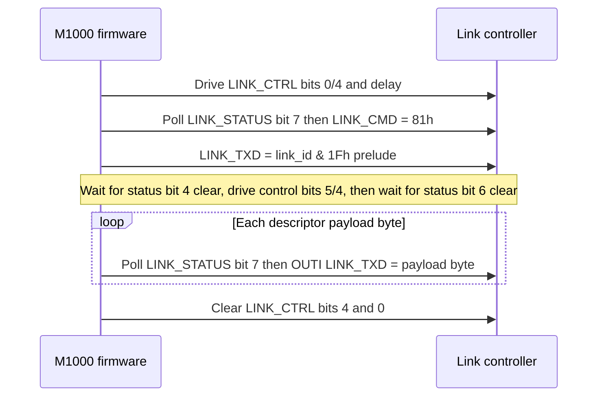
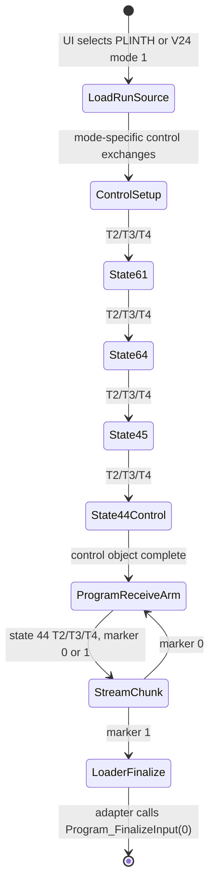
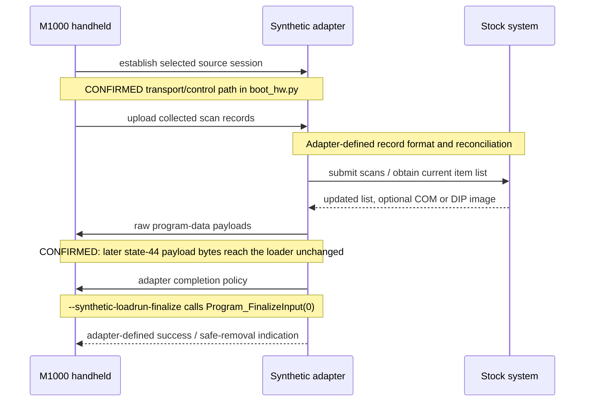

# Commstar evidence and traces

> **Scope: session/protocol layer (above the 4Ah–4Fh latch boundary).**
> This page carries the **firmware evidence** behind the Commstar link:
> ROM addresses, controller transaction sequences (Link_BlockTx/Rx),
> validated frame envelopes, session error maps, addressing tables, and
> the emulator peer contract. The programmer-facing contract is in
> [Protocol: Commstar](../protocol/commstar.md); the physical/wire layer
> (analog timing, modulation, IR line capture, HDLC framing) is in
> [IR wire protocol](ir-wire-protocol.md); the hardware test plan is in
> [ROM exerciser test plan](exerciser-test-plan.md).

**On this page:** This is the primary firmware evidence record for the
Commstar link. It documents every CONFIRMED transaction at the latch
boundary, the session error decades, addressing and connector selection,
the emulator peer traces, and the blocking evidence needed for an
interoperable implementation. Intended for analysis and adapter building;
together with [IR wire protocol](ir-wire-protocol.md) it covers both
sides of the 4Ah–4Fh latch interface.

* [Controller transaction](#controller-transaction) — Link_BlockTx/Rx,
  probe, and the mechanical latch handshake
* [Validated frame envelope](#validated-frame-envelope) — buffer format,
  length, link-id filter, sequence numbers
* [Full session error map](#the-full-session-error-map-confirmed)
* [Session-operation error decades](#session-operation-error-decades)
* [Types, replies and session state](#types-replies-and-session-state)
* [Addressing and connector selection](#addressing-and-connector-selection)
* [Bounded synthetic traces](#bounded-synthetic-session-builder-traces-confirmed-mechanics-only)
* [Blocking evidence](#blocking-evidence)
* [Interface shape](#interface-shape)
* [Evidence moved from protocol/commstar.md](#protocol-split-evidence)

The content below is the pre-split RE record preserved here so that every
ROM address remains byte-verifiable and every trace remains citable.

---

> Contract statements for this material live in
> [Protocol reference: Commstar transport](../protocol/commstar.md).
> This page carries only the firmware evidence behind them.

## Controller transaction

### Physical TX capture (no peer response)

**CONFIRMED (owner capture, 2026-09-02):** a Keysight MSOX3054A segmented
capture of V24 ADAPTOR output, with no IR response transmitted to the
handheld, has 50 complete segments of 30,769 samples. CH1 is the clock
emitter and CH2 is the data emitter. Sampling CH2 at each CH1 rising edge
with zero sample offset yields exactly these three burst classes:

| Rising edges | CH2 bits at CH1 rising edges | Count |
|---:|---|---:|
| 17 | `10000001000001011` | 16 |
| 21 | `000010000001000001011` | 15 |
| 22 | `0000110000001000001011` | 19 |

The median rising-edge period is **121.993 us** (approximately 8.20 kHz).
`analysis/decode_ir_scope.py` streams the CSV one segment at a time and
writes the edge times, periods, thresholds, and extracted bit strings as
JSON; it does not load the multi-segment CSV into memory. Offsets of -10, 0,
and +10 samples (about +/-1.04 us) produce identical edge counts and bit
strings for all 50 segments.

**CONFIRMED (owner clarification):** the capture is continuous. Between CSV
segments, both channels hold 0 V; their median timestamp gap is 90.605 ms
(range 89.876-100.435 ms). Those intervals contain no CH1 rising edges, so
they contribute no clocked symbols. In chronological order, the three
families are `A=17`, `B=21`, and `C=22` rising edges:

```
ABCBAACACBCBCBCBCAACCBCAABCBCACBCAAAABCBCBAACBCBCA
```

`BC` occurs 13 times, `CB` 12 times, and `CBC` 10 times. Family-label
autocorrelation peaks at lag 18 (20/32 equal labels); this is evidence of
repeated physical burst classes, not an established packet period.

**CONFIRMED:** the first eight rising-edge samples in every family are A
`10000001`, B `00001000`, and C `00001100`. If, and only if, a burst start is
an MSB-first byte boundary, these read as `0x81`, `0x08`, and `0x0C`.
**CORRECTION:** the earlier conditional matches of A-start `0x81` to
`LINK_CMD=0x81` and C-start `0x0C` to the descriptor byte are discarded.
With the shared `0x81` position as the byte alignment, C's `0x0C` crosses its
five-bit preamble and the marker; it is not a descriptor-byte observation.

**CONFIRMED:** every B burst has one 244-us CH1 interval after its fourth
rising edge, exactly two nominal 122-us cells. Sampling CH2 at the missing
cell recovers B as 22 cells, `0000010000001000001011`, with its inverted
`0x7E` flag at the same right-aligned position as A and C. Thus B is not a
21-bit alternative frame; it is a 22-cell burst with one unclocked cell.

**LIKELY (inverted HDLC-style start plus prelude):** the shared raw marker is
`10000001` (`0x81`), the inverted electrical representation of HDLC's
`01111110` (`0x7E`) flag. The nine following raw bits are `000001011`: five
zeroes, a one, then `011`. In an inverted line sense, HDLC's stuffed zero is
a physical one, so removing that one yields `00000011` (`0x03`). This exactly
matches the first controller-boundary `LINK_TXD` byte, the `link_id & 0x1F`
prelude for the established `0x43` Load/Run transaction. All 50 bursts carry
this same flag-plus-prelude suffix; A is exactly that 17-bit suffix, while B
and C add four/five raw preamble bits before it.

Full HDLC remains **SUSPECTED**: this no-peer capture has no closing flag,
variable payload, or FCS to verify. The quiescent 0-V intervals have no clock
edges (owner clarification), so they do not themselves distinguish gated-clock
HDLC from another synchronous burst protocol.

### Next physical test (no adapter required)

**OPEN:** the no-peer transmitter stops after the proven physical `0x03`
prelude, before the controller-boundary next byte `0x0C`. `Link_BlockTx` has
only the `Link_TransferService` caller, so changing later Load/Run request
fields cannot distinguish physical byte framing while this low-level exchange
is stalled. The Z80 does not parse an optical flag here: after writing the
prelude it waits for controller `LINK_STATUS` bit 4 to clear, strobes
`LINK_CTRL` bits 5 then 4, and waits for status bit 6 to clear. Only then does
it stream the descriptor's first byte (`0x0C` in the documented V24 request),
with status bit 7 checked before every byte. Thus an Arduino optical response
must change the link controller's state machine; a null-bit/flag sequence is
not firmware-proven acknowledgement grammar. Start passively by validating
the decoded `0x03`; then inject one conservative candidate response while
capturing whether `LINK_STATUS` or the next IR octet changes. A synchronous
probe of `LINK_TXD`, `LINK_STATUS`, and the IR emitters would establish the
controller-byte-to-IR mapping directly.

This confirms an inverted HDLC-style start marker and the first physical
prelude byte. It does **not** establish a complete HDLC frame, closing flag,
FCS, or the meaning of the preamble cells.

Link_BlockTx (ROM00:3277-3377) and Link_BlockRx (ROM00:3378-3453) mechanically
drive `LINK_CTRL` (4Ah) and poll `LINK_STATUS` (4Bh). **No electrical names
for status or control bits are proven** — the descriptions below list only the
bit numbers polled/driven and the timeout constants observed in the bytes.

### Transmit

**CONFIRMED:** `Link_BlockTx` (ROM00:3277-3377) ordered controller-facing
sequence (byte-verified):

1. `Link_PortSelect` (ROM00:3454) has already driven `LINK_CTRL` bit 1 to
   match active-link-id bit 5. This selects one of two owner-confirmed IR line
   states. Wire-ID bit 5 clear sets `LINK_CTRL` bit 1 and port `2Ch` bit 5 and
   is the top V24 state. Wire-ID bit 5 set clears those outputs and is
   **LIKELY** back PLINTH pending direct observation.
2. Clear `LINK_CTRL` bit 0, set `LINK_CTRL` bit 0, clear `LINK_CTRL` bit 4;
   `B=0x80` DJNZ delay.
3. `Link_Present` (ROM00:34EC) then `Link_WaitReady` (ROM00:34F8). `34F8` is
   the poll — `LINK_STATUS` bit 7 with timeout `DE=0x02DA`; `34EC` calls it
   and, on success, writes `0x81` to `LINK_CMD` (4Ch). Either wait timing out
   returns `EBh` (`ROM00:335A`).
4. Write low five bits of input `A` (held in `C`, `link_id & 1Fh`) to
   `LINK_TXD` (4Dh) as a controller prelude. This byte is not part of the
   in-memory frame descriptor payload.
5. Wait for `LINK_STATUS` bit 4 to clear (`DE=0x026C` timeout → `EBh`);
   then set
   `LINK_CTRL` bit 5, set `LINK_CTRL` bit 4; `B=0x20` DJNZ delay; clear
   `LINK_CTRL` bit 5; wait for `LINK_STATUS` bit 6 to clear
   (`DE=0x026C` timeout → `EEh`).
6. Stream descriptor payload bytes: each `OUTI` to `LINK_TXD` is gated by
   `LINK_STATUS` bit 7 with per-byte timeout `DE=0x06F9` (timeout → `EEh`).
7. Cleanup: clear `LINK_CTRL` bit 4, clear `LINK_CTRL` bit 0 before returning.

**Controller-queue turn-taking rule (CONFIRMED):** the synthetic peer asserts
`LINK_STATUS` bit 4 while its inbound queue remains, but `Link_BlockTx` waits
for bit 4 to clear before a handheld transmission. A controller model must
drain/deassert its inbound indication before accepting the next M1000 TX
transaction, or that TX path returns `EBh`. This is a controller-facing
mechanical constraint, not a proven IR half-duplex electrical rule.

The payload source is a **descriptor list** in RAM. Each four-byte entry is
`{ count_lo, count_hi, ptr_lo, ptr_hi }`; `LinkReadBufferDescriptor`
(ROM00:3508) advances to the next entry until a zero count terminates the
list. These descriptors are not transmitted.

The diagram below is the confirmed controller-facing transmit ordering. It is
not a Commstar session exchange and makes no claim about the external
controller's electrical timing or the meaning of any status/control bit beyond
the mechanical poll/drive listed above.



### Receive

**CONFIRMED:** `Link_BlockRx` (ROM00:3378-3453) mechanically drives
`LINK_CTRL` and polls `LINK_STATUS`; no electrical names for status or control
bits are proven. Byte-verified sequence: clear `LINK_CTRL` bit 0, set
`LINK_CTRL` bit 5, single `IN` from `LINK_RXD` (4Eh), set `LINK_CTRL` bit 4,
`B=0x20` DJNZ delay, clear `LINK_CTRL` bit 5; then `INI` from `LINK_RXD`
only while `LINK_STATUS` bit 0 is set. If bit 0 is clear, bit 1 set continues
to bits 2/3 decode while bit 1 clear waits/retries with `DE=0x06F9`; bit 2 set
performs an extra `INI`; bit 3 set returns `EC`. Cleanup toggles
`LINK_CTRL` bit 1, sets then clears `LINK_CTRL` bit 0, clears `LINK_CTRL`
bit 4, toggles `LINK_CTRL` bit 1. A separate `ECh` exit follows a
controller-byte count below two at `ROM00:340D`; it leaves F sign set.
The v5 hardware result F=`29h` has sign clear, so its `ECh` came from
the terminal `LINK_STATUS` bit-3 branch, not that short-count exit.
CONFIRMED (owner v6 physical readout and diagnostic bytes): the matched
F7 V24 run sampled terminal `LINK_STATUS=CAh`, with `LINK_STATUS`
bits 0/2 clear and bits 1/3/6/7 set. Its derived receive-loop `INI`
count was `0000`; the count excludes the setup `LINK_RXD` read and
has a 256-byte descriptor-boundary caveat. The controller's reason
for asserting `LINK_STATUS` bit 3 is OPEN.
The same-image F7 scope repeat matched all 93 configured Uno D5/D6
GPIO cells and again produced `R6IEC29SCAN0000` (owner). The owner
separately confirmed signal reaches the optical receivers. Their ASIC
clock/data identities and controller interpretation remain open.

`LINK_CTRL` bit 1 is also the `Link_PortSelect` output (see Transmit step 1).
Whether the paired RX-cleanup toggles restore the selected value, or leave it
inverted until the next `Link_PortSelect`, is **OPEN**; a controller model
should not assume bit 1 is stable across a receive.

An adapter emulator must model the stateful handshake, not merely present a
flat byte stream. The current experimental Python model is not a conformance
implementation.

### Observed receive paths and the flag-ACK hypothesis — 2026-09-24

CONFIRMED (fresh stock listings, v6 hook source, owner readouts and
independent review): the paths below distinguish the observed terminal
statuses. These are controller-visible values, not decoded wire bytes.

| Stage | CAh / N0000 | 8Eh / N0001 |
|---|---|---|
| `ROM00:33CF-33E1` terminal sample | LINK_STATUS bit 0 clear, bit 1 set: take terminal path | Same |
| `ROM00:33F0-33F6` optional read | LINK_STATUS bit 2 clear: skip terminal INI | LINK_STATUS bit 2 set: perform terminal INI from LINK_RXD |
| `ROM00:33F7-33FA` error test | LINK_STATUS bit 3 set: return ECh | Same |
| `ROM00:33FC-340D` success count / short-count check | Not reached | Not reached |
| Stock caller `ROM00:2FC5` | Carry would discard/re-arm before header validation | Same |

V6 replaces the call at `ROM00:2FC1` with its diagnostic wrapper and
stops after reporting the first receive return. Thus the stock caller's
discard/re-arm branch is the counterfactual stock continuation, not an
action taken after the displayed v6 result. The optional terminal INI
is enclosed by PUSH AF / POP AF, preserving the sampled status and
flags before testing LINK_STATUS bit 3. N0001 is a derived count with
the documented descriptor-boundary caveat; status 8Eh independently
proves that terminal byte read, but does not disclose its value.

CONFIRMED: entry to the stock receive dispatcher is gated by
LINK_STATUS bit 4 set (`ROM00:31B6-31C5`, helper `ROM00:34E7-34EB`).
There is no comparison with raw 7Eh/81h flags and no received-flag
counter in the examined entry, block-receive, caller and header-validator
path. After a successful block read, the validator at `ROM00:30DC-30FB`
checks a minimum length of six, equality with the embedded length and
the active link identifier. Only then does the dispatcher inspect
software state and frame type (`ROM00:2FDA-300D`). Our EC observations
do not reach that software protocol decision.

CONFIRMED: `Link_Present` writes 81h to LINK_CMD after a successful
LINK_STATUS bit-7-set wait (`ROM00:34EC-3507`). `Link_BlockTx` also
waits for LINK_STATUS bits 4 and 6 to clear at different stages. These
are controller commands/status waits, not proof that the optical peer
must acknowledge with a particular number of flags. Older shorthand
calling LINK_STATUS bit 6 "ACK" does not establish that wire meaning.

SUSPECTED (owner): the ASIC could recognize repeated flags as a handshake
or synchronization sequence. The matched double-7E / 00-7E / double-7E
test changed the terminal read/error reproducibly; double-7E returned
before the full 101-cell stimulus ended. This does not demonstrate a
completed packet or flag-count acknowledgement. The next discriminating
data are the terminal byte value and active descriptor. The subsequent
v6-only control replaced the 80 payload bits with low-data clock cells
while retaining the double-7E prefix and total duration. Owner reported
`R6IEE6D`; the scoped first reply matched all 101 cells, with yellow low
at 32.9096 ms for 918 us. Restoring the original payload returned
`R6IECADS8EN0001`, again with all 101 cells verified and yellow low at
8.2120 ms for 918 us. CONFIRMED: double flags plus the zero payload did
not reproduce the original payload's early terminal read/error in this
comparison. This does not identify a flag-count ACK or a valid frame.

### Probe

**CONFIRMED:** `Link_Probe` starts at ROM00:348A and writes `0x1F` to
`LINK_PROBE` (4Fh) then executes a `LINK_CTRL` latch sequence. The
physical or reset effect remains **OPEN**.

It does not load `0x1F` directly — it **computes** it:

```text
348A  3E 7F     LD A,7Fh
348C  E6 1F     AND 1Fh        ; -> 1Fh
348E  32 99 F7  LD (0F799h),A  ; shadowed
3491  D3 4F     OUT (4Fh),A
```

`7Fh AND 1Fh` is exactly the masking `Link_BlockTx` applies to form a prelude
from a link id (transmit step 4), so the probe addresses id `7Fh` — the same
constant the TX builder writes at frame offset +4. **CONFIRMED** that `0x7F`
is used *as an id* in at least one place; whether it means "broadcast" or
"unassigned" remains **OPEN**.

Both callers of `Link_Probe` — `ROM00:0202` and `ROM00:0229` — discard its
return value, so it is a cold-boot reset of the link controller and not a
detection primitive.

## Validated frame envelope {#validated-frame-envelope}

The following is established by `Link_ValidateFrameHeader` (ROM00:30DC) and
the receive dispatcher (ROM00:2FBD). It describes the buffer after the
controller has received the prelude and payload; it is not a complete
session-message specification.

| Offset | Size | Field | Status |
|---:|---:|---|---|
| 0 | 2 | Total received length, little-endian | **CONFIRMED**: must equal the received byte count. |
| 2 | 1 | Frame type | **CONFIRMED**: dispatcher tests 2, 3, and 4. |
| 3 | 1 | Per-link sequence | **CONFIRMED**: `Link_ProcessCommandFrame` compares it with `FE43h + (fdd4 & 3Fh)` (init 1); mismatch path yields `01EF`. |
| 4 | 1 | Active link id | **CONFIRMED**: `Link_ValidateFrameHeader` (ROM00:30DC) XOR-compares byte 4 to `fdd4`. |
| 5 | 1 | Unread by ROM link code | **OPEN**: never read by ROM link code; may be writable by loaded code — do not assume unused. |
| 6 | n | Session payload | **OPEN**: format depends on the runtime session module; the examined ROM transport/header path performs no checksum. |

Validation rejects frames shorter than six bytes, frames whose embedded
length differs from the caller-supplied logical count, and frames whose
byte 4 differs from the active link id (`fdd4`). The comparison is an
equality test implemented with XOR; it is an address filter, not a
checksum. `Link_ValidateFrameHeader` does not inspect byte +5.

`Link_FramePrefixWrite` (ROM00:316B) writes TX offsets 0..4 as
`{len LE, type, sequence, 0x7F}` and leaves offset +5 untouched. `0x7F` is
**CONFIRMED** to be used as a link id elsewhere (`Link_Probe`, above), but its
*meaning* at offset +4 — broadcast, unassigned, or "no target" — is
**SUSPECTED** only. `+5` is untouched by that path.

**Direction asymmetry (CONFIRMED):** a received logical frame must have its
offset +4 equal to the active link id. The corresponding M1000 TX builder
writes `0x7F` at offset +4 instead. A server must not copy this TX `0x7F` into
an RX queue as the target-id field — it must send the handheld's own id
there. The server-side meaning of the M1000's `0x7F` remains **SUSPECTED**.

`Link_ProcessCommandFrame` reads byte 3, compares it with the per-link
byte at `FE43h + (fdd4 & 3Fh)` (initialised to 1), and accepts either
the expected value or one behind it in a specific retry state. It does
**not** establish a generic 16-bit command word. Do not encode the
values `{2B,2A,23,03}` as session commands: they belong to a separate
local device-route lookup.

The sequence-number lifecycle is **OPEN**. The ROM-visible initial value and
comparison are known, but the evidence does not establish who advances it,
when it advances, whether directions share a counter, or how the observed
mode-1 TX sequence `00` then `01` relates to the queue examples. Do not infer
a server increment rule from these traces.

`Link_BlockTx` sends the low 5-bit prelude (`link_id & 1Fh`) before the
descriptor payload; the prelude is excluded from the descriptor byte
count. `Link_BlockRx` on success returns `DE = controller bytes consumed
minus 2`; in the examined bounded emulator session the two excluded bytes are
**CONFIRMED** as copies of the logical frame's type (`+2`) and sequence
(`+3`) — observed as the trailing `02 01` after the six-byte logical
frame `06 00 02 01 63 00` in the form-4 controller queues
(`00 06 00 02 01 63 00 02 01` and `00 06 00 04 01 63 00 04 01`);
the controller-level reason for the exclusion remains **OPEN**. These
receive queues are emulator-supplied fixtures, not a physical capture
establishing the optical trailer or excluding a hardware FCS.

Descriptor lists (byte-verified, structurally mutable where noted): RX
`FE0E` = `{6 -> FDE4, 3 -> FE38, 0}` (mutable); RX `FE32` =
`{9 -> FE3A, 0}`; TX `FDEA` = `{6 -> FDDE, 0}`. The sequence table is
`FE43h + (fdd4 & 3Fh)`.

`Link_BlockTx` outcomes (CONFIRMED, `A` and carry on return):

* `EBh` — either pre-payload bit-7 wait or the bit-4-clear wait timed out.
* `EEh` — bit-6-clear, per-byte bit-7, or post-payload bit-7
  failure.
* `ECh` — final status bit5 set.
* success `A=00h` carry clear.

Retry scheduler (CONFIRMED): initial `fdd6=32h` / `fdd8=6`, later
`fdd6=14h` / `fdd8=3`; the caller reschedules after `Link_BlockTx`
without testing returned `A`/carry. After `RTC_Init`, one scheduler sweep
corresponds to one observed 64 Hz RTC Register C PF event.

### Timing boundary

The wire-level timing table (loop counts, T-state budgets, wall-clock
deadlines) lives in [IR wire protocol — Why the session fails and where](ir-wire-protocol.md#why-the-session-fails-and-where-likely),
which has the cycle-accounted deadlines at the corrected 3.6864 MHz. The
firmware timeout constants are summarised there. This page carries only the
firmware-loop-provenance note:

At the owner-supplied **3.6864 MHz** Z80 clock (corrected 2026-09-03; this
page previously said 3.579545 MHz), one T-state is 0.271 us. The loop counts
are byte-verified from `Link_BlockTx` and `Link_WaitReady`. See
[IR wire protocol](ir-wire-protocol.md#why-the-session-fails-and-where-likely)
for the full table and [RTC](rtc.md#periodic-interrupt-rates-from-register-a-call-order-and-live-emulation)
for the accounting method.

The retry cadence is no longer open: a scope capture of a failing connect shows
exactly 50 bursts spaced 93.75 ms end-to-end, matching `fdd6=0x32`. See
[IR wire protocol](ir-wire-protocol.md).

## The full session error map — CONFIRMED

Byte-verified 2026-09-04 by joining each wrapper's `Kernel_TableDispatch` table
to the `LD HL,1Fxx` literal in each case handler and the message builder that
follows it. Result `0x0000` is always the success arm and `0x0004` is a second
success arm on the three connect commands.

| Command | Result | Code | Message |
|---|---:|---:|---|
| `C-INIT-COMMS` | 9 | 8001 | Plinth not connected |
| | *default* | **8000** | Plinth not connected |
| `C-DIAL` | 9 | 8011 | Not available |
| | 12h | 8012 | Failed to connect |
| | 13h | 8013 | Failed to connect |
| | 0Ch | 8014 | Failed to connect |
| | 0Bh | 8015 | Failed to connect |
| | 1, 0Fh | 8016 | Modem fault |
| | *default* | 8010 | Failed to connect |
| `C-ANSWER` | 9 | 8021 | Not available |
| | 12h | 8022 | Failed to connect |
| | 13h | 8023 | Failed to connect |
| | 1, 0Fh | 8024 | Modem fault |
| | *default* | 8020 | Failed to connect |
| `C-MANUAL` | 9 | 8031 | Not available |
| | 12h | 8032 | Failed to connect |
| | 13h | 8033 | Failed to connect |
| | 0Dh | 8034 | Failed to connect |
| | 1, 0Fh | 8035 | Modem fault |
| | *default* | 8030 | Failed to connect |
| `C-DROP-LINE` | 9 | 8041 | Not available |
| | 1, 0Fh | 8042 | Modem fault |
| | *default* | **8040** | Line failure |

The result values are a **vocabulary shared across commands**, which is the
useful part:

| Result | Meaning, read off the message it produces everywhere it appears |
|---:|---|
| 0, 4 | success — the command continues |
| 1, `0Fh` | modem fault |
| 9 | requested facility not available |
| `12h`, `13h` | connect refused/failed |
| `0Bh`, `0Ch`, `0Dh` | connect failures specific to dial and manual |
| anything else | falls to the command's own default arm |

**The link layer's result codes are outside this vocabulary entirely.**
`Link_BlockTx`/`Link_BlockRx` return `0EBh`, `0ECh`, `0EDh` or `0EEh`, none of
which any switch enumerates, so a link failure always lands on the default arm.
That is the single mechanism behind `8000`, `8010`, `8020`, `8030` and `8040`
alike — the same underlying event, named after whichever command was running.

Decades `8050`+ belong to `C-COMMAND` and the transfer commands and follow the
same shape; their switches are not decoded here.

## What else can appear in `RCV1`

`RCV1` is `ram:E5BE` zero-extended. Two families of value reach it:

| Value | Source | Meaning |
|---:|---|---|
| 2, 3, 4 | frame type | a frame really was received; type as dispatched by `ROM00:2FBD` |
| **235** `0EBh` | `ROM00:335A` | controller absent or not ready — `Link_Present`/`Link_WaitReady`, or the `RXBUSY` wait, timed out |
| **236** `0ECh` | `335E`, `341C` | controller reported an error: TX status bit 5, or the receive error bit |
| **237** `0EDh` | `3414` | receive-side descriptor exhausted — the documented case is a 16-byte type-4 queue overrunning a fixed descriptor |
| **238** `0EEh` | `3356`, `31EE`, `33EB`, `3418` | timed out waiting for completion |

Byte-verified: those are every `LD A,<E0-EFh>` in `ROM00:3100-3600`, i.e. the
whole link layer. So an operator reading `(238/001)` is being shown a
**timeout**, and `235` would mean the controller never even reported ready —
which is the discriminating observation for whether an adapter is being seen at
all.

## Why 8040 is not a state-machine refusal — CONFIRMED

The session state matrix at `ROM00:692A` was already solved (2026-09-01):
`table[state * 17 + command]`, a cell under `0x80` being the new state, `0x80`
meaning ignored, `0x81`/`0x8D` refusal markers. What matters for the `8040`
question is one column of it, rendered here for the first time in these notes:

| state | INIT | DIAL/ANSW/MANU | DROP | COMM | SHUT | ABRT |
|---|---|---|---|---|---|---|
| 0 NOT-STARTED | **1** | - | **0** | - | - | - |
| 1 DISCONNECTED | 81 | **2** | **0** | 81 | 81 | 13 |
| 2 CONNECTED | 8D | 8D | **0** | **3** | **12** | 13 |
| 3-11 (transfer states) | 8D | 8D | **0** | 8D | 8D | 13 |
| 12 TERMINATED | 8D | 8D | **0** | 8D | 8D | 13 |
| 13 CRASHED | 8D | 8D | **0** | 8D | 8D | 8D |

**`C-DROP-LINE` is legal from every one of the fourteen states and always
transitions to 0.** Its column is `0` in all fourteen rows — it is the only
command that escapes `CRASHED`. So `8040` cannot be a rejected transition: the
state change succeeds and the failure happens in the work the command then
does. The same holds for `8000` — `C-INIT-COMMS` from `NOT-STARTED`
transitions cleanly to `DISCONNECTED`.

That is the useful negative result. Both errors are the *link layer* failing
underneath a perfectly legal session command, which is why sweeping session
semantics would never have explained them.

## What `(238/001)` says about where it dies

`E701` = RCV1 is already documented as a zero-extended snapshot of `ram:E5BE`,
with the note that "transport error may put `EEh` (238) there". The owner's
hardware now shows exactly that: **every failure, with and without an adapter
answering, reads `238`**. So the displayed RCV1 is the transport error path,
not a receive counter, and the value is `0EEh`.

`Link_BlockTx` returns `0EEh` from three sites: the `LINK_STATUS` bit-6 wait at
`ROM00:32F3`, the per-byte `LINK_STATUS` bit-7 wait at `3315`/`334E`, and the
completion `LINK_STATUS` bit-6 wait at `3336`. A scope capture of the IR line
during the failure shows the flag and the prelude and **no payload byte at
all**. This excludes the completion wait and every per-byte wait after the
first byte, but it does not exclude the first `TXRDY` wait: that can return
`0EEh` before emitting any payload. The failure is therefore narrowed to
either `LINK_STATUS` bit 6 at `ROM00:32F3` or `LINK_STATUS` bit 7 at
`ROM00:3318`; the optical capture cannot distinguish them.

### What the firmware actually waits for

| Step | ROM | Waits on | On the wire |
|---|---|---|---|
| 1 | `34F8` | `LINK_STATUS` bit 7 (`TXRDY`) set, 9.70 ms | — |
| 2 | `34F5` | writes `81h` to `LINK_CMD` | the flag |
| 3 | `32B3` | writes `id & 1Fh` to `LINK_TXD` | the address |
| 4 | `32B8` | `LINK_STATUS` bit 4 (`RXBUSY`) **clear**, 9.92 ms | — |
| 5 | `32CC`-`32E6` | drives `LINK_CTRL` bit 5 high, bit 4 high, 32 `DJNZ`, bit 5 low | — |
| 6 | `32F3` | `LINK_STATUS` bit 6 (`HSBUSY`) **clear**, 9.92 ms | failure candidate |
| 7 | `3318` | per byte: `LINK_STATUS` bit 7 (`TXRDY`) set, 24.69 ms | failure candidate before byte 1 |

**Every one of these is a status bit from the local link controller. The
firmware never examines the IR line.** No frame content can satisfy step 6 or
step 7 directly — it can only cause the controller to change `LINK_STATUS`
bit 6 or `LINK_STATUS` bit 7. What makes the controller do that is a property
of the controller, not of the firmware. Both states remain **OPEN**.

This bounds the adapter problem usefully. Sweeping reply content is only worth
doing under the assumption that `LINK_STATUS` bit 6 or `LINK_STATUS` bit 7
tracks a received frame. That either status bit instead tracks a
carrier/presence signal, or needs a complete frame including whatever the
framer appends, is equally consistent with everything observed. Direct
`LINK_STATUS` capture is needed to tell.

## Session-operation error decades

**CONFIRMED**, byte-verified 2026-09-04, prompted by an owner observation on
real hardware: a V24 connect attempt ends `8000 (238/001) Plinth not
connected`, and pressing ENTER runs a second batch of 50 attempts that ends
`8040 (238/001) Line failure`. **8040 was not in this repository at all** — it
is not a retry of the connect.

### The mechanism

Every `C-*` session command is a thin wrapper of identical shape. It pushes an
**operation selector** and calls a common dispatcher at `ROM00:452D`, stores
the result in `E488`, and routes it through its own `Kernel_TableDispatch`
switch. `C-DROP-LINE`:

```text
4A25  11 00 00     LD DE,0000h
4A28  CD 37 D8     CALL D837h
4A2B  21 04 00     LD HL,0004h       ; operation selector 4
4A2E  E5           PUSH HL
4A2F  CD 2D 45     CALL 452Dh        ; the common session-op dispatcher
4A32  D1           POP DE
4A33  22 88 E4     LD (E488),HL      ; result
4A36  7C B5        LD A,H / OR L
4A37  C2 C8 4A     JP NZ,4AC8h
4A3A  CD 2A 58     CALL 582Ah
4A3D  22 88 E4     LD (E488),HL
4A40  2A 88 E4     LD HL,(E488)
4A43  C3 B1 4A     JP 4AB1h          ; -> the result switch
```

The selector indexes the `C-*` name table (pointers at `ROM00:6B67`, strings
from `6B8D`). Every call site of `452D` in the image, with its selector:

| Wrapper | Selector | Command | Result switch | Error decade |
|---|---:|---|---|---|
| `4563` | 0 | `C-INIT-COMMS` | `46D6` | 8000, 8001 |
| `47F6` | 1 | `C-DIAL` | `4890` | 8010-8016 |
| `48BF` | 2 | `C-ANSWER` | `494D` | 8020-8024 |
| `4974` | 3 | `C-MANUAL` | `49FA` | 8030-8035 |
| `4A25` | 4 | **`C-DROP-LINE`** | `4AB1` | **8040, 8041, 8042** |
| `4AE0` | 5 | `C-COMMAND` | — | 8050-8056 |
| `4D7B` | 8 | `C-SHUT-DOWN` | — | |
| `4E73` | 9 | `C-RX-REC` | — | 8090, 8091 |
| `4F60` | 10 | `C-RX-BLK` | — | 8100-8102 |
| `503A` | 11 | `C-BEGIN-FILE` | — | 8120, 8121 |
| `50F3` | 12 | `C-TX-REC` | — | 8130, 8131 |
| `517F` | 13 | `C-END-FILE` | — | 8140, 8141 |
| `51F2` | 14 | `C-TX-BLK` | — | 8150, 8151 |
| `52EB` | 15 | `C-END-TX` | — | |
| `546F` | 16 | `C_ABORT` | — | |

Selector 0 landing on the wrapper that owns `46D6` independently confirms the
alignment: `46D6` was already attributed to `C-INIT-COMMS` on separate
evidence. Selectors 6 and 7 (`C-RX-CMD`, `C-TX-REPLY`) have no `452D` call
site — **OPEN**. A second block at `46E9`, switch `47E3`, re-uses 8000/8001
without its own selector push and is probably a later stage of
`C-INIT-COMMS` — **SUSPECTED**.

### The two switches side by side

```text
46D6  CALL E0B2  n=2  0000->469C  0009->46AA(8001)                    default->46BD(8000)
4AB1  CALL E0B2  n=4  0000->4A47  0001->4A85(8042)  0009->4A72(8041)
                      000F->4A85(8042)                                default->4A98(8040)
```

So `8000` and `8040` are the **same event in different operations**: a result
the wrapper's switch does not enumerate. Both write `E488 = 6` first, which is
why the `e488` code is 6 in both cases and the 8000-series literal is the site,
not the class.

### Reading the message off the builder

Each error literal is followed by a call to one of seven message builders, and
each builder corresponds to one string. Every builder is pinned by at least one
already-documented code, so the mapping is byte-verified rather than inferred:

| Builder | Message | Pinned by |
|---|---|---|
| `445D` | Plinth not connected | 8000, 8001 |
| `4475` | Not available | 8011, 8055, 8056, 8102 |
| `448D` | Line failure | 8054, 8090, 8110 |
| `44A5` | Failed to connect | 8010, 8012-8015 |
| `44BD` | Invalid reply | 8053 |
| `44D5` | Modem fault | 8016 |
| `443C` | Invalid data stream | 8101 |

`8040` at `ROM00:4A9E` calls `448D`, so it prints **Line failure** — which is
exactly what the hardware shows. The same sweep of `LD HL,1Fxx` literals across
`ROM00:4200-5200` yields the decades in the table above, and adds 8020-8024,
8030-8035, 8041, 8042, 8091, 8100, 8111, 8120, 8121, 8130, 8131, 8140 and 8141
to the error list, none of which the emulator had reached.

### What it means operationally

The handheld's second batch of 50 is **the line teardown, not another connect**.
`C-INIT-COMMS` fails and reports 8000; the operator presses ENTER; the session
tries to drop the line; `C-DROP-LINE` fails the same way and reports 8040. The
50-attempt count is the link-layer retry limit (`fdd6=0x32`), which applies to
any request, so both batches retry equally.

**OPEN:** what result value `C-DROP-LINE` actually returned. The switch handles
0, 1, 9 and `0Fh`; the observed failure is none of those. Recovering it needs
`452D` decoded, or `E488` read at the point of failure.

## Types, replies, and session state

The receiver dispatches type 2, 3, and 4 differently. The state labels
`CONNECTED`, `READY-RX-DATA`, `RECORD-RX`, `BLOCK-TX`, and related C-*
texts are firmware UI/state vocabulary. They are useful research anchors,
but they are not a wire-command dictionary.

The loaded session module also uses `Kernel_TableDispatch` (ram:E0B2) for
local control flow. **CONFIRMED:** a CALL is followed by an inline table
with `{count: u16le} {case: u16le, handler: u16le} x count
{default_handler: u16le}`. The dispatcher probes the declared number of
cases, then tail-jumps to the trailing default when none matches. This
mechanism is local module control flow, not evidence that the case values
are wire-command identifiers. Numeric case values observed at `5A69` (abort `44,45,60,61,64`), `53C7` (`0..5`), `5410` (`0,4,8,9`), and `5291` (`0,4,9`) are **CONFIRMED** inline cases — do not name them as wire commands. The table at `6A4A` is **CONFIRMED** as 16 state-display pointers, not a wire map.

The firmware writes these numeric little-endian words into a reply
buffer on seven static paths (treat as numeric words/types, not named
semantic commands unless the bytes prove a meaning):

* `01EE` — attempt exhaustion with `fdd5=1`.
* `02EE` — attempt exhaustion with other state.
* `02E0`, `04E0`, `05E0` — numeric unexpected-type paths.
* `01EF` — type-4 sequence mismatch (per-link sequence at
  `FE43h + (fdd4 & 3Fh)`).
* `03EE` — error/reset path from ROM00:2E72.

The complete reply envelope, payload, and any session meaning remain
**OPEN**. The examined ROM transport/header path has no checksum.
Integrity inside unresolved loaded-session payloads remains **OPEN**.

### The `OK`/`NO`/`DM` reply-token classifier — CONFIRMED

The "control object" classifier is a three-entry lookup table, not inline
comparisons. **CONFIRMED by fresh disassembly and a byte read (2026-09-20):**

* The table lives at `ram:E22F` (resident copy) and `ROM00:7303` (ROM
  original), as `{token[2], 0x00, class:u8}` stride 4:
  `4F 4B 00 00 | 4E 4F 00 01 | 44 4D 00 02` — `OK`→0, `NO`→1, `DM`→2.
  The class byte is at entry offset 3.
* `Session_CoroJumpTx` (`ROM00:3F65`–`3FC8`) walks it: it forms
  `base + i*4` (`ROM00:3F9B` `LD DE,0xE22F`; `ROM00:3FBB` `LD DE,0xE232`),
  compares the packed object's bytes from `ptr+1` (past the `{u8 count}`
  prefix) against `token[2]` via the resident helper `ram:DB40`, and on a
  match stores the class byte into `ram:E452`. No match after three entries
  leaves `ram:E452 = 3` (set at the arm, `ROM00:3F5F`/`3F69`). The two
  callers use different codes: `Session_CmdCommand` (`ROM00:4C81`) passes
  `0x1F75 (8053)` and `Session_CmdEndTx` (`ROM00:5380`) passes
  `0x1FE3 (8163)`, both to `Session_MsgInvalidReply` (`ROM00:44BD`).

The class values and the fall-through are **CONFIRMED mechanics**. What a
peer means by `NO` or `DM` is a *server-side* convention: the ROM maps the
literal bytes to an ordinal and attaches no semantics of its own, so the
peer-level meanings are **OPEN** and not recoverable from this image alone —
the same status as the numeric reply words above.

**But the distinction is not load-bearing in this ROM — CONFIRMED
(2026-09-20, byte-verified).** Both callers dispatch the class through
`Kernel_TableDispatch` (`ram:E0B2`) with an inline case table, and in both
tables classes 1 (`NO`) and 2 (`DM`) point at the **same handler**, while
class 0 (`OK`) and class 3 (invalid) take distinct paths:

| Class | `Session_CmdCommand` (`ROM00:4CC5`) | `Session_CmdEndTx` (`ROM00:53C4`) |
|---:|---|---|
| 0 (`OK`) | `4C41` | `534D` |
| 1 (`NO`) | `4C70` | `536F` |
| 2 (`DM`) | `4C70` (same) | `536F` (same) |
| 3 (invalid) | `4C81` → `0x1F75 (8053)` | `5380` → `0x1FE3 (8163)` |

Both class-1 and class-2 handlers set the same result and issue the same
follow-on call (`LD HL,0x5 / LD (E488),HL`, `LD HL,0x2 / CALL 0x3BF5`). So a
peer's choice of `NO` versus `DM` makes **no difference to the firmware's
state transitions**; only `OK` versus not-`OK` (and the invalid class) does.
A peer that can send `NO` need not also model `DM` separately.

No historical Commstar state diagram or host/peer session sequence is
normative yet. A capture must establish each transition as:

| Current state | Received bytes | Guard | Transmitted bytes | Next state |
|---|---|---|---|---|
| _pending capture_ | | | | |

The [emulator peer contract](#emulator-peer-contract-bounded-synthetic-loadrun-responder)
below is deliberately narrower: it documents controller queues accepted by the
tested Load/Run path, not a reconstruction of a historical Commstar peer, and
it cannot be driven by an external server.

## Addressing and connector selection

The active link id is retained in `fdd4`.

* Its low five bits are transmitted first as the controller prelude
  (excluded from descriptor counts).
* Its bit 5 selects one of two external link configurations through
  `Link_PortSelect` (ROM00:3454).
* The complete id appears at validated-frame byte 4 (RX offset +4,
  XOR-compared to `fdd4` at ROM00:30DC) and selects a per-link sequence
  slot `FE43h + (fdd4 & 3Fh)` (init 1).

### Wire IDs, latch states, and physical ports {#device-table-ports}

**CONFIRMED:** both tested Load/Run choices use wire ID `43h` when they reach
`Link_BlockTx`. This is the wire-ID-bit-5-clear branch of `Link_PortSelect`,
which sets `LINK_CTRL` bit 1 and port `2Ch` bit 5. A September 6 revision
incorrectly claimed the V24 choice used `63h`; a fresh reproduction with
explicit port-select instrumentation disproves it.

There are **three distinct bits** in that sentence. “Clear” refers only to
bit 5 of the wire ID held in `fdd4`; it does not refer to port `2Ch` bit 5.
The canonical mapping is:

| `fdd4` wire ID | wire-ID bit 5 | forced `LINK_CTRL` bit 1 | forced port `2Ch` bit 5 | selection values with other bits clear | active baseline after `Link_BlockTx` opens |
|---|---:|---:|---:|---|---|
| `43h` | **0 (clear)** | **1 (set)** | **1 (set)** | `LINK_CTRL=02h`, `2Ch=20h` | `LINK_CTRL=03h` |
| `63h` | **1 (set)** | **0 (clear)** | **0 (clear)** | `LINK_CTRL=00h`, `2Ch=00h` | `LINK_CTRL=01h` |

The whole `LINK_CTRL` value can contain other protocol-state bits. The exact
selection transformations are `old | 02h` for wire ID `43h` and
`old & FDh` for wire ID `63h`. The corresponding port-`2Ch` transformations
are `(old & FCh) | 20h` and `old & DCh`.

The two reproduced UI routes were:

| From | `fdd4` | `Link_PortSelect` branch | `LINK_CTRL` bit 1 | port `2Ch` bit 5 |
|---|---|---|---|---|
| `PLINTH` | `43h` | `3473` (wire-ID bit 5 clear) | set | set (`2C`=`20`) |
| `V24 ADAPTOR`, mode 1 | `43h` | `3473` (wire-ID bit 5 clear) | set | set (`2C`=`20`) |

The routes are genuinely distinct: the V24 run enters its extra Log-on form,
accepts mode 1, and emits a different state-6 application object. The new
harness regression records each completed `Link_PortSelect` invocation as
`FDD4/CTRL.b1/2C.b5`; both runs report `43/1/1`.

The false `63h` result came from a static correlation that the bytes do not
support. `Session_TxBlock4` at `ROM00:5BF7` does test its **first stack
argument** against 1 at `ROM00:5C04`: equality selects device 3 (`63h`) and
inequality selects device 4 (`43h`). `ram:E04B` returns a boolean in `HL` and
sets Z for false, so that local branch reading is correct. What was not
correct was identifying that stack argument with the index of the two-option
string table at `ROM01:7663`. There is no static reference joining the table
to `ROM00:5C04`, and the runtime result is selector 4 for both tested routes.

**CONFIRMED for the top window:** the owner selected V24 ADAPTOR and captured
the handheld transmission at the top V24 window; the reproduced route uses
`fdd4=43h`. Therefore **wire-ID bit 5 clear**, **`LINK_CTRL` bit 1 set**, and
**port `2Ch` bit 5 set** identify the top state. Wire-ID bit 5 set, which
clears both output bits, is **LIKELY** the back PLINTH state by elimination
from two ports and two states, but has not yet been observed directly there.
The replacement-ROM exerciser alternates both states and makes that remaining
check self-describing.

`E701`/`E6FF` are the width-3 decimal RCV1/RCV2 status fields
shown on the session status screen (**CONFIRMED provenance**):
`E701` is a zero-extended snapshot of the received numeric frame type at
`E5BE` before local substitutions (transport error may put `EEh` (238)
there); `E6FF` is the zero-extended received sequence at `E5BF`. They are
displayed as `RCV1`/`RCV2`. Broader UI meaning beyond that display remains
**OPEN**.

### Session-module senders and status fields — 2026-09-17 (parent-adjudicated, bytes verified; supersedes 2026-09-12 RECORD-vs-BLOCK framing)

* **RECORD vs BLOCK transmit — the `C-TX-REC` / `C-TX-BLK` pair and shared stream path (CONFIRMED, `ROM00`).** `C-TX-REC` is `ROM00:50F3` (selector 12, error decade 8130/8131) and `C-TX-BLK` is `ROM00:51F2` (selector 14, error decade 8150/8151), per the `452D` call-site table already in this page (wrappers `50F3`/`51F2` indexing the `C-*` name table at `ROM00:6B67`). **Both** transmit through the same TX stream walker `ROM00:3E14` — direct `CALL` at `ROM00:511B` in `C-TX-REC` and at `ROM00:5247` in `C-TX-BLK`. `ROM00:3E14` walks a counted source buffer whose pointer is at `SP+0x0C`, comparing with `E0E7` and appending each byte via `ROM00:3D9B`. `ROM00:3D9B` is the byte accumulator: it appends the byte to a buffer at `e3c6` with a count at `e446`, and when the count reaches `0x80` (128) it flushes via `ROM00:3D11`. So records and blocks are both chunked into 128-byte objects (126 data bytes + 2-byte header, matching the documented "objects of at most 126 data bytes").

* **RECORD/BLOCK difference is pre-walk setup, not wire chunking (CONFIRMED, `ROM00`).** `C-TX-REC` pre-seeds the accumulator with `3D9B` of `0x1E` at `ROM00:5107` before walking; `C-TX-BLK` calls `ROM00:3CF7` (`Session_InitAndRunTx`, which calls `ROM00:3CEA` then `ROM00:5834` -> `ROM00:60D6`) at `ROM00:5210` before walking. `C-END-FILE` (`ROM00:517F`) also appends via `3D9B` at `ROM00:5193`.

* **RX mirror (CONFIRMED, `ROM00`).** `C-RX-BLK` (`ROM00:4F5A`, wrapper `4F60`) uses the RX stream walker `ROM00:3E6A` at `ROM00:4FB9`; `ROM00:3E6A` consumes via `ROM00:3DCB`. No `3E14`/`3E6A` cross-use.

* **Transfer-vector exposure of the stream primitives (CONFIRMED).** `ROM00:3E14` via `ROM00:7DD2` / `ram:edb0`; `ROM00:3E6A` via `ROM00:7DBA` / `ram:ed80`; `ROM00:3D9B` via `ROM00:7DD4` / `ram:edb4`; `ROM00:3D11` via `ROM00:7DB6` / `ram:ed78`; `ROM00:3CF7` via `ROM00:7DC4` / `ram:ed94`.

* **CORRECTION — `Session_Tx4Param`/`Session_Tx5Param` are NOT RECORD/BLOCK senders (CONFIRMED mechanics; supersedes "Tx4Param vs Tx5Param is RECORD vs BLOCK: OPEN").** `Session_Tx4Param` (`ROM00:5669`, 4 stack args: 1 word + 3 byte) calls `Session_TxBlock4` (`ROM00:5BF7` at `ROM00:5699`; result `g_wTxBlock4Result` at `ram:e64e`); `Session_Tx5Param` (`ROM00:56A4`, 5 byte args) calls `Session_TxBlock5` (`ROM00:5CD7` at `ROM00:56DC`; result `g_wTxBlock5Result` at `ram:e65a`). Both builders remain reachable via `Session_RuntimeStubSourceTable` entries `ROM00:7D96` (index 7 → `ROM00:5BF7`) and `ROM00:7D98` (index 8 → `ROM00:5CD7`), plus `TxBlock4` fills `ram:e650`-`ram:e656` (first stack word `==1` selects device `63h` else `43h` → `ram:e52e`; `ram:e658=8`) and `TxBlock5` fills `ram:e65c`-`ram:e668` as before. Their only direct callers are `ROM00:4689` (inside `C-INIT-COMMS`, whose flow runs `ROM00:4563` -> `ROM00:4600` and ends at the `46D6` result switch) and `ROM00:4796` (the `ROM00:46E9` InitState stage ending at the `47E3` switch), plus the transfer-vector stubs (`ROM00:7DE4`/`7DE6`, `ram:edd4`/`edd8`). They are the connect/init control-object senders. Likewise `Session_TxBlock4` (`ROM00:5BF7`) / `Session_TxBlock5` (`ROM00:5CD7`) are reached only via those wrappers (`5699`/`56DC`), the stub table (`7D96`/`7D98`) and RAM stubs (`ram:ed38`/`ed3c`) — not from the `3E14` RECORD/BLOCK walker path. The open question "whether Tx4Param vs Tx5Param is RECORD vs BLOCK" is therefore closed: neither is; the premise was wrong. See `research/session-log.md` 2026-09-17 entry.

* **RCV1/RCV2 snapshots (CONFIRMED).** `ram:e701` (`g_wSessRcv1`) and
  `ram:e6ff` (`g_wSessRcv2`) are display snapshots of the last-consumed
  RX object's frame-type byte at `ram:e5be` and sequence byte at
  `ram:e5bf` via `ram:e646`/`ram:e648` (`ROM00:5AA3`/`ROM00:5AAC`); 3
  direct static writers (live copy `ROM00:5AA3`/`ROM00:5AAC`; init-zero
  `ROM00:45C4`/`ROM00:45CA` and `ROM00:4737`/`ROM00:473D`); single direct
  reader `ROM00:4380`/`ROM00:4399` in `Session_StateBuild` via
  `Lib_DecU16` width 3. Not counters, not builder inputs.

* **Zero-length wait threshold `ram:e6fc` (`g_bSessZeroLengthWaitSec`)
  (CONFIRMED mechanics; 55 s semantics LIKELY).** Written `0x37` at
  `ROM00:4587`/`ROM00:46FA`; read `ROM00:5AF0` → `ROM00:6443` which
  compares baseline vs RTC current time (BDOS `FDh` via `ram:DA13`;
  `+60` at minute boundary) and returns
  `baseline + threshold_seconds ≤ current_seconds` → result `9`. The
  `0x37` value's meaning as 55 seconds is LIKELY.

Cross-link: `research/session-log.md` 2026-09-12 entry covers the same
findings with full writer/reader addresses.

## Bounded synthetic session-builder traces (CONFIRMED mechanics only)

Two bounded synthetic traces were captured by calling the session TX
builders with synthetic stack arguments and bypassing their preceding
state-`0000` transaction at `5C1F`/`5D05` (forcing successful `HL=0` at
`5C22`/`5D08`).
`E6E6=0` in both traces. The physical low-five-bit prelude
(`link_id & 1Fh`) is excluded from the quoted logical frames. Meanings of
payload constants/fields and complete RECORD/BLOCK/C-COMMAND semantics
remain **OPEN**.

**The former "preflight" question is CLOSED.** Both call sites invoke
`Session_TxFrameAndRx` (`ROM00:5B79`), which clears the two 138-byte session
buffers, calls `Session_SetParams` with state, argument, and size zero and both
frame lengths six, sends through `Session_TxSendFrame33`, and waits in
`Session_RxByteLoop`. The ordinary protocol-aware peer completes it with the
normal type-2/type-3/type-4 control exchange. The bounded program-download
regression executes it without a forced return and observes states beginning
`0000`, `0006`, `0062`, `0064`, `0045`. **CONFIRMED by bytes at
`ROM00:5B79`-`5BA5`, both call sites, and the emulator regression.**

* `g_wSessionDeviceSelector` at `E52E` is a service-33 device selector,
  mapped through `FE83 + selector - 1`; it is **not** logical frame type.
  `g_wSessionTxPayloadLength` at `E530` counts payload bytes starting at
  `E534`; bytes `E532-E533` are skipped. Logical frame type `1` is written
  independently by `ROM00:2F6D`.

* **Trace 4 — Session_TxBlock4 path (CONFIRMED):** synthetic stack args
  `(1,6,22h,33h)`, `E6E6=0`; bypassed only the preceding state-`0000`
  exchange at
  `5C1F` by forcing successful `HL=0` at `5C22`. Payload length `15`;
  payload `06 00 00 00 80 00 00 4C 00 00 22 33 00 00 05`; complete logical
  frame `15 00 01 01 7F 00 06 00 00 00 80 00 00 4C 00 00 22 33 00 00 05`.

* **Trace 5 — Session_TxBlock5 path (CONFIRMED):** args
  `(1,6,1,44h,55h)`, `E6E6=0`; bypassed only the preceding state-`0000`
  exchange at `5D05` by forcing `HL=0` at `5D08`. Payload length `19`;
  payload
  `06 00 00 00 80 00 01 55 02 00 44 3C 00 00 00 00 00 00 01`; logical frame
  `19 00 01 01 7F 00 06 00 00 00 80 00 01 55 02 00 44 3C 00 00 00 00 00 00 01`.

These traces establish framing mechanics only. The meaning of any payload
constant or field, and the complete RECORD/BLOCK/C-COMMAND session
semantics, remain **OPEN**.

## Bounded real transaction — form 4 through service 33 / link IRQ path (CONFIRMED mechanics only)

A bounded harness option `--trace-session-transaction 4` runs builder
form 4 through the **actual service-33/link IRQ path**, bypassing only the
preceding state-`0000` exchange to isolate the state-`0006` builder (forcing
`HL=0` at `5C22`). The state-`0000` exchange is separately covered by the
end-to-end peer regression described above. This option is a mechanically
valid firmware exercise, not an interoperable Commstar specification.

**Service identities (CONFIRMED):** actual service-33 entry is
`ROM00:2E02` (`Device_SelectOpen`, retained name); `ROM00:2E72` is
`Device_Service33Timeout`, not the entry; `ROM00:2E85` is
`Device_Service33Complete`, the completion callback registered through
`ram:FDD2` (`g_pSvc33Callback`). Successful type-4 processing falls
through at `30BC` into shared completion `30BD`; the callback discards the
synthetic return address `30DB` and returns to `31C1` in the IRQ path. `59D0` is
the initial async-launch return before completion.

**Exact successful transaction (CONFIRMED byte-verified):**

* Initial **controller-boundary TX bytes** captured from `LINK_TXD`: `03 15 00 01 01 7F 00 06 00
  00 00 80 00 00 4C 00 00 22 33 00 00 05` — first `03` is the low-five-bit
  selector prelude (`link_id & 1Fh`), the remainder is the logical frame
  `15 00 01 01 7F 00 06 00 00 00 80 00 00 4C 00 00 22 33 00 00 05` (type 1).

* Phase-1 **controller queue** presented to `Link_BlockRx`: `00 06 00 02 01 63
  00 02 01` = one uncounted sync `00`, six-byte logical numeric type-2
  frame `06 00 02 01 63 00`, then two excluded copies `02 01` (type and
  sequence copies; controller-level reason remains **OPEN**).

* Exact **controller-boundary TX bytes** captured: `03 06 00 03 01 7F 00` = prelude `03` plus
  six-byte logical numeric type-3 frame `06 00 03 01 7F 00`.

* Phase-2 **controller queue**: `00 06 00 04 01 63 00 04 01` with the same
  sync/logical/excluded shape (logical frame `06 00 04 01 63 00`).

* Service receive object at `E5BC-E5C2` after phase 2 becomes `00 00 02 01
  00 00 00` (seven bytes; first bytes retain the zero-payload mapping).

**Peer scaffold requirements (CONFIRMED):** the harness peer must expose
`LINK_STATUS` bit4 while inbound bytes remain (so IRQ poll `31B6`
dispatches), bit0 while bytes remain, and bit1 after drain. Do not assign
electrical names to these bits.

**Zero-payload endpoint (CONFIRMED):** the zero-payload object reaches
`SessionRxStateMachine` (`ROM00:5A81`, via thunk `5A63`
`Session_RxStateMachineThunk`), retains length `0` and numeric value `2`,
then takes `5B07 -> 5A13` to resume internal receive polling. It does
**NOT** return a final numeric result and does **NOT** relaunch service
33. Requiring `5B57` would need an invented nonzero object/UI outcome, so
the regression correctly stops at one completed zero-payload poll cycle.

**Scope warning:** complete command/payload meaning, the broader meaning
of numeric types `2/3/4`, and whether a real peer naturally emits these
exact controller queues remain **OPEN**. This section documents exact bytes
and state transitions only.

## Load/Run receive sequencing (CONFIRMED mechanics only)

The software-only PLINTH Load/Run trace reaches the screen states
`Logged on` then `Receiving prog` using real service-33/IRQ transport.
This establishes controller sequencing and coroutine ownership, not an
interoperable program-transfer grammar.

### Emulator peer contract: bounded synthetic Load/Run responder

This is the implementation contract for the repository's regression peer. It
drives the tested PLINTH route and the separately regression-covered V24
mode-1 software route, delivering raw COM or DIP bytes to the real loader. It
is not a general Commstar protocol. Its diagnostic default reads active state
from M1000 RAM. With `--synthetic-loadrun-arm-delay-us 500000`, however, the
fresh receive is scheduled only from the instant the peer supplies the
preceding type-4 completion; no RAM, descriptor, or PC arming oracle decides
when to send.

`id` is the active link id at `g_bActiveLinkId` (`FDD4`), `seq` is its
per-link sequence at `FE43 + (id & 0x3F)`, and `N` is an inner payload length.
Every firmware controller transmission starts with a separate prelude
`id & 0x1F`; it is excluded from the queues below.

| Controller queue / TX capture | Exact bytes | Tested use |
|---|---|---|
| Type-2 control (states 61/64/45) | `00, 07 00, 02, seq, id, 00, 00, 02, seq` | Single zero payload byte; used for the pre-state-44 control exchanges. |
| Type-2 phase 1 | `00, u16(N+14), 02, seq, id, 00, 00 00, u16(marker), u16(N), payload[N], 00 00, 02, seq` | Supply a state-44 receive object. |
| Firmware type-3 acknowledgement | `id & 1F, 06 00, 03, seq, 7F, 00` | Output after phase 1; the prelude may be captured separately. |
| Type-4 phase 2 | `00, 06 00, 04, seq, id, 00, 04, seq` | Complete the preceding type-2 operation. |

The final two queue bytes repeat the logical frame's type and sequence.
`Link_BlockRx` excludes them from its logical count; their controller-level
purpose is **OPEN**. The count expression is a tested construction, not a
claimed length rule for other frame types.

#### Externally observable subset

An external observer can obtain, from M1000 traffic alone, the controller
prelude `id & 0x1F` (five id bits), logical-frame offset +3 sequence, offset
+2 type, and offset +0..1 length. It cannot obtain the full eight-bit link id,
which a server must reproduce exactly at offset +4 of every frame it sends.
Captured length is `1 + u16le(tx[1:3])`, including the prelude; this is the
only confirmed rule for delimiting a captured M1000 transmission.

| Link id bits | Server-observable? | Source |
|---|---|---|
| 0-4 | Yes | Controller prelude (`Link_BlockTx` transmit step 4). |
| 5 | No | Port select via `Link_PortSelect`; clear is top V24, set is LIKELY back PLINTH. |
| 6-7 | No | Never transmitted. Both observed ids (`0x43`, `0x63`) have bit 6 set and bit 7 clear; two samples are not a rule. |

Recovering the remaining three bits by capture, probing, or a fixed convention
is a prerequisite for an external server. It cannot observe
`g_bActiveLinkId`, the per-link RAM sequence slot, the receive-descriptor
ownership, or the fresh program-receive arm directly. The diagnostic oracle
waits for `FDDC=FE0E`, `FDD5=01`, specific callback/descriptor pointers, and
PC `ROM00:2F78`; none is exposed by the known link protocol.

**CONFIRMED in bounded emulation:** timing from the peer-controlled type-4
completion removes that oracle. With the corrected 3.6864 MHz CPU clock, a
275 ms delay loses the following receive-first object, while 300 ms completes
both receive boundaries for a 50-byte DIP. The regression uses 500 ms and
passes with 1700-, 3400-, and 6800-tick emulator slices. The timer begins when
the controller model is supplied the type-4 queue. The same 500 ms policy also
passes the V24 mode-1 route and a 200-byte, two-chunk COM transfer. A physical
implementation would naturally begin after finishing that frame on the IR
wire, so its epoch is slightly later; whether there is an upper acceptance
deadline and whether 500 ms is reliable on hardware remain **OPEN**.

The queue forms below remain controller-model evidence. A timed receive-arm
fallback is now available, but the return wire handshake and the three hidden
link-id bits still prevent a physical server.

#### Captured M1000 session requests (controller-boundary TX) {#captured-session-requests}

**Provenance.** These transmissions are captured by the V24 mode-1
regression in `analysis/test_boot_upload.py`
(`BootSessionTransactionTest.test_v24_mode1_reaches_loader`), which asserts
each capture whole rather than by prefix. The harness prints them as
`<label> TX=` lines; regenerate with:

```sh
analysis/venv/bin/python3 analysis/boot_hw.py \
  --trace-loadrun-source v24 --trace-loadrun-v24-mode 1 \
  --synthetic-loadrun FILE --synthetic-loadrun-finalize | grep ' TX='
```

The captured bytes and the request/response object grammar derived from them
are tabulated once, in
[Protocol reference: request and response object format](../protocol/commstar.md#request-and-response-object-format).
They are not repeated here: the transcription drifted twice while two copies
existed, so the test is the authority and the contract page is the single
published transcription.

The link id in this trace is `0x43`, so the prelude is `03`; the frame
offset +4 constant on transmit is `0x7F` in every capture.

For a program-data receive, marker 0 permits another refill and marker 1
returns result 8, latches `E44A`, and prevents a further refill after payload
delivery. This is a ROM mechanic, not a historical EOF command. The payload is
copied unchanged to the loader stream: `C9 C8` selects DIP; any other prefix
selects raw COM.



`State61`, `State64`, `State45`, and `State44Control` are mechanics labels for
observed numeric state values, not historical protocol command names. The
harness verifies entry into `Session_ProgramReceiveMode` (`ROM00:4F5A`) before
streaming payloads. `LoaderFinalize` is adapter policy, not a received frame.

Minimal algorithm:

1. Select PLINTH, or V24 with Mode 1 (`MODEM A/ANS`), through the firmware
   UI. Neither software route proves physical connector polarity.
2. Delimit each outgoing request using the captured-length rule above.
3. Complete the mode-specific setup, then use the type-2 control form for
   states 61, 64, and 45. For state 44, use the `N+14` type-2 form with `N=6`
   and payload `4F 4B A5 5A 3C C3`, then complete each exchange with type 3
   and type 4 using current `id` and `seq`.
4. For diagnostics, wait for the fresh program receive arm:
   `FDDC=FE0E`, `FDD5=01`, `FDC5=E530`, `FDC7=E5BA`, and `FDD2=2E85`.
   For an externally reproducible policy, instead wait 500 ms after supplying
   the preceding type-4 completion. This is emulator-confirmed adapter policy;
   its physical-wire timing remains untested.
5. Send marker 0 for non-final chunks, marker 1 for the final chunk. Chunks
   of 126 then 74 bytes are regression tested, not maximums.
6. If completion is needed, invoke `Program_FinalizeInput` with zero status as
   explicit adapter policy. Do not represent it as a peer EOF packet.

State `44h` uses a variable phase-1 receive descriptor (`FDDC=FE0E`) and a
fixed phase-2 descriptor (`FDDC=FE32`). The latter is exactly one
nine-byte descriptor at `FE3A`, followed by its terminator. Therefore a
variable payload must be supplied in phase-1 type 2; a six-byte type-4
completion is the only byte-verified phase-2 shape. A 16-byte type-4 frame
exhausts `FE32` and returns transport result `EDh`, later displayed as
`0x1F76 (8054), "Line failure"`.

For the examined state-44 path, this phase-1 payload is received at
`E5BE`; `Device_Service33Complete` (`ROM00:2E85`) writes only its completed
payload length to `E5BC-E5BD`. A ten-byte phase-1 payload
`00 00 01 00 02 00 4F 4B 00 00`, followed by the normal six-byte type-4
completion, yields `DE=000A` at the completion callback and `HL=0008` from
`SessionRxStateMachine`. The nested object is then copied intact into a
packed caller buffer and classified by its first two bytes: `OK` -> 0,
`NO` -> 1, `DM` -> 2, otherwise 3 -> `0x1F75 (8053), "Invalid reply"`.
The classifier does not strip `OK`; trailing bytes are not compared but
remain in the copied object. The peer-level meanings of these tokens remain
**OPEN**.

The result first unwinds through the RAM coroutine epilogue at `D84C` to
`ROM00:624B`; it is not a direct return to the outer result dispatcher.
The next service transaction is stale-owner-safe only after `ROM00:2F78`,
where `FDDC=FE0E`, `FDD5=01`, `FDC5=E530`, `FDC7=E5BA`, and `FDD2=2E85`.
At that point a zero-payload peer-initiated type-2 frame and normal type-4
completion are accepted by the new service, and the UI reaches `Logged on` /
`Receiving prog`. Do not inject such a frame while `FDDC=FE32`: it is then
consumed by the preceding state-44 phase-2 operation.

### Loader-stream boundary

The accepted state-44 `OK` scaffold is not a Commstar program-data grammar.
After the receive-first exchange, its bytes arrive at the Load/Run staging
buffer and are consumed by `Program_ConsumeInputChunk` (`ROM01:0BAC`).

**CONFIRMED:** the fresh parser requests 14 bytes at `ROM01:0D08-0D0B`.
Its initial routing is:

* fewer than 14 received bytes -> raw COM at `ROM01:0D3B`;
* 14 or more with first little-endian word `0xC8C9` (`C9 C8`) -> DIP at
  `ROM01:0DD7`;
* 14 or more with any other first word -> raw COM.

Thus `4F 4B A5 5A 3C C3` is a six-byte raw-COM prefix, not a DIP header and
not a token the loader removes. A later byte cannot repair that stream into a
DIP: a DIP experiment must restart with `C9 C8` at offset zero. A normal
zero-status `Program_FinalizeInput` completion resumes this parser, so EOF
after the six bytes follows the short-COM route; it is not necessary to pad
the outstanding 14-byte request.

**CONFIRMED:** each DIP block receives an eight-byte serialized prefix into a
resident descriptor whose stride is 10 bytes (`ROM01:0E2D-0E43`). The first
eight bytes are type, bank offset, destination address, and payload length;
the purpose of the two remaining resident bytes is not established here.

The later `0x1F9A (8090), "Line failure"` is likewise not a loader-format
error. `ROM00:4E4E` dispatches the session result word:
only values `0`, `4`, `6`, `8`, and `9` have explicit arms. Its default arm
at `ROM00:4E3D` stores result `6` and passes `0x1F9A` to
`Session_MsgLineFailure`. The upstream stalled-harness result remains **OPEN**.

### Program-data receive path

The control object and program bytes use separate state-44 call paths.
`OK`/`NO`/`DM` classification applies only to the earlier control caller;
it does not constrain the inner bytes of a later program-data receive.

**CONFIRMED, cross-provider reviewed:** the internal basic block
`ROM00:4F5A` (`Session_ProgramReceiveMode`) enters program receive mode
`0x000A` and calls `Session_ReadStreamChunk` (`ROM00:3E6A`) at `4FB9` with a
maximum aggregate read of 128 bytes. It is reached from its parent state
machine, not as a callable function entry. The receive path validates
state-44 outer metadata but does not inspect `E5C4`, the inner payload start.
On success it copies payload bytes from `E5C4` unchanged into the stream
buffer. `Session_ReadStreamChunk` returns a caller-facing packed object
`{u8 count, payload[count]}`; it adds the count but does not alter the payload.

A program-data object may therefore start its inner payload with `C9 C8`,
which reaches the loader stream as its first two data bytes. This is the
correct location for a DIP header experiment; putting `C9 C8` in the earlier
classified control object is not. The exact peer command/envelope that causes
this later state-44 receive remains **OPEN**.

### Synthetic peer policy

`boot_hw.py --trace-loadrun-source plinth|v24 --synthetic-loadrun FILE`
provides a deliberately scoped compatibility peer. It runs the confirmed
control exchanges, then supplies the validated COM/DIP file as raw inner
program-data payloads. The harness has an opt-in
regression using a 50-byte DIP file and a 200-byte COM file which reaches the
explicit end-of-stream boundary in two chunks (126 bytes with marker 0, then
74 bytes with marker 1). **The maximum is 126 data bytes, measured.** 126 succeeds; 127 is silently
dropped (no acknowledgement, the handheld re-requests, and the session ends
`Session aborted` with `C-RX-BLK` returning 4); 128 fails with `0x1FAE`. The
envelope overhead is therefore 8 bytes against the `ROM00:6230` capacity of
`0x86` (134) — arithmetically consistent, but the RX frame struct at
`ram:E5BA` is 138 bytes with its data area at `+0Ah`, which implies a
different budget. The two readings are unreconciled: treat 126 as a measured
limit, not a derived one.

This is **not** a claim that the historical Commstar peer used this command
ordering or envelope. The control-path and raw-payload copies are
**CONFIRMED**; chunk selection, EOF representation, retries, and a final
safe-removal acknowledgement are configurable compatibility policy and remain
**OPEN**.

`--synthetic-loadrun-finalize` supplies one useful adapter policy: after the
last synthetic payload it calls the real `Program_FinalizeInput` callback with
zero status, reaching loader state 3 in the emulator. This completes the
software-facing transfer but is deliberately not represented as a received
Commstar EOF command or a user-facing safe-removal acknowledgement.

`--synthetic-workflow FILE` reads a `SyntheticWorkflow` JSON manifest, resolves
its image relative to the manifest, and invokes the same tested PLINTH path.
It reports the manifest's scan-record count, run intent, feedback, and
safe-removal policy, but does not serialize records or emit a safe-removal
frame. When `run_after_load` is true, it verifies the requested program name
against the loaded name and invokes the real `Program_RunByName` path after
the loader reaches state 3. The loaded program's transfer does not return, so
feedback and safe removal remain adapter policy. The manifest wrapper remains
PLINTH-only by policy; V24 mode-1 completion is regression covered separately
but has no manifest workflow support.

### V24 selection

**CONFIRMED:** the Load/Run choice list includes `V24 ADAPTOR` and its form
contains Mode, Linespeed, User id, Password, Group id, and Telephone number
labels (`ROM01:7A0F`, `7B7E-7BCB`). `YES, YES, ENTER` selects this form in the
emulator. **SUSPECTED:** leaving its fields blank reaches an early state-44
control exchange but then takes the 0x1FAE (8110), "Line failure" path before
the known program-receive basic block. This is emulator behavior, not evidence
about historical authentication or the form fields' persistence.

**CONFIRMED:** the form descriptor maps its six fields to a contiguous
30-byte backing object:

| Field | Backing storage | Initial value |
| --- | --- | --- |
| Mode | `g_bLogonModeIndex` | 0 (`LOCAL LINK`) |
| Linespeed | `g_bLogonLineSpeedIndex` | `0xFF` sentinel |
| User id | `g_acLogonUserId`, 9 bytes | empty |
| Password | `g_acLogonPassword`, 9 bytes | empty |
| Group id | `g_acLogonGroupId`, 9 bytes | empty |
| Telephone number | `g_acLogonTelephoneNumber`, 19 bytes | empty |

The `0xFF` linespeed sentinel resolves through the selected mode record; mode
0 supplies encoded value `0x0E`, the `9600` table entry. The post-form session
call stages Group id, User id, and Password, while the selected mode callback
receives the Telephone number buffer only for modes 0 and 2. This proves
mode-dependent software dispatch, not V24/PLINTH physical-port polarity or
the historical meanings of the text fields.

**CONFIRMED:** the blank mode-0 path selects mode record `D108`, whose callback
stub reaches `Session_LogonMode0Or2Callback` and whose session/device selector
is 4. Service 33 resolves selector 4 through `g_bDeviceWireId4`; its firmware
default is `0x43`. The `AND 0x20` at `Link_BlockTx` is therefore zero and takes
the wire-ID-bit-5-clear latch path. This identifies the selected software
latch state, not the physical V24 or PLINTH connector.

The errors `0x1F40 (8000)` and `0x1F41 (8001)` both display `"Plinth not
connected"`. **CONFIRMED:** they arise in the two connection-result dispatchers
before `Session_LogonMode0Or2Callback`, not in that callback. The message text
therefore cannot identify the selected physical connector.

**CONFIRMED:** while the Mode field is active, raw keyboard-ring byte `0xDB`
invokes `FieldCounterEdit` and advances to the next mode enabled by
`g_wLogonModeEnableMask`; physical key identity is not assigned. A bounded
emulator run with `g_wLogonModeEnableMask=0xFFFF` changed mode 0 to mode 1
(`MODEM A/ANS`) and, on accept, reached `0x1F40 (8000), "Plinth not
connected"`. This exercises a mode-dependent software branch only; it does
not establish an adapter transport or physical-port selection.

**CONFIRMED bounded emulator observation:** selecting mode 1 (`MODEM A/ANS`)
with the raw counter-edit byte, then accepting the form, reaches the observed
state-61, state-64, state-45, state-44, and program-receive sequence used by
the synthetic PLINTH route. `--trace-loadrun-v24-mode 1 --synthetic-loadrun
FILE` with the adapter-policy finalizer reaches loader state 3 in the
regression. The mode-specific initial request is captured as
**controller-boundary TX bytes** `03 0C 00 01 00 7F 00 00 00 00 00 00 00`, followed by
`03 15 00 01 01 7F 00 06 00 00 00 80 00 00 4C 00 00 07 3C 00 00 05`.
No response to the first request is captured here; this is not a documented
session-opening exchange.
This does not establish historical V24/Commstar framing, modem authentication,
line discipline, field semantics, EOF protocol, PLINTH equivalence, or
physical-port polarity.

**CONFIRMED static dispatch mechanics:** the six-byte mode-1 record at
`D10E` is `{ selector=6, callback=EE04, default=07, argument=0000 }`.
`ROM01:129A-12AA` selects records as `g_bLogonModeIndex * 6 + D108`; at
`131D-1330` it passes record `+4` as an argument and dispatches record `+1`
through the runtime stub mechanism. The returned `HL` is tested at
`1334-133C`; zero continues at `1343` and calls runtime slot `EE0C` at `1369`.

The static RAM bytes at `EE04` and `EE0C` are template `LD HL,1 / RET`
stubs, not their live behavior. Bank-0 boot enqueue starts at `ED1C` and
overwrites its four-byte slots: index 58 (`EE04`) targets `ROM00:48BF`; index
60 (`EE0C`) targets `ROM00:4AE0`; index 68 (`EE2C`) targets
`ROM00:4F5A`. `48BF` invokes local operation 2, then conditionally invokes
the state-62 builder; it stores and dispatches its result before returning.
The dynamic trace, rather than a direct static call from `1369`, establishes
participation of the `4F5A` program-receive path.

**CONFIRMED:** `Link_BlockTx` passes active-link-id bit 5 to
`Link_PortSelect` (`ROM00:3454`) from `ROM00:3277-327A`. The selector-4 default wire ID is
`FE86=0x43`; this is not evidence for mode 1, whose mode record begins with
selector 6.

## Blocking evidence {#blocking-evidence}

One synchronized capture of a genuine server login and a small COM/DIP
transfer is the highest-value remaining experiment. Capture every byte in
both directions, including the low-five-bit prelude, and snapshot these RAM
regions at each type-1 send, RX dispatch, completion callback, and
state-machine classification:

```text
FDD4-FDDF  active link and service state
FDE4-FE42  logical RX/TX descriptor buffers
FE43-...   per-link sequence state
E530-E5C8  request and reply objects
```

Use recognisable, fixed-width values for user ID, password, and group ID, and
repeat the login while changing one field at a time. Transfer files sized 1,
126, 127, 128, and 129 bytes, plus a normal multi-block file. That resolves
authentication formatting, the remaining request/response object fields,
final-block/EOF signalling, and most retry/abort behaviour without inferring
semantics from UI strings.

Until that evidence exists, a server built from this record is a
compatibility peer: it satisfies the ROM's observed acceptance conditions,
but cannot claim to speak the historical Commstar application protocol.

## Appendix: synthetic stock-check workflow example

This is an example adapter workflow, not recovered historical Commstar
behavior. It illustrates how a stock-check deployment could sequence its own
application policy around the ROM-confirmed Load/Run path. The order of the
application steps is adapter-defined.



The executable upload portion of this example is:

!!! note "Emulator regression, not a physical-server recipe"
    Requires a checkout containing the ROM image, the repository's Python
    dependencies, and the `analysis/` harness; the published documentation
    site does not provide those prerequisites.

```sh
analysis/venv/bin/python3 analysis/boot_hw.py \
  --trace-loadrun-source plinth \
  --synthetic-loadrun item-list.dip \
  --synthetic-loadrun-finalize
```

`item-list.dip` may instead be a COM image. The harness validates the file,
serves the current single-payload regression, and uses the real loader
finalizer. It also has a two-payload regression using the 126-byte
chunk size, which is the measured maximum (see above). Scan-record encoding, the
database/list schema, software-update decision, final user feedback, and
safe-removal signal are adapter policy, not claims about a historical deployed
system.

The equivalent manifest invocation is:

```sh
analysis/venv/bin/python3 analysis/boot_hw.py \
  --synthetic-workflow stock-check.json \
  --synthetic-loadrun-finalize
```

The reusable policy object is `micronic.commstar.SyntheticWorkflow`. Its JSON
fields are `source` (`plinth` or `v24`), `scan_records` (opaque objects), an
optional `image`, `run_after_load`, `feedback`, and `safe_to_remove`. It
produces ordered application events; an adapter chooses how to serialize them
for its own service.

## What is not specified yet

An interoperable Commstar peer still needs captured evidence for:

* the complete session-command table and any command-name mapping;
* every command payload and RECORD/BLOCK format;
* reply-frame envelope and reply payloads (beyond the seven numeric
  words above);
* startup, abort, retry, and completion transitions;
* maximum lengths, framing boundaries, and controller timing on the
  connector-facing side; and
* the physical connector/electrical interface required outside the M1000.

Do not claim a grammar such as `[type][16-bit big-endian command]
[payload]`, symmetric protocol roles, payload checksums, filenames, or
a verified bidirectional Commstar exchange — none are proven for the
examined ROM transport/header path. Until captures exist, an
implementation may emulate the M1000-side register and validator
behaviour, but must not claim Commstar file-transfer compatibility.

## Evidence and next captures

The implementation evidence is in `Link_BlockTx` (ROM00:3277),
`Link_BlockRx` (ROM00:3378), `Link_ValidateFrameHeader` (ROM00:30DC),
`Link_ProcessCommandFrame` (ROM00:3084), `Link_FramePrefixWrite`
(ROM00:316B), `Link_Probe` (ROM00:348A), and the descriptor helper
(ROM00:3508). The [research worklist](../research/TASKS.md) records the
capture tasks.

The next work should prioritize server blockers and the easiest physical
discriminator:

1. Run the prepared replacement-ROM exerciser and record its complete
   `LINK_STATUS` samples. The owner reports that programming the socketed ROM
   is easier than attaching a logic analyser to the Z80 bus. A stock-ROM bus
   capture remains the fallback if the exerciser cannot return usable records.
2. Measure the 500 ms completion-relative receive-arm fallback's epoch and
   acceptance window on hardware. PLINTH/V24 and single-/multi-chunk emulator
   coverage is complete.
3. Capture a successful bidirectional IR exchange to establish the return
   handshake and whether controller-queue sync/trailer bytes exist on the
   wire. The stock handheld's outbound waveform is already captured.
4. Capture a **historical** handheld-to-host RECORD/BLOCK transfer. This
   project's own peer now receives one (`CommstarRecordUploadTest`), which
   establishes the ROM's acceptance conditions but not what a real server
   sent.

A complete valid session trace should include the prelude, received-count
boundary, every transmitted reply byte, and the RAM frame buffer before and
after dispatch. It should become both a table in this document and an
assertion-based regression test.

## Interface shape: byte-latch access — firmware behaviour CONFIRMED, electrical function OPEN {#interface-shape}

*This section preserves the I/O-map evidence that underpins the latch
contract. The stable port table lives in
[Memory and I/O map](../reference/memory-map.md).*

The firmware accesses the 4x block with **distinct latch addresses** and
status-gated byte pumps, which does not match a Z80 SCC/SIO/ADLC
register-select model. Distinguishing observations (mechanical, byte-verified):

* TX and RX use **distinct latch addresses** (4Dh write-only, 4Eh
  read-only) — an SCC has one bidirectional data port.
* Data moves via `OUTI` (mem→4Dh) gated by `LINK_STATUS` bit 7 and `INI`
  (4Eh→mem) gated by `LINK_STATUS` bit 0 (with bits 1-3 participating in the
  `Link_BlockRx` decode), not register-select + data sequences. No WR0/WR1-style
  command/register programming occurs.
* 4Ah is a control latch mechanically driven as bits 0/4/5 around transfers
  with bit 1 toggled per link-id bit 5 — electrical labels such as
  `idle/run`, `talk`/`RX-enable`, `clock`, or `online/enable` (bits 6/7) are
  **not proven**.
* 4Bh is a status port mechanically polled as bits 7, 4 and 6 in the TX
  handshake and bits 0-3 in the RX path — firmware polls are **CONFIRMED**;
  electrical labels such as `TX-ready` (bit 7), `RX-ready` (bit 0), `ACK`
  (bit 6), `peer-ready`/`type` (bit 4) or `frame phase` (bits 1/2) are
  **not proven**.
* 4Ch receives `0x81` after a `LINK_STATUS` bit 7 poll (`Link_Present` →
  `Link_WaitReady`, `DE=0x02DA`); 4Fh receives `0x1F` during `Link_Probe`
  (ROM00:348A) followed by a `LINK_CTRL` latch sequence — mechanical
  writes are **CONFIRMED**; labelling them `command/ACK` or `probe/
  reset` for the physical meaning remains **OPEN** (probe effect
  **OPEN**).
* The synchronous clock+data IR pairs (2 photodiodes + 2 LEDs per
  port, per US 4,423,319) are downstream of this byte interface —
  the M1000's Z80 mechanically pushes/pulls whole bytes while polling
  `LINK_STATUS`; electrical timing on the connector-facing side remains to be
  traced.

**No dedicated CRC configuration register has been identified from
these ROM accesses.** This does not exclude a fixed ASIC-internal
FCS checker or additional hardware address filtering. The observed
non-data command/probe write-outs are 4Ch=0x81 (present) and 4Fh=0x1F
(probe). Multidrop addressing is done in software: the frame's byte
at offset +4 is XOR-matched against the unit's link id `fdd4`
(`Link_ValidateFrameHeader` ROM00:30DC, does not inspect +5). TX
offset +4 constant `0x7F` (via `Link_FramePrefixWrite` 316B) is a link id
`Link_Probe` also uses, but its meaning at offset +4 is **SUSPECTED**;
offset +5 is never read by the examined ROM link
code and may be writable by loaded code — the examined ROM
transport/header path has no checksum; integrity inside unresolved
loaded-session payloads remains **OPEN**.

## Evidence moved from protocol/commstar.md — Stage 1 split {#protocol-split-evidence}

The sections below were moved from `protocol/commstar.md` during the
contract/evidence split. They are preserved verbatim with evidence tags.

### Scope and implementation status — emulator provenance {#scope-and-implementation-status}

Both directions now run end to end against real firmware in the emulator — a
program download to the handheld, and a record upload from it. The outbound IR
clock/data waveform and one-byte prelude are captured from stock hardware. The
synthetic peer's diagnostic default uses RAM and program-counter observations
unavailable to a physical peer; an alternate tested mode waits 500 ms from
supplying the preceding type-4 completion and uses no hidden arm state.
Nothing here is proven against a historical adapter or plinth. The historical
adapter disclaimer and the synthetic-peer's oracle/timing provenance are
investigation narrative, not a latch contract.

### Server implementer summary — regression provenance {#server-implementer-summary}

The matrix on the protocol page is normative guidance; the named regressions
(`CommstarRecordUploadTest`, `CommstarCleanTeardownTest`,
`ProgramDownloadPolicy`) and the diagnostic oracle's RAM/PC observations are
evidence and remain here, not on the contract page.

### Roles and byte-level terminology — provenance {#roles-and-byte-level-terminology}

The V24 ADAPTOR (top) / PLINTH (back) identities and the wire-ID bit 5 mapping
are owner-confirmed (2026-08-24). The byte-level distinctions (wire bytes vs
controller-queue bytes vs logical-frame bytes) are definitions; the source of
the port identities is provenance and belongs here.

### How the IR hardware works — capture provenance {#how-the-ir-hardware-works}

The handheld talks to its link controller through six latches (`4Ah`-`4Fh`);
that controller serialises onto two IR emitters. The stock-hardware capture
establishing the outbound clock/data waveform and prelude is in
[IR wire protocol](ir-wire-protocol.md). How a far end completes the return
handshake remains open; the latch transaction definition is contract, the
discovery narrative is evidence.

### The transmit transaction, decoded — full listing {#the-transmit-transaction-decoded}

`Link_BlockTx` (`ROM00:3277`, 257 bytes) — every step byte-read from the ROM.
See the listing on the former protocol page (ROM00:3277-3377, `RST`-bank
comparisons, `F794` shadow, `OUT (4Ah)`/`OUT (4Dh)` sequences, `DJNZ` settles,
`34EC`/`34F8` ready checks, `link id & 1Fh` prelude at `32B3`, handshake waits
on status bits 4/6, per-byte `TXRDY` gated `OUTI` loop, and completion checks
at `332E`–`336C`). Result convention: carry clear `A=0` success; `EBh`/`ECh`/`EEh`
on error. The listing is preserved in the prior `protocol/commstar.md` revision
and in `Controller transaction` above.

### What this settles — investigative argument {#what-this-settles}

**The prelude byte comes from `ROM00:32B3`, and it is `link id & 1Fh`.**
A peer cannot recover the full eight-bit id from the wire — firmware masks it
to five bits. The peer library's `link_id_from_prelude` is guessing at the
other three bits.

**CONFIRMED: the examined ROM transport and header validator do not
compute or compare a software checksum.** Fresh listings of
`Link_BlockTx`, `Link_BlockRx` and `Link_ValidateFrameHeader` support
only that bounded statement. The former claim "no checksum, anywhere"
and its conclusion about integrity are withdrawn. ASIC-internal FCS
generation/checking remains SUSPECTED; terminal `LINK_STATUS` bit 3
does not identify the cause of the controller error.

Whether the controller forwards the prelude (`4Dh` before the strobe) onto
the IR line or consumes it as addressing is **not determinable from firmware**
— it depends on the controller and requires a logic capture of the line during
a transfer.

### Timing budget — derivation {#timing-budget}

Three timeout constants counted in `DEC DE / LD A,D / OR E` loops on a
3.6864 MHz Z80 (corrected 2026-09-03; earlier revision said 3.579545 MHz and
was 3% too long). Loop cycle counts (49 T, 59 T, 51 T) give deadlines 9.70 ms,
9.92 ms, 24.69 ms, plus `DJNZ` settles. The corrected clock is corroborated by
the wire: 3.6864 MHz / 450 = 8192 bit/s, where 3.579545 MHz has no integer
divider. See [IR wire protocol](ir-wire-protocol.md).

### The receive transaction, decoded — full listing {#the-receive-transaction-decoded}

`Link_BlockRx` (`ROM00:3378`, 221 bytes) — status bits 0..3 framing via single
`IN A,(4Bh)` shifted with `RRCA` at `33CF`, `INI` gated by bit 0, end-of-frame
bit 1, extra-byte bit 2 (`33F3` single `INI`), error bit 3.
CONFIRMED: `LINK_STATUS` bit 2 gates one optional `INI`; the success
length arithmetic independently subtracts two at `ROM00:3408-340B`.
The earlier claim that bit 2 signals both excluded bytes is withdrawn.
Per-byte timeout `06F9h` = 1785, failure `EEh`. Full listing was on the former
protocol page and is preserved here by reference.

### FCS hypothesis and test limits — 2026-09-24

CONFIRMED (fresh stock bytes and caller): receive polls `LINK_STATUS`
at `ROM00:33CF`. If `LINK_STATUS` bit 0 is set it performs `INI` and
polls again. With bit 0 clear, bit 1 selects the terminal path; bit 2
permits one last `INI`, then bit 3 selects the `ECh` error return.
`ROM00:2FC5` discards a carry-set result before header validation at
`ROM00:30DC`. Thus the CPU streams available controller bytes and
consults terminal error status, but it does not necessarily read every
physical wire byte before an error. Descriptor capacity and what the
ASIC exposes through `LINK_RXD` bound those reads.

SUSPECTED (owner): a trailer may be an FCS, serialized through the
same stuffing rule as frame data. This is compatible with the visible
status-driven interface; neither FCS width nor coverage, encoding,
nor `LINK_STATUS` bit 3 as an FCS-error flag is established. The fixed
subtract-two is not proof of a 16-bit FCS. Type/sequence copies in the
emulator's receive queues are synthetic fixtures, not measured optical
trailer bytes. Likewise `N0000` cannot exclude an ASIC that withholds
data until checking a frame; that buffering behavior is also unknown.

After framing controls, a complete 8-bit candidate search covers 256
values only for one chosen trailer location and frame convention.
Serialize each candidate through the stuffed data path before the raw
closing marker. V6 stops after the first receive return, including
`ECh`, so an unattended search requires a repeatable report/re-arm
diagnostic with candidate IDs and outcome logging. Do not interpret
later transmitted candidates as tested after the handheld has stopped.
A repeatable hit should fail with a corrupted trailer and be checked
against a second payload. For a 16-bit search, specify covered bytes,
polynomial, initialization, reflection, final XOR and transmitted byte
order for each algorithm candidate. A fully negative search would not
disprove FCS while framing and receive timing remain uncertain.

### The command and probe latches — derivation {#the-command-and-probe-latches}

`LINK_CMD` (`4Ch`) has exactly one writer/value: `81h` via `Link_Present`
(`ROM00:34EC` → `34F8` → shadow `F796`). No second value exists in ROM00,
ROM01 or battery RAM. `LINK_PROBE` (`4Fh`) is computed `7Fh AND 1Fh → 1Fh`
(`ROM00:348A`–`3491`), the same masking as a prelude — so `7Fh` is used as an
id. Whether it means broadcast or unassigned is OPEN.

### The receive-armed handshake — measurements and correction history {#the-receive-armed-handshake}

`RXARM` (`LINK_CTRL` bits 6+7) via `ROM00:31B6` poll (`34D2` clear, `34E7`
`AND 10h` `RXBUSY` test, `2FBD` dispatch or `34BD` set). Interrupt disassembly,
polling-rate measurements, synthetic-peer timing experiments and the correction
history that established the CONFIRMED latch sequence belong here. The
protocol page records that ordering and now marks the control pair's
electrical receive-enable meaning as unmeasured.

### Captured M1000 session requests (controller-boundary TX) — raw captures {#captured-m1000-session-requests-controller-boundary-tx}

V24 Mode 1 captures of pre-stream requests. First byte is the controller
prelude; remaining bytes are the logical frame. Stable as observed traces for
this harness; field semantics beyond the envelope are provisional.

| Request | Prelude | Logical frame |
|---|---|---|
| Initial | `03` | `0C 00 01 00 7F 00 00 00 00 00 00 00` |
| State 61 | `03` | `0C 00 01 01 7F 00 61 00 00 00 00 00` |
| State 64 | `03` | `0C 00 01 01 7F 00 64 00 00 00 00 00` |
| State 45 | `03` | `42 00 01 01 7F 00 45 00 01 00 36 00 00 00 00 00 00 00 00 00 00 00 00 00 00 00 4C 4F 41 44 31 32 33 34 35 36 37 38 00 00 00 00 00 00 00 00 00 00 00 00 00 00 00 00 00 00 00 00 00 00 00 00 00 00 00 00` |
| State 44 | `03` | `0C 00 01 01 7F 00 44 00 00 00 FF 00` |

At most one worked packet example should be shown beside the canonical grammar
on the protocol page; the table above is the citable evidence.

### The wire states — call-site enumeration and transcripts {#the-wire-states}

`state` via `Session_SetParams` (`ROM00:5973`) — twelve call sites as fixed
tuples, enumerated from the ROM. Routine descriptions, the state-`0000`
preflight proof, `0062` direct-connection identity, `E520` link-type latch, and
the measured 200-byte `arg` last-block transcript belong here. The normative
state-value table, `0045` marker rule and reassembly rule remain on the
protocol page. [The protocol page](../protocol/commstar.md#the-wire-states) now
carries a **Label** column of documentation-assigned convenience names for these
numeric states.

### State-45 object layout — variation experiments {#state-45-object-layout}

Measured by varying one input at a time and comparing captures
(`--serial`/`--trace-loadrun-name`); each field confirmed by observing that it
and nothing else changed. Frame length stayed 66.

**Assembly provenance — CONFIRMED, byte-verified (2026-09-20).** The
54-byte command record is assembled at `ram:E492` and sent whole from
`ROM00:4C11` (`LD HL,0x36 / LD HL,0xE492 / CALL 0x5880`). `Session_CmdCommand`
(`ROM00:4AE0`) builds it field by field with `memcpy` (`ROM00:DB89`):

| Record offset | Size | Source | Written from |
|---:|---:|---|---|
| +0 | 8 | `ram:E6D0` | `Session_InitCommsCmd` arg 1 |
| +8 | 6 | `ram:E6E8` | `Session_InitCommsCmd` arg 2 |
| +14 | 4 | op-name table `ram:E247` (ROM `ROM00:731B`), stride 6 | computed `ROM00:4B1C`–`4B3A` |
| +18 | 8 | `ram:E6EF` | `Session_InitCommsCmd` arg 3 |
| +26 | 8 | `ram:E6C4` | `Session_InitCommsCmd` arg 4 |
| +34 | 8 | `ram:E6D9` | `Session_InitCommsCmd` arg 5 |
| +42 | 12 | caller stack argument | `ROM00:4BF0`–`4C04` |

`Session_InitCommsCmd` (`ROM00:4563`) copies five NUL-terminated
stack-argument strings into `ram:E6D0`/`E6E8`/`E6EF`/`E6C4`/`E6D9`
(capacities 8/6/8/8/8, each terminated immediately after) and sends via
`Session_Tx4Param` (`ROM00:5669`). `Session_InitState` (`ROM00:46E9`;
`ROM00:4744`–`4760`) **clears the same five cells** to empty and sends via
`Session_Tx5Param` (`ROM00:56A4`).

The four identity fields (+0, +8, +26, +34) and the workstation field (+18)
are caller-supplied strings; the ROM never assigns them a literal. Their
sources are the V24 Log-on form buffers, latched by `C-INIT-COMMS` (see
[Commstar API](../reference/commstar-api.md#c-init-comms)):

| Record field | Source cell | Reading |
|---|---|---|
| +0 | `ram:ECAB` | Group id — CONFIRMED (`g_acLogonGroupId`) |
| +8 | `ram:D120` | vestigial — a zero byte before the callback table at `D121`; no writer, so always blank |
| +18 | `ram:EC8E` | Workstation id (the banner serial in Load/Run) |
| +26 | `ram:EC99` | User id — CONFIRMED (`g_acLogonUserId`) |
| +34 | `ram:ECA2` | Password — CONFIRMED (`g_acLogonPassword`) |

The `+0`/`+8`/`+26`/`+34` slots are blank in Load/Run traces because the
synthetic run never fills the Log-on form (the source buffers are empty), not
because the ROM leaves them uninterpreted.

**CONFIRMED dynamically (2026-09-20).** Seeding `ram:ECAB`/`EC99`/`ECA2` at
the logon step (`MICRONIC_LOGON_POKE=1` in `boot_hw.py`) and running the
synthetic Load/Run puts `"GRP1"`/`"USER1"`/`"PASS1"` at record `+0`/`+26`/`+34`
respectively, with `+18="12345678"` and `+8` blank — the cell → offset map is
proven by execution, not just by the `Lib_StrCopyN` reading. The
`Group id`/`User id`/`Password` names are the ROM's own labels
(`g_acLogonGroupId`/`g_acLogonUserId`/`g_acLogonPassword`) — **CONFIRMED**.

Ghidra note: the listing shows `AND 0xe5` at `ROM00:4BC0`, but the bytes are
`21 C4 E6` (`LD HL,0xE6C4`) — the `+26` source copy. The canonical 54-byte
field/encoding table remains on the protocol page.

**Dynamic witness — CONFIRMED (2026-09-20).** A bounded synthetic Load/Run
(`boot_hw.py --trace-loadrun-source plinth --synthetic-loadrun hello.dip
--synthetic-loadrun-finalize`, LCD off) reaches `Logged on` / `Program received`
and leaves the record populated:

* `ram:E492 +14` = `45 4E 44 43` (`"ENDC"`) — the operation name.
* `ram:E492 +18` = `31 32 33 34 35 36 37 38` (`"12345678"`) — the 8-char value
  typed at the banner (the unit serial in this run), right-justified.
* `+0`, `+8`, `+26`, `+34` and `+42` remain blank.

The `E6C4-E6F0` watch confirms the assembly path: the field cells are written
by the `Lib_StrCopyN` copy loop (`ram:DBA2`, 32 writes) and the
`Session_InitCommsCmd`/`Session_CmdCommand` sites (`45EA`/`4607`/`4641`,
`4B02`/`4B0F`), matching the static map. This is the first **dynamic** witness
of the record layout; it settles the offset map and shows `+18` is filled from
the unit's entered serial number rather than a config-form workstation field.

### Frame sequence numbers and duplicate suppression — disassembly {#frame-sequence-numbers-and-duplicate-suppression}

Per-link table at `ram:FE43` initialised to `01` (`ROM00:317B`), accessor
`31A1`/`31A6`/`31AB`, index `fdd4 & 3Fh`, and branch listing at `ROM00:3084`
(`FDE7` vs expected, duplicate `expected-1` when link state 2, error `01EF`)
belong here. The normative per-peer counter rule and accepted/duplicate/error
table remain on the protocol page.

### `C-COMMAND` is a generator, not a parser — proof {#c-command-is-a-generator-not-a-parser}

`ROM00:4AE0` assembles the 54-byte record and transmits it (`4C19`), then
examines the reply; no inbound decode exists in the routine. Routine-address
and call proof belong here; the protocol direction remains on the contract page.

### The receive path is always armed, but dead-ends — control-flow proof {#the-receive-path-is-always-armed-but-dead-ends}

Five-record interrupt table `{u8 mask, u16 handler}` at `ROM00:2352` copied to
`ram:FD84`; `Kernel_WorkerPollPort5` (`ROM00:230A`) reading port `05h`, mask
`04` → `ROM00:31B6`; no session-state test; no xref to `31B6` (reachable only
via `ram:FD84`); dispatcher `ROM00:2FBD` branching only on link-layer state
`ram:FDD5` and sole exit `ROM00:30D7` `JP (HL)` through `ram:FDD2` with its one
writer `ROM00:2F36` in `ROM00:2F24`. The concise "unsolicited traffic cannot
enter a session" rule remains on the protocol page.

### Do not send unsolicited frames — jump-path argument {#do-not-send-unsolicited-frames}

With the link idle, `ROM00:2FBD` will accept any frame whose length matches
and whose byte +4 equals `ram:FDD4`; a type other than 2/3 falls through
`3060` → `3078` → `30AD` → `30D7` (`JP (HL)` through `FDD2` which is `0000`
cold) landing on the reset vector; type 2 draws a three-byte reply and moves
the link to state 3. The cold-RAM speculative control-flow proof belongs here;
the LIKELY safety warning remains on the protocol page.

### There is no Plinth detection — device-table archaeology {#there-is-no-plinth-detection}

Listings (`ROM00:3277` `AND 20h` → `3454` `Link_PortSelect` driving `LINK_CTRL`
bit 1 and port `2Ch` bit 5; `ROM00:31FF` flat 16-entry `FE83` → `80 AB 63 43…`;
`ROM00:5BF7` `5C04` device 3/4 selection), device-table archaeology (`FE83`
four repeats, `D108`/`D10E` mode records), emulator comparisons (`--trace-loadrun-
source plinth|v24` both `fdd4=43h`), owner observation chronology (2026-09-02
back/base vs top flashes), correction history (false `63h` correlation) belong
here. The short "menu selection, not autodetection" rule and qualified port-
selection mapping remain on the protocol page.

### `ram:E520`, the link type {#rame520-the-link-type}

Two writers, both in `C-INIT-COMMS`'s callees (`ROM00:5676`, `ROM00:56B1`); it
is a caller-supplied parameter, never probed from hardware. Only comparison is
against 6. From the link-method table: 4 = `LOCAL LINK` (IR path), 6 = any of
the three modem methods. So `E520 == 6` does not mean "MODEM A/ANS"
specifically. The direct-vs-modem behavioural consequence (`0062` vs
`0060`/`0061`) remains in the wire-state table on the protocol page.

### `ram:E48D`, the session mode {#rame48d-the-session-mode}

Three-valued mode byte — four readers comparing against different values
(byte-verified, helper `E04B` zero-flag inverted): `Session_StartDataMode`
`452D:4533` vs 2 (skip table), `C-COMMAND` `4B40` vs 1 (no record), `C-SHUT-DOWN`
`4D92` vs 1, `C-END-TX` `530D` vs 1. Mode 0 everything on, mode 1 local/quiet,
mode 2 validation off. Two writers via runtime stubs `ram:EE20` (index 65,
`4563`, from argument) and `ram:EE24` (index 66, `46E9`, `E48D=2`,
`E6FC=0x37`). Nothing calls slot 66; `E48D` measures 0 throughout. Full
reachability analysis belongs here; the caller-visible mode contract is on the
API page.

### The firmware's own state names — provenance {#the-firmwares-own-state-names}

`ROM00:6A4A` 16-pointer display-string table, byte-read from ROM — the
firmware's own vocabulary, not necessarily what travels on the wire. The
`2×2` operation shape and the need to distinguish state names from wire-state
values are architectural inference; the table itself is stable.

### The firmware's own command names — provenance {#the-firmwares-own-command-names}

`ROM00:6B67` 17-pointer command-name table, byte-read, every pointer resolves
inside the following string block. Neither table's index is a proven wire value
(wire values are `00`, `06`, `44`, `45`, `61`, `64`, `65`); no static xref,
indices supplied by RAM-resident session module; Load/Run traces cannot
correlate them. The shape (which operations exist, RECORD vs BLOCK, file
framing as wrapper) is the evidence.

### The four operations — provenance {#the-four-operations}

Load/Run is the Commstar session screen (owner-confirmed); `ROM00:6C8E` four
strings form the `2×2` matrix; `C-COMMAND` first argument selects the row
(`ROM01:135F`/`1365` `LOAD`/`PROG` in firmware, `RCV1`/`RCV2`/`SEND` via
application). Call-site provenance and trace coverage belong here; the
matrix itself remains on the protocol page.

### The protocol state machine — extraction mechanics {#the-protocol-state-machine}

`ROM00:692A` matrix `table[state*17+command]`, bit 7 illegal, `& 0x7F` next
state — `*17` multiply and `692A`-`6A17` extent byte-verified at `ROM00:3C06`,
decoded machine internally consistent, generated by
`analysis/decode_state_machine.py --mermaid`. Internal staging (`ram:E48C`
vs `ram:E491`, `Session_SetState` 46 callers) beyond the legal-transition
diagram belongs here; the diagram and exceptions remain on the protocol page.

### RECORD carries data, BLOCK carries programs — derivation {#record-carries-data-block-carries-programs}

Previous guess is now stable: each of four transfer operations calls
`Session_StartDataMode` (`ROM00:452D`) with its index and loads its display
string (`C-RX-REC` 9 `Receiving data` at `4EA3`, `C-RX-BLK` 10 `Receiving prog`
at `4F90`, `C-BEGIN-FILE` 11 `Sending data` at `506A`, `C-TX-BLK` 14 `Sending
prog` at `5222`). Only indices 6 (`C-RX-CMD`) and 7 (`C-TX-REPLY`) have no
call site. Prior-guess history belongs here.

### What selects the operation — writer census {#what-selects-the-operation}

Three off-table states have no incoming legal transition; the matrix's
`CONNECTED`→`C-COMMAND` cell yields `READY-RX-DATA`. `C-COMMAND` overwrites it
from its operation table — validated, then staged state discarded. The
`Session_SetState` writer census (46 callers, 26 literal `0`/`2`/`13`, 17
`E48C`, 2 `E491`) and the no-literal-`4`/`5`/`6` observation belong here; the
concise override rule remains on the protocol page.

### What the table permits, and how `C-COMMAND` gets past it — methodology {#what-the-table-permits-and-how-c-command-gets-past-it}

BFS from `NOT-STARTED` over legal transitions only via
`analysis/decode_state_machine.py` — reachable set vs off-table set. The
decoder-script methodology and the argument about table incompleteness belong
here; the legal-sequence summary remains on the protocol page.

### How READY-RX-PROG, READY-TX-DATA and READY-TX-PROG are entered — listings and emulator proof {#how-states-4-5-and-6-are-entered}

`ROM00:731B` seven 6-byte `{char name[5]; u8 target_state;}` records copied to
`ram:E247` by `ROM00:7D68`; `C-COMMAND` multiplies index by six at
`4B15`–`4B26` (`E48F`) and `4B29`–`4B3D` (`E491`) with no bounds check;
validation at `4AEA` (`Session_StartDataMode(5)`) then `4C62` `Session_SetState`
with `E491` discarding `E48C`. Copy-descriptor/call-site listings, the firmware
`LOAD`/`PROG` at `ROM01:135F`/`1365`/`1369`, and the `SEND` emulator proof
(`1 2 5 9 9 10 2`, `Data transmitted`) belong here; the seven-operation table
and override semantics remain on the protocol page.

### End-to-end confirmation of the state machine — live experiment {#end-to-end-confirmation-of-the-state-machine}

Calling `C_ABORT` (`ram:EE00`) from a loaded COM in boot state displays:

```text
      C_ABORT
    called from
    NOT-STARTED
Press >> to continue
```

This is `Session_CoroJumpTable`'s illegal-transition path, confirming at once:
indexing `NOT-STARTED` row `C_ABORT` column, cell `0x80` bit 7 illegal, both
name tables rendering, `g_bSessionState` as row index booting to 0. The call
never returns (waiting in `Session_WaitContinue`). This live experiment is
evidence, not part of the transition contract.

### Which entry points the firmware itself uses — reachability {#which-entry-points-the-firmware-itself-uses}

Searching ROM00, ROM01, upper live RAM and banked RAM for `CALL`/`JP` to each
of twenty slots finds six direct callers:

| Slot | Command | Invoked from |
|---:|---|---|
| 57 `EE00` | `C_ABORT` | `ROM01:11A4` |
| 60 `EE0C` | `C-COMMAND` | `ROM01:1369` |
| 62 `EE14` | `C-DROP-LINE` | `ROM01:11A7`, `ROM01:152B` |
| 65 `EE20` | `C-INIT-COMMS` | `ROM01:1304` |
| 68 `EE2C` | `C-RX-BLK` | `ROM01:141E` |
| 72 `EE3C` | `C-SHUT-DOWN` | `ROM01:151C` |

Three more (`EE04` `C-ANSWER`, `EE10` `C-DIAL`, `EE28` `C-MANUAL`) via
link-method table callback (`ROM01:1330 CALL 0D828h`). Eleven slots have no
caller, including every transmit primitive (`EE08` `EE44` `EE18` `EE40`
`EE1C`) and `EE24`. The shipped firmware only completes Program Reception.
The missing caller is LIKELY the application (transfer-vector `ED1C`-`F17F`),
CONFIRMED by a 16-byte COM at `EE24` leaving mode gate 2 and by later COM
download/upload drives. Image-search reachability and application hypothesis
belong here; the catalogue itself is owned by the API page.

### The 4x byte transport is not loadable storage — CONFIRMED {#the-4x-byte-transport-is-not-loadable-storage}

All drive-C:+ storage I/O runs over the 4x byte transport (never the 2D edge
input). This is CONFIRMED, not an analogy to a wire-id or port. The EXT
STORAGE ADAPTER's attachment point is not yet adjudicated — do not bind it to
a wire-id or port until the owner confirms. Default FE93 storage wires are
`C:=0x73`, `D:=0x72` (wire-ID bit5=1 in both, same port state, adjacent unit
addresses).

See also: [Commstar API reference](../reference/commstar-api.md),
[Commstar peer library](../reference/commstar-peer.md).


### V7 receive diagnostics and phase controls {#v7-receive-diagnostics}

This section replaces the growing experiment history formerly embedded in
`Link_BlockRx`'s Ghidra plate. The detailed trial sequence, exact LCD rows,
waveform measurements, artifact paths and recovery state are retained in
[the stock-context v7 handover](stock-context-v7-handover.md). Earlier
framing and swap trials remain in the
[v4-v6 handover](stock-context-v4-handover.md).

CONFIRMED (owner readouts, diagnostic bytes and reviewed captures):

| Test | Observation | Limit |
|---|---|---|
| Single7E baseline | Terminal LINK_STATUS=CAh; no descriptor advancement | Setup port read and controller-buffered data are outside this count |
| Double7E, original payload | LINK_STATUS=8Eh; terminal INI stores C0h; one byte advanced in a six-byte descriptor | Still ECh with carry; no valid-frame or byte-role claim |
| Second payload byte07h->06h | Verified single-bit waveform change; terminal C0h unchanged; original control restored | Fixed direct-MSB C0h->80h prediction failed |
| First payload byte00h->80h | Verified single-bit waveform change; terminal C0h unchanged; original control restored | Fixed flag/payload-boundary C0h->D0h prediction failed |
| Data phase-2/8 cell | Two reports of decimal8000 then8040; repeat waveform verified | No R7 return or yellow pulse reported |
| Restore data phase+2/8 cell | Also decimal8000 then8040; no completed yellow-trigger capture | Phase comparison inconclusive; earlier successful control did not reproduce |

The earlier successful plus2 capture has intended data at external clock
falling edges; the minus2 repeat has intended data at rising edges and
zero at falling edges. These GPIO facts do not identify ASIC polarity or
sampling edge. The failed restoration prevents attributing the change in
handheld behavior to phase alone.

V7's byte-valid field certifies capture after the optional INI, not a
complete payload byte or accepted frame. The separate setup LINK_RXD read
is not recorded. Partial/residual data, preexisting controller state or
local echo, and different receive sampling remain SUSPECTED. The handover
pairs each with a discriminating observation. The 03h handheld transmit
byte's bit reversal equals C0h, but that numerical match is not echo proof.

Latest recovery: after the owner rebooted, the original plus2 response
returned EC29, terminal LINK_STATUS=8Ah and one-byte advancement in the
six-byte descriptor. Status bit2 is clear, so this was an earlier ordinary
INI, not a terminal INI. V7 does not display that ordinary byte; terminal
00 is an invalid placeholder. A valid101-cell waveform and918us yellow
pulse were captured. Diagnostic return recovered, but the earlier8Eh/C0h
terminal result did not. Phase causality remains inconclusive. See the v7
handover for exact rows, byte verification and the synthetic01h/8Ah check.

### V8 prepared: ordinary-byte readback

The [v8 handover](stock-context-v8-handover.md) records the new ROM00 image
(checksum **387331**). It reads two active-buffer bytes after return and
retains the terminal-byte slot. CONFIRMED by emulator comparison: receive
and yellow-marker timing match v7; only later display gains 73 T-states.
All 76 v5–v8 tests and independent release review passed. Physical v8
validation is pending. Scratch is assessed only for the controlled FOO
trial; unused buffer slots are invalid. This enables testing the unknown
ordinary byte from the post-reset 8A result without adding LINK_RXD reads.


### 2026-09-24 v8 first double-7E result

Owner display:

```text
R8IECA9:8EC00600E4FD
X0EFEE5FDC01A060005
```

CONFIRMED observation: the existing decoder reports LINK_STATUS=8E,
terminal C0, descriptor FE0E length six, buffer FDE4, next-write FDE5,
residual B=5. Under the documented stable-descriptor interpretation,
one terminal INI and zero ordinary INIs occurred in this active descriptor.
Post-return buffer slot zero is C0, matching the terminal capture. Raw
slot one is 1A but lies outside the one-byte advancement: it is invalid,
not a second received byte. The receive return is still EC with carry set;
this is not packet acceptance. The ordinary-byte question remains open.

Saved `analysis/captures/stock-v8-double7e-20260924` POD1, PNG, serial log,
scope metadata and analysis. CONFIRMED raw capture: 101 clock cells;
data sampled 40–80 us after each rise matches the archived original
five lead zeros, two 7E flags and payload 00070002014300000201.
This payload requires no inserted bits under the configured five-ones
stuffing rule; that comparison does not prove ASIC destuffing behavior.
Yellow starts 8262.8 us after first clock and remains low 918.0 us.

V8's terminal-path buffer readback now has one physical consistency check;
ordinary-path readback remains hardware-unvalidated. Next: one unchanged
double-7E repeat to seek the previously observed 8A ordinary path without
changing framing or phase. Do not infer ordinary-byte equality from this
8E result. Restored silent Uno, all 5626 flash bytes verified, fresh
LISTEN ONLY banner saved as `stock-v8-double7e-post-silent-banner-20260924.txt`.
Safe to request handheld reset; no serial logger left running.


V8 unchanged repeat reproduced both display rows (8E, terminal C0,
buffer C0/invalid1A), but its scope capture is invalid: 149 clock edges,
no yellow pulse, inconsistent samples. Owner identified likely mistrigger.
No waveform repeatability claim follows. See v8 handover; next capture
uses yellow D4 falling trigger with the unchanged responder.


### 2026-09-24 v8 valid yellow-trigger repeat

Owner again reports:

```text
R8IECA9:8EC00600E4FD
X0EFEE5FDC01A060005
```

CONFIRMED capture observation: 101 D2 rising edges, identical original
raw double-7E sequence at all D3 sampling offsets 40–80 us after each
rise. Yellow starts 8264.0 us after first clock and remains low 918.4 us.
This is a valid repeat of the first v8 waveform (8262.8 us / 918.0 us),
unlike the intervening mistrigger. All artifacts use
`analysis/captures/stock-v8-double7e-yellow-20260924` (serial, POD1, PNG,
metadata and decoded analysis). Configured payload stuffing inserts no
bits in this particular payload; ASIC destuffing behavior remains open.

The existing decoder gives status 8E, one terminal C0 and post-return
buffer C0/invalid1A. One-byte advancement with terminal presence means
zero ordinary reads under the documented descriptor assumptions.
Three v8 displays match, two with validated reply waveforms. The earlier
8A ordinary path has not recurred on v8, so its byte is still unknown.
Do not interpret the unused 1A slot as a received byte or FCS.

Uno restored to silent firmware: all 5626 flash bytes verified, fresh
LISTEN ONLY banner saved under the same yellow-post-silent prefix.
Logger stopped; handheld may remain on the diagnostic display.

Recommended next experiment: a controlled reply-start-delay comparison,
keeping emitted bits and within-cell data/clock phase unchanged, with
33 ms baseline controls and D4-triggered capture. SUSPECTED: relative
arrival/poll timing may affect whether the byte is consumed by ordinary
or terminal INI. Reproducible 8A/8E changes across controlled delays would
support timing sensitivity; repeated 8E would leave the cause unresolved.
This proposal does not identify the controller's internal sampling edge
or explain the earlier hardware quiet state. No new variant is armed.


### Offline adjudication and next battery (2026-09-24) {#v8-offline-adjudication}

Hardware testing is parked; Uno remains verified silent. The
[v8 offline review and test battery](stock-context-v8-handover.md#offline-review)
supersedes the earlier blanket recommendation to vary reply delay next.
Fresh ROM00:33CF–341F bytes and caller ROM00:2FBD–2FCC confirm the already
documented status-driven receive path; no software FLAG counter/ACK or
software FCS calculation appears in this loop. ASIC interpretation remains
open. CPU F values A9/AD/29 must not be confused with LINK_STATUS CA/8E/8A.

CONFIRMED saved-waveform comparison: both valid v8 original replies have
101 cells, but yellow begins after only 68 clock rises, about 3.94 ms
before the final rise. The return cannot be a completed verdict on that
entire emitted ten-byte payload; early rejection or a shorter perceived
frame remains possible. An FCS in the protocol is not excluded. Equal-length
00,7E versus 7E,7E controls contradict a pure added-clock-count explanation,
without proving an ASIC flag-count rule.

The reproducible `analysis/review_ir_v8_captures.py` audit intersects fixed
raw eight-cell C0 candidates across original, payload07→06 and first-byte
00→80 captures. No unchanged-level MSB-first fixed position survives.
Unchanged-level LSB positions0/28, inverted-level MSB4/12, and inverted-level
LSB6 survive mathematically; most overlap lead/flag bits and none establishes
ASIC decoding. Indexing is zero-based emitted clock cells. Payloads have
no conventional five-ones stuff bits; alternate decoding remains open.
The invalid149-edge repeat is explicitly excluded. Artifact:
`analysis/captures/stock-v8-offline-review-20260924.json`.

Recommended five runs: A original; B payload07→47 (one raw bit, cell30,
conditional LSB28 prediction C0→C4); A restored; C original with requested
reply delay33060us instead of33000us; A restored. Confirm any changed C
with another C/A pair before causal interpretation. Use D4 falling capture
with at least50ms pretrigger to measure actual preceding-handheld-to-reply
delay. Same-provider independent review approved this limited scope.
No new diagnostic ROM is needed for the plan; no hardware was operated during
this review, and no new variant is built or armed. Later equal-length
three-flag controls and properly bracketed phase/inversion tests are
conditional follow-ups; FCS brute force remains premature.
